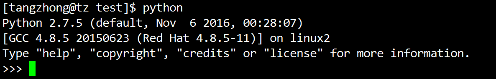
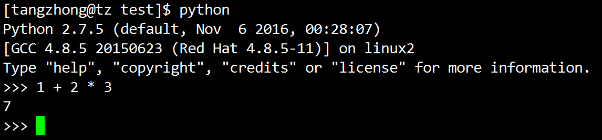

# Python快速入门

### 本节重点
>* 了解Python语言的基本特点
>* 对Python的语法有一个初步的认识
>* 能够实现一些简单的Python小程序

## Python背景介绍
Life is short, use python. 人生苦短, 我用python.


由Guido van Rossum于1989年圣诞节为**打发无聊时间**，而开发的一个新的脚本解释程序. 第一个公开发行版发行于1991年.<br>
至于为什么选中Python作为语言名字，是因为他是一叫Monty Python的喜剧团体的爱好者. <br>

### Python的特点
- 优雅
- 明确
- 简单

**Python是一个下限特别低, 上限特别高的编程语言**

>* 下限特别低: 上手容易, 特别适合啥都不懂的小白作为第一门编程语言. 通过简单的代码就能做出实用的功能, 特别容易培养兴趣.
>* 上限特别高: Python有非常丰富的语法特性, 支持多种编程风格, 又有非常庞大驳杂的库. 想要学到 "精通" 也绝非一朝一夕. 

**Python支持多种编程风格**

>* Python支持面向过程的编程风格. 如果你熟悉C语言, 那么完全可以像写C一样写Python
>* Python支持面向对象的编程风格. 数字, 字符串, 函数, 模块... 都是 "对象".
>* Python支持函数式编程. 其实这世界上只有两种编程语言, C类语言, Lisp类语言. Python也支持函数式编程.

那么作为一个程序猿, 我们如果没有对象怎么办? 当然可以new一个~~


**了解函数式编程** 请同学们课后收集资料, 了解 "函数式编程" 是怎么回事. <a href="http://www.ruanyifeng.com/blog/2017/02/fp-tutorial.html">函数式编程简介</a>

**Python语法简洁, 表达能力强**

python代码量小, 维护成本低, 编程效率高, 标准库强大, 第三方库非常丰富, 目前已经成为全世界最广泛使用的编程语言之一. 


同一样问题，用不同的语言解决，代码量差距太多了，一般情况下python是java的1/5，所以说人数苦短，我用python，多留点时间泡妹子吧，不然就老了. 


**解释运行**

Python是一种解释型的编程语言. 和C/C++不同, 不是先将源代码文件转化成可执行文件, 再执行; 而是直接由Python解释器一行一行的读取源代码, 每读一行就执行一行.<br>
但严格意义上讲 ,Python算是一种 "半编译, 半解释" 型的语言. 一方面, Python解释器会按行读取源代码文件, 然后会先将源代码转为供Python解释器直接执行的 "字节码". 然后再执行字节码.<br>

例如, 我们执行一个.py文件之后, 会生成一个同名的.pyc文件. 这个.pyc文件就是Python解释器生成的字节码文件. 如果已经存在了.pyc文件, 那么就不需要再 "翻译" 一次了, 这样也提高了执行效率.

**跨平台**

Python是基于Python的解释器来进行执行. 只要某个操作系统/平台上能运行Python解释器, 就可以完美的运行Python的源代码. 主流的Windows, Linux, Mac等操作系统上都能够很好的支持Python. 

**可扩展强**

Python可以很容易的调用C/C++语言. 如果觉得哪里的逻辑性能不满足要求, 可以用C/C++重构这部分模块, 用Python调用.

**可嵌入**

Python的代码也可以很容易的嵌入到C/C++中执行.

**丰富的库**

君子性非异也, 善假于物也.<br>
Python标准库已经非常丰富强大, 同时也有非常庞大的第三方库. 几乎可以是上天入地, 心随我意~

### Python能做哪些事
对于开发人员:
>* 模块组合拼接, 快速搭建线上业务逻辑
>* 实现线下数据生成流程
>* 爬虫开发
>* web开发
>* 机器学习
>* 大数据处理

对于测试人员:
>* 搭建自动化测试框架
>* 搭建持续集成环境
>* 搭建bug状态跟踪平台

对于运维人员:
>* 自动化机器管理
>* 自动化上线部署
>* 数据同步分发工具

对于产品经理:
>* 数据统计/分析
>* office辅助工具

对于黑客/白帽子:
>* 渗透测试工具
>* 系统分析工具
>* 实现游戏外挂

对于其他人:
>* 实现各种解决我们生活中的具体问题的小工具

除了驱动开发, Python几乎无所不能. 

### Python的缺点
执行效率!! 执行效率!! 执行效率!!

但是, 
>* 在摩尔定律的作用下, 硬件越来越便宜, 反而是开发人员的成本越来越高;
>* 一些好的编程实践可以帮助我们写出比较高性能的代码; 
>* python解释器的执行效率也在不断被优化;


### Python版本选择
Python当前主要有两个大版本分支:

- Python2: 最新版本是Python2.7.14
- Python3: 最新版本是Python3.6.2

Python3虽然是Python2的升级版, 但是很多语法并不兼容!!

关于兼容性: 
>* C++能非常好的兼容C语言(C语言写的代码可以直接使用C++编译器进行编译), 但是也意味着C++背负着很多C语言的历史包袱.
>* 但是Python3和Python2很多地方不兼容(Python2写的代码, 不能很顺利的在Python3的解释器上执行). 

这样做是好是坏, 不便评说, 还是要看几年之后的最终结果是好是坏, 才能盖棺定论. 
>* 这样意味着很多已经用Python2写好的代码不会很顺利的升级到Python3.
>* 但是这样也意味着Python3可以不用背负历史包袱, 大刀阔斧的把一些不合理的地方修改掉.

官方的说法是, Python2最多维护到2020年便停止更新. \<br>
但是截至到目前为止, 90%以上的Python应用仍然是运行在Python2版本上.\<br>
企业中主要应用到的Python版本也是Python2.7甚至是Python2.6(幸好, Python2.7和2.6差别不大).

我们的课程主要学习的是Python2版本的内容. 关于Python3的一些新特性, 有兴趣的同学课后自己研究. 

## Python安装 (课后作业)
<a href="https://www.python.org/downloads/">Python官网</a>

- Windows平台安装: 直接到Python官网上, 可以下载到Python安装包, 直接下载即可.
- Linux平台安装: Centos上默认安装了Python. 如果没有默认安装, 执行 `sudo yum install python` 即可.

我们主要学习在Linux环境下的Python开发(其实同样一份代码, 在Windows上一般情况下也是可以直接执行的). 

<a href="https://docs.python.org/2">Python2官网文档</a>

由于国内访问Python官网比较慢, 大家可以把文档下载下来看比较方便.

## Python开发环境搭建 (课后作业)
开发工具有很多种, 这里推荐几种常见的, 同学们选择适合自己的方式搭建.

### Windows/Linux: vim + jedi-vim (推荐)
- vim是一个非常强大的编辑器, 这里不多介绍了. 在 .vimrc 中添加 `nnoremap <F4> :w<cr>:!python %<cr>` 按F4即可直接执行当前python文件.
- jedi-vim是vim上的一个非常优秀的python代码补全插件. 官网参见 <a href="https://github.com/davidhalter/jedi-vim">jedi-vim</a>

### Windows/Linux: Eclipse + pydev
- Eclipse不仅仅是一个Java IDE, 同时是一个通用的跨平台IDE开发框架, 可以搭载插件后支持各种编程语言.
- pydev是一个Eclipse上的python插件. 安装过程参见 <a href="http://www.cnblogs.com/Bonker/p/3584707.html"> python + Eclipse开发环境搭建 </a>

### Windows: Sublime Text + SublimeREPL
- Sublime Text是一个Windows上的非常优秀的文本编辑器
- SublimeREPL是一个Sublime Text上的Python补全插件. <a href="https://www.liudon.org/1337.html">SublimeCodeIntel的使用</a>
- 按ctrl+b即可执行当前的Python文件.

### Windows/Linux: VSCode + Python插件
- VSCode是微软爸爸把宇宙第一IDE Visual Studio的编辑器部分抽取出来, 单独搞的一个跨平台的开源项目, 非常强大的文本编辑器.
- 通过VSCode + 内置Python插件, 可以达到一个 **勉强可以** 的效果. 配置过程参见 <a href="http://www.cnblogs.com/bloglkl/archive/2016/08/23/5797805.html">用VSCode写Python的正确姿势</a>

### Windows: PyCharm 
- PyCharm是一个相当优秀的Python IDE. 不过是付费软件. 从网上可以找到注册码. 安装过程参见 <a href="http://www.jb51.net/article/50689.htm">pycharm使用心得</a>

## 认识Python解释器
直接在命令行中敲 `python` 就进入了Python解释器. 这时候我们看到了一个Python的shell.



首先, 我们可以将这个解释器当做一个基本的计算器.



当然, 也可以执行任意的合法Python语句


上图是一个Python的Helloworld的例子. 

按ctrl + d退出python shell.

虽然我们可以通过Python shell来执行一些python语句, 但是更多的是将Python代码写到一个 .py 后缀的文件中, 通过Python解释器解释这个.py文件来执行代码. 

创建一个 helloworld.py

	print 'helloworld'

执行 `python helloworld.py` , 结果如下:


## 快速入门

### 变量和赋值
**动态类型**<br>
>* Python中的变量不需要声明, 直接定义即可. 会在初始化的时候决定变量的 "类型"
>* 使用 = 来进行初始化和赋值操作.

	>>> counter = 0
	>>> miles = 1000.0 //float：双精度
	>>> name = 'Bob'
	>>> kilometers = 1.609 * miles

>* Python中也支持增量赋值

	>>> n = n * 10

等价于

	>>> n *= 10

>* Python中不支持 ++/-- 这样的操作, 只能写成

	>>> n += 1

下面是见证奇迹的时刻<br>


>* 同一个名字变量, 可以赋值成不同的类型的值.

	>>> a = 100
	>>> print a
	100
	>>> a = 'hehe'
	>>> print a
	hehe

**变量命名规则**<br>
>* 变量名必须是字母, 数字, 下划线. 但是不能用数字开头(规则和C语言一样).
>* 变量名大小写敏感, case 和 Case 是两个不同的变量.
>* 变量命名要做到 "见名知意" . 更多关于变量命名规则的讨论, 可以参见 <<代码大全>> 第10章, 第11章.

### 认识 "数字"
>* Python没有int, float, 这样的关键字, 但是实际上数字的类型是区分 "int" "float" 这样的类型的. 使用内建函数 type 可以查看变量的类型.

```python
>>> a = 1
>>> type(a)
<type 'int'>
(class <int>)
>>> a = 1.0
>>> type(a)
<type 'float'>
```

>* Python中的数字变量的取值范围, 并没有限制(完全取决于你机器的内存多大), 而不是像C语言中int用4个字节表示.

	>>> a = 10000 * 10000 * 10000 * 10000 * 10000 * 10000
	>>> print a
	1000000000000000000000000

>* Python中还有一种 "复数" 类型. 和数学中的 "复数" 是相同的概念.

	>>> a = 10 + 5j
	>>> print a
	(10+5j)

### 认识 "字符串"
>* Python中可以使用 单引号('), 双引号("), 三引号('''/""") 来表示字符串. 这三种字符串的区别, 我们后面再讨论.

	>>> a = 'hehe'
	>>> b = "hehe"
	>>> c = '''hehe'''

>* 这样的好处是如果字符串中包含了 " 这样的字符, 就不用蹩脚的进行转义.

	>>> a = 'My name is "tangzhong"'
	>>> print a
	My name is "tangzhong"

>* 如果一个字符串中既有单引号, 又有双引号, 可咋办? 别忘了咱们还有三引号!（还有三双引号）

	>>> a = '''I say "haha", you say 'hehe'.'''

>* 但是有些不可见字符, 仍然得进行转义, 使用 \ 进行转义. 比如换行符 \n

	>>> a = 'My name is \n "tangzhong"'
	>>> print a
	My name is 
 	"tangzhong"

>* \ 本身需要 \\ 这样的方式来表示.

>* 使用索引操作符 [] 或者切片操作符 [:] 来获取子字符串(切片操作是一个前闭后开区间).
>* 字符串的索引规则是: 第一个字符索引是0, 最后一个字符索引是-1(可以理解成len-1).

	>>> pystr = 'hehe'
	>>> pystr[0]
	'h'
	>>> pystr[-1]
	'e'
	>>> pystr[1:3]
	'eh'
	>>> pystr[1:-1]
	'eh'
	>>> pystr[1:]
	'ehe'
	>>> pystr[:2]
	'he'
	>>> pystr[:]
	'hehe'

>* + 用于字符串连接运算, * 用于字符串重复.

	>>> a = 'hehe'
	>>> b = 'haha'
	>>> c = a + b
	>>> print c
	hehehaha
	>>> d = a * 4
	>>> print d
	hehehehehehehehe
	>>> e = a * b
	Traceback (most recent call last):
	  File "<stdin>", line 1, in <module>
	TypeError: can't multiply sequence by non-int of type 'str'

>* Python没有 "字符类型" 这样的概念. 单个字符也是字符串.

	>>> a = 'hehe'
	>>> type(a[0])
	<type 'str'>

>* 用内建函数 len 获取字符串长度

	>>> a = 'hehe'
	>>> print len(a)
	4

>* 格式化字符串, 可以使用 % 这样的方式进行格式化的替换.

	>>> a = 100
	>>> pystr = "a = %d"
	>>> result = pystr % a
	>>> print result
	a = 100

>* 可以简化的写成如下方式

	>>> print "a = %d" % a
	a = 100 

### 认识 "布尔类型"
"布尔" 这个概念, 更多的是一个数学上的玩意. 


作为一个程序猿, 只要知道布尔值表示的是一个表达式的的 "真" 和 "假" 就行了~


>* Python中用True和False来表示布尔值(注意, 第一个字符大写).

	>>> a = True
	>>> print a
	True
	>>> print type(a)
	<type 'bool'>

>* 布尔类型的变量, 也是一种特殊的整数类型. 在和整数进行运算时, True被当做1, False被当做0.

	>>> a = True
	>>> b = a + 1
	>>> print b
	2 

### 输入输出
>* print函数将结果输出到标准输出(显示器)上.
>* raw_input函数从标准输入中获取用户输入.

	>>> name = raw_input('Enter name:')
	Enter name:aaa
	>>> print name
	aaa

>* raw_input返回的结果只是一个字符串. 如果需要获得一个数字, 需要使用int函数把字符串转换成数字.

	>>> num = raw_input('Enter num:')
	Enter num:100
	>>> print num + 1
	Traceback (most recent call last):
	  File "<stdin>", line 1, in <module>
	TypeError: cannot concatenate 'str' and 'int' objects
	>>> print int(num) + 1
	101


### 注释
>* Python中使用 # 作为单行注释. #后面的内容都是注释的内容

	a = 1.0  # define a
	print type(a)

>* 良好的注释, 也是一个优秀的程序猿必备的技能之一. 
>* 使用中文注释时, 要小心~~ 直接使用会运行报错.

	a = 1.0  # 定义变量 a
	print type(a)
	
	[tangzhong@tz python]$ python test.py 
	  File "test.py", line 1
	SyntaxError: Non-ASCII character '\xe5' in file test.py on line 1, but no encoding declared; see http://www.python.org/peps/pep-0263.html for details

>* Python的源代码默认只支持ASCII, 所以如果要包含中文, 需要在代码文件最开头的地方注明 ` # -*- coding: UTF-8 -*- `

### 操作符
>* Python中支持 + - * / % 这样的操作符. 并且它们的行为都和C语言一样.
>* / 是 "传统除法" . 如果两个整数相除, 得到的结果仍然是整数, 如果其中一个数是浮点数, 那么得到的结果也是浮点数; 

	>>> a = 1
	>>> b = 2
	>>> print a / b
	0
	
	>>> a = 1.0
	>>> b = 2
	>>> print a / b
	0.5


>* // 是 "地板除". 无论操作数类型如何, 都会对结果进行取地板运算.

	>>> a = 1
	>>> b = 2
	>>> print a // b
	0
	>>> a = 1.0
	>>> b = 2
	>>> print a // b
	0.0

>* 使用 `from __future__ import division` 就会使 / 变为精确除法

	>>> from __future__ import division
	>>> a = 1
	>>> b = 2
	>>> print a / b
	0.5

>* ** 表示乘方运算(记得Python的数据无上限)

	>>> a = 100
	>>> b = 100
	>>> print a ** b
	100000000000000000000000000000000000000000000000000000000000000000000000000000000000000000000000000000000000000000000000000000000000000000000000000000000000000000000000000000000000000000000000000000000

>* Python也支持标准的比较运算符. > < >= <= == != 这些运算符的表达式的结果, 是一个布尔值

	>>> 2 < 4
	True
	>>> 2 == 4
	False
	>>> 2 > 4
	False
	>>> 2 != 4
	True

>* Python也支持逻辑运算符. and or not

	>>>  2 < 4 and 2 == 4
	False
	>>> 2 > 4 or 2 < 4
	True
	>>> not 6.2 <= 6
	True

>* Python中,  `3 < 4 < 5` 等价于 `3 < 4 and 4 < 5` 这一点和其他大多数编程语言都不太一样.
>* 运算符之间有高低优先级的区分. 应该合理使用括号来增加代码的可读性.
>* 字符串和字符串之间也可以使用运算符进行操作, 例如前面使用 + 进行字符串连接

	>>> print 'haha' + 'hehe'
	hahahehe

>* 字符串之间可以使用 == != 来判定字符串的**内容**是否相同

	>>> 'haha' != 'hehe'
	True

>* 字符串之间也可以比较大小. 这个大小的结果取决于字符串的 "字典序"

	>>> 'haha' < 'hehe'
	True

### 列表/元组/字典
>* 列表和元组类似于C语言中的数组. 
>* 使用 [] 来表示列表, 使用 () 来表示元组.

	>>> alist = [1, 2, 3, 4]
	>>> alist
	[1, 2, 3, 4]
	
	>>> atuple = (1, 2, 3, 4)
	>>> atuple
	(1, 2, 3, 4)

>* 列表和元组能保存任意数量, 任意类型的Python对象

	>>> a = [1, 'haha']
	>>> a
	[1, 'haha']

>* 可以使用下标来访问里面的元素, 下标从0开始. 最后一个下标为-1

	>>> a[0]
	1
	>>> a[1]
	'haha'
	>>> a[-1]
	'haha'

>* 可以使用[:]切片操作得到列表或元组的子集. 这个动作和字符串操作是一样的.

	>>> a[:]
	[1, 'haha']

>* 列表和元组唯一的区别是, 列表中的元素可以修改, 但是元组中的元素不能修改.

	>>> a = [1, 2, 3, 4]
	>>> a[0] = 100
	>>> a
	[100, 2, 3, 4]
	
	>>> a = (1, 2, 3, 4)
	>>> a[0] = 100
	Traceback (most recent call last):
	  File "<stdin>", line 1, in <module>
	TypeError: 'tuple' object does not support item assignment
	>>> 

>* 字典是Python中的映射数据类型. 存储键值对(key-value). 
>* 几乎所有类型的Python对象都可以用作键. 不过一般还是数字和字符串最常用.
>* 使用 {} 表示字典.

#### 字典

	>>> a = { 'ip' : '127.0.0.1'}   # 创建字典
	>>> a['ip']                     # 取字典中的元素
	'127.0.0.1'
	>>> a['port'] = 80              # 插入新键值对
	>>> a
	{'ip': '127.0.0.1', 'port': 80}


### 理解 "引用"
>* Python中可以用 id 这个内建函数, 查看变量的 "地址".

	>>> a = 100
	>>> id(a)
	24187568
	>>> a = 200
	>>> id(a)
	24191144
	>>> b = a
	>>> id(b)
	24191144
	>>> b = 300
	>>> id(b)
	25094648 

>* 给a重新赋值成200, 相当于新创建了一个200这样的对象, 然后将变量名a重新绑定到200这个对象上.
>* 将a赋值给b, 其实相当于又创建了一个变量名b, 并将b这个名字和200这个对象绑定到一起.
>* 再次修改b的值, 可以看到其实是又创建了一个300这样的对象, 将b绑定到300这个对象上.
>* 像创建的 a, b 这样的变量名, 其实只是一个对象的别名. 或者叫做变量的 "引用"

### 代码块及缩进
>* Python中使用缩进来表示代码块. 相当于天然从语法的角度规定了代码风格.
>* Python是独一无二的使用缩进而不是{}的, 这就避免了一场党派之争~

党派1:


党派2:


这两个党派争论不休, 互不相让.


Python表示, 还是要靠劳资来结束这场纷争


并不存在大括号. 因此也就不需要考虑大括号放在哪里了.

### if语句
>* 标准的if条件语句语法为如下.
>* 如果表达式的值非0或者为布尔值True, 则执行 do_something, 否则执行下一跳语句.

	if expression:
		do_something1
		do_something2
	next_something

>* Python也支持else语句

	if expression:
		do_something1
	else:
		do_something2

>* Python里还有神奇的的elif(意思是else-if)

	if expression1:
		do_something1
	elif expression2:
		do_something2
	else:
		do_something3

>* Python并不支持switch/case这样的语句. 也没有必要支持. 实际上 switch/case 语法并不优雅.
>* 如果条件分支太多, 可以考虑使用 "表驱动" 的方式来组织代码. 具体可以参见 <<代码大全>> 第18章.

### while循环
>* while循环语句和if语句语法类似. 只要表达式的值非0或者为True, 就会循环执行do_something

	while expression:
		do_something
	
	# 循环执行三次print
	counter = 0
	while counter < 3:
		print 'loop %d' % counter
		counter += 1

### for循环
>* Python中的for循环和传统的for循环不太一样. 
>* for循环接收可迭代对象(序列或者迭代器)作为参数, 每次迭代其中的一个元素.

	# 遍历字符串中的每一个字符
	a = 'hehe'
	for c in a:
		print c
	
	# 执行结果
	h
	e
	h
	e
	
	# 遍历列表中的每一个元素
	a = [1, 2, 3, 4]
	for item in a:
		print item
	
	# 执行结果
	1
	2
	3
	4
	
	# 遍历字典中的所有key-value
	a = {'ip':'192.168.1.1', 'port':80}
	for key in a:
		print key, a[key]
	
	# 执行结果
	ip 127.0.0.1
	port 80

>* 内建函数range能够生成一个数字组成的列表, 方便进行for循环遍历.

	# for循环执行三次打印
	for i in range(0, 3):
		print 'loop %d' % i
	
	# 执行结果
	loop 0
	loop 1
	loop 2

>* range函数其实有三个参数. 前两个参数分别表示了一个前闭后开的区间. 第三个参数表示step, 每次迭代的**步长**

	# 遍历[0, 100)区间中的偶数
	for i in range(0, 100, 2):
		print i

### break和continue
>* 使用break语句跳出当前循环

	# 查找 [0, 100) 第一个3的倍数
	for i in range(0, 100):
		if i % 3 == 0:
			break

>* 使用continue语句, 回到循环顶端, 判定循环条件; 
>* 循环条件满足, 则执行下一次循环;

	# 打印 [0, 100) 所有3的倍数
	for i in range(0, 100):
		if i % 3 != 0:
			continue
		print i

### pass语句
>* 有时候需要用到 **空语句** 这样的概念, 什么都不做. 由于没有 {} , 需要有一个专门的语句来占位, 要不缩进就混乱了.

	if x % 2 == 0:
		pass
	else:
		do_something


### 列表解析
又到了见证奇迹的时刻了. Python语法的强大简介, 初展峥嵘.


>* 使用for循环将生成的值放在一个列表中

	# 生成 [0, 4) 的数字的平方序列
	squared = [x ** 2 for x in range(4)]
	print squared
	
	# 执行结果
	[0, 1, 4, 9]

>* 这个过程还可以搭配使用if语句

	# 获取 [0, 8) 区间中的所有的奇数
	evens = [x for x in range(0, 8) if x % 2 == 1]
	print evens

### 函数
>* 一些可以被重复使用的代码, 可以提取出来放到函数中.
>* Python使用def来定义一个函数. 使用return来返回结果.

	def Add(x, y):
		return x + y

>* Python使用()来调用函数

	print Add(1, 2)

>* 理解 "形参" 和 "实参": 形参相当于数学中 "未知数" 这样的概念. 实参就是给未知数确定具体的数值.

>* Python中没有 "重载" 这样的概念. 相同名字的函数, 后面的会覆盖前面的.

	def Func():
	print 'aaaa'
	
	def Func():
	    print 'bbbb'
	
	Func()
	
	# 执行结果
	bbbb

>* Python支持默认参数. 函数的参数可以具备默认值.

	def Func(debug=True):
		if debug:
			print 'in debug mode'
		print 'done'
	
	Func()
	Func(False)

又到了见证奇迹的时刻, 再次感受下Python简洁强大的语法吧~


>* Python解包(unpack)语法, 函数返回多个值.

	def GetPoint():
		return 100, 200
	
	x, y = GetPoint()

>* 假如我只关注y, 不想关注x, 可以使用 _ 作为占位符.

	_, y = GetPoint()

>* 函数也是 "对象". 一个函数和一个数字, 字符串一样, 都可以定义 "别名" 来引用它. 

```python
def Func():
	print 'aaa'

func = Func
func()
print type(func)

# 执行结果
aaa
<type 'function'>
```

>* 函数既然是一个对象, 那么也可以作为另外的一个函数的参数和返回值. 具体细节我们后面再详细讨论.

### 文件操作
>* 使用内建函数 open打开一个文件

```python
    handle = open(file_name, access_mode='r')  # handle = open("d:/test.txt","r")
```

>* file_name是文件的名字. 可以是一个绝对路径, 也可以是相对路径.

	handle = open('text.txt', access_mode='r')
	
	# 或者
	
	handle = open('/home/tangzhong/text.txt', access_mode='r')

>* access_mode是文件的打开方式. 选项有以下几种

	'r' : 只读
	'w' : 只写
	'a' : 追加写
	't' : 按文本方式读写
	'b' : 按二进制方式读写

>* handle是一个文件句柄, 是一个可迭代的对象. 可以直接使用for循环按行读取文件内容.

	for line in handle:
		print line

>* handle使用完毕, 需要close掉. 否则会引起资源泄露(一个进程能打开的句柄数目是有限的).

	handle.close()

### 一个完整的例子: 统计文本中的词频
>* 一个文本文件中, 每一行是一个单词. 可能有重复. 统计每个单词出现的次数.

示例文件:

	aaa
	bbb
	ccc
	aaa
	bb
	c
	aaa

代码实现如下:

```python
handle = open('text.txt', mode='r')
words = {}
for word in handle:
    # word = word[:-1]        # 去掉末尾的 \n，会误删最后一行单词的最后一个字符
    word = word.strip()     # 去除首尾空白字符
    if word not in words:   # 使用 in 关键字判定这个单词是否是字典的key.
        words[word] = 1
    else:
        words[word] += 1;
handle.close()
print words
```

### 模块
当我们一个项目的代码量较大的时候, 需要把代码放到多个不同的.py文件中. 
>* 可以通过 `import` 关键字, 引用其他.py文件中的代码. 
>* 被引入的这个代码文件, 就称之为 "模块". 
>* 被引入的文件, 去掉.py后缀名, 就是模块名. 

例如:

	# add.py内容
	def Add(x, y):
		return x + y
	
	# test.py内容, 直接import模块名
	import add
	print add.Add(1, 2)
	
	# test2.py内容, 只import add模块中Add这一个名字.
	from add import Add
	print Add(1, 2)
	
	# test3.py内容, import模块名, 并且给模块名取了一个别名.
	import add
	a = add
	print a.Add(1, 2)

>* 模块查找的顺序, 先是查找当前目录, 然后查找Python解释器的安装目录.

	import sys
	print sys.path   # 打印出了模块查找的路径
	
	# 执行结果
	['/home/tangzhong/bit/python', '/usr/lib64/python27.zip', '/usr/lib64/python2.7', '/usr/lib64/python2.7/plat-linux2', '/usr/lib64/python2.7/lib-tk', '/usr/lib64/python2.7/lib-old', '/usr/lib64/python2.7/lib-dynload', '/usr/lib64/python2.7/site-packages', '/usr/lib64/python2.7/site-packages/gtk-2.0', '/usr/lib/python2.7/site-packages']

### 实用函数
前面我们接触到了一些非常有用的内建函数. 这里我们小小的总结一下.


## 一些练习

### raw_input练习
1. 使用raw_input从用户输入得到一个字符串, 并显示这个用户输入的内容.
2. 使用raw_input输入两个数字, 计算两个数字的并显示.

### 循环
1. 使用while循环输出 0-10
2. 使用for循环输出 0-10
3. 用户输入一个字符串, 逐个字符显示. 分别实现while版本和for版本.

### 条件判断
用户输入一个数字, 判定这个数字是正数, 负数, 还是0.

### 列表
创建一个包含5个数值的列表, 通过用户输入来确定每一个值. 并计算出5个数值的平均数.

### 猜数字游戏
代码中生成一个随机整数. 然后用户输入数字后, 程序提示用户的输入是高了还是低了. 直到用户猜中这个数字, 游戏结束. 提示, random模块的randint函数能够帮助我们生成随机数. 

### 带文本菜单的程序
菜单项如下: 1. 求五个数的和; 2. 求五个数的平均值; ... (X). 退出<br>
由用户输入选择, 程序执行相应的功能.