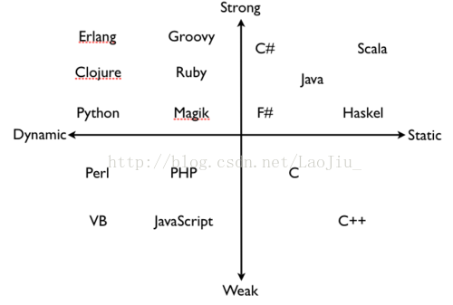

# Python基础语法

上节课, 我们粗略的, 快速的过了一遍Python基础语法, 只是让大家有一个直观的认识能够快速上手. 但实际Python的语法并不简单, 还有很多细节没有交代到. 

### 本节重点
>* 对以下Python基础语法的一些细节有一定的巩固和认知.
>* 语句和变量
>* 对象和类型
>* 数字和运算
>* 条件和循环
>* 函数和可调用对象

## 语句和变量

### 语句折行
>* 如果一行代码太长, 可以折成多行来写, 看起来会更清楚. 
>* 一定要记得, 代码写出来是给人看的, 不能看不懂. 怎么简单, 怎么清晰, 就怎么写.

典型的反例是医生开的处方. 这样的处方, 药房的人会很容易抓错药~


>* Python中, 如果一个语句被小括号, 中括号, 大括号包起来, 是可以跨行书写的. 

	# 这样格式化的写一个字典, 在字典元素很多的时候会显得很清晰.
	server = {
		'ip' : '127.0.0.1',
		'port' : 80
	}

>* 如果没有用括号包起来, 可以使用 \ 来换行.

	if x == 1 and \
		y == 1:
		do_something

>* 双引号(")和单引号(')字符串, 都不能折行, 但是三引号('''/""")可以折行.

	print ''' hello,
	how are you? '''

>* 使用 ; 可以把多个语句写到同一行. 但是强烈**不建议**这么做.

	print 'haha'; print 'hehe'

### 缩进规范
>* Python中使用缩进表示语句块. 
>* 同一个语句块中的代码必须保证严格的左对齐(左边有同样数目的空格和制表符).

	x = 0
	if x == 1:
	    print x
	     x += 1     # 这一行多缩进了一个空格
	
	# 执行结果
	  File "test.py", line 4
	    x += 1
	    ^
	IndentationError: unexpected indent

>* 虽然Python语法允许使用制表符作为缩进, 但是Python编码规范强烈**不推荐**使用制表符. 因为不同的编辑器的制表符长度不同(4个空格或者8个空格).
>* 我们推荐使用四个空格来表示一个缩进.

### 多重赋值(链式赋值)
>* 可以同时给多个变量赋相同的值

	x = y = 1

### 多元赋值
>* 可以同时给多个变量赋不同的值

	x, y = 1, 2

又到了见证奇迹的时刻~~~


我们不是学了C语言里, 如何交换两个变量嘛? 我们讲了三种方法~~

**普通青年**

	int a = 10;
	int b = 20;
	
	int tmp = a;
	a = b;
	b = tmp;

**2B青年(1)**

	int a = 10;
	int b = 20;
	
	a = a + b;
	b = a - b;
	a = a - b;

**2B青年(2)**

	int a = 10;
	int b = 20;
	
	a = a ^ b;
	b = a ^ b;
	a = a ^ b;

为啥要叫2B青年? 恕我直言, 这代码和上面的药方有啥差别?


好了, 来看看Python怎么写~~

**真 * 文艺青年**

	x, y = 10, 20
	x, y = y, x

此时此刻, 我的心情只能用一个字形容~~


还没完, 这里不得不提, 还有一个坑~~, 请看这样一段毁你三观的代码（仅限 python 2）

	True, False = False, True
	if True:
		print 'haha'
	else:
		print 'hehe'

猜猜看, 输出结果是啥?

>* True和False也是变量, 只不过是系统自带的"内置变量", 一样可以修改值的~~
>* 不过我们实际写代码的时候, 千万千万别这么写, **和作死无异**~~~(当然, 除非是你故意想埋坑).


### 增量赋值
>* 我们前面提到过, 可以使用 += 直接让变量自增.
>* 其实还支持很多其他的自增操作(参见下图).


### 作用域和生命周期
>* Python中, def, class(我们后面会讲), lamda(我们后面会讲) 会改变变量的作用域
>* if, else, elif, while, for, try/catch(我们后面会讲) 不会改变变量的作用域

	for i in range(0, 10):
		print i
	print i      # 即使出了 for 循环语句块, 变量i仍然能访问到i变量.
	
	def func():
		x = 1
		print x
	
	print x      # 出了def的函数语句块, 就不再能访问到x变量了. 

>* 内建函数globals()返回了全局作用域下都有哪些变量, 内建函数locals()返回了作用域下都有哪些变量

```python
a = 100
def Func():
    x = 0
    print globals()
    print locals()

print 'In Gloabl'
print globals()
print locals()

print 'In Func'
Func()

# 执行结果
In Gloabl
{'a': 100, '__builtins__': <module '__builtin__' (built-in)>, '__file__': 'test.py', '__package__': None, 'Func': <function Func at 0x7f9085d5b9b0>, '__name__': '__main__', '__doc__': None}
{'a': 100, '__builtins__': <module '__builtin__' (built-in)>, '__file__': 'test.py', '__package__': None, 'Func': <function Func at 0x7f9085d5b9b0>, '__name__': '__main__', '__doc__': None}
In Func
{'a': 100, '__builtins__': <module '__builtin__' (built-in)>, '__file__': 'test.py', '__package__': None, 'Func': <function Func at 0x7f9085d5b9b0>, '__name__': '__main__', '__doc__': None}
{'x': 0}
```

>* 关于Python的变量的生命周期, 这个不需要程序猿操心, Python提供了垃圾回收机制自动识别一个变量的生命周期是否走到尽头, 并自动释放空间(详情我们稍后再讲). 

### Python关键字
>* 目前我们接触了 while, if, else, for, continue, break, return等关键字, 其实还有很多其他的关键字. 参见下图


### 特殊标识符
>* Python使用下划线(_)作为变量的前缀和后缀, 来表示特殊的标识符.
>* _xxx表示一个 "私有变量", 使用 `from module import *` 无法导入.

	# add.py
	def _Add(x, y):
		return x + y
	
	# test.py
	from add import *
	_Add(1, 2)
	
	# 执行结果
	Traceback (most recent call last):
	  File "test.py", line 3, in <module>
	    _Add(1, 2)
	NameError: name '_Add' is not defined

>* `_xxx_`(前后一个下划线), `__xxx__`(前后两个下划线) 一般是系统定义的名字. 我们自己在给变量命名时要避开这种风格. 防止和系统变量冲突.

### 文档字符串
>* 写注释对于提升程序的可读性有很大的帮助.
>* 前面我们介绍了 # 来表示单行注释.
>* 对于多行注释, 我们可以使用 三引号('''/""") 在函数/类**开始位置**表示. 这个东西也被称为 **文档字符串**

	def Add(x, y):
		'''
		define function for add two number
		'''
		return x + y

>* 使用对象的 __doc__ 属性就能看到这个帮助文档了(别忘了, 函数也是对象).

	print Add.__doc__
	
	# 执行结果
	define function for add two num


>* 或者使用内建函数 `help` 也可以做到同样的效果.

	help(Add)
	
	# 执行结果
	Add(x, y)
	define function for add two num

>* 文档字符串一定要放在函数/类的开始位置. 否则就无法使用 `__doc__` 或者 `help` 来访问了.

### Unix起始行
>* 对于Linux或者Mac这类的Unix类系统, 可以给Python代码文件增加一个起始行, 用来指定程序的执行方式.

	#!/usr/bin/python
	print 'haha'

>* 保存上面的代码为test.py. 给这个文件增加可执行权限: `chmod +x test.py`
>* 然后就可以通过 ./test.py 的方式执行了.

### 模块文档
>* 不光一个函数/类可以有一个文档字符串. 一个模块也同样可以.

	# add.py
	'''
	define some function for add
	'''
	def Add(x, y):
		return x + y
	
	# test.py
	import add
	print add.__doc__
	
	# 执行结果
	define some function for add

## 对象和类型

### 一切都是对象

一个Python的对象, 包含三部分信息:
>* 身份: 每一个对象都有一个唯一的身份标识自己. 实用内建函数id可以看到这个标识的具体的值.
>* 类型: 对象的类型决定了对象保存什么样的值, 可以进行什么样的操作, 以及遵守什么样的规则. 实用内建函数type可以查看对象的类型. 本质上就是把对象分分类.
>* 值: 表示对象中具体保存的内容. 有些对象的值可以修改, 有些对象的值不能修改, 这个称为对象的 "可变性". 

Python中任何类型的值其实都是一个对象(判定一个东西是不是对象, 就尝试用id取一下看能否取到). <br>
100 这样的字面值常量, 也是对象; 一个字符串, 也是对象; 一个函数, 也是对象; 一个类型(type函数的返回值), 其实也是对象; 一个模块, 还是对象;

所以, 在Python面前, Java也敢自称自己是 "纯粹" 的面向对象语言? 等Java啥时候把字面值常量, 基本类型, 函数, 包等等都变成对象了再说吧~~


但是, 有一门叫做**Ruby**的编程语言, 更是 "纯粹" 的面向对象.

	# 打印 3 次 "X"
	3.times{print "X"}


### 理解对象和引用
我们以下面这段简单的代码为例, 仔细看一下对象创建的过程.

	a = 2
	b = 3
	b = 2

>* 按照我们C语言中的理解, `a = 2` , 相当于先创建一个变量名a, a就是一个篮子(给a分配了内存空间), 然后把数字2装到a这个篮子中. 但Python中完全**不是**这样的.
>* 我们在解释器中敲入 `a = 2`, 首先有一个 `integer class` 被唤醒(找到了整数对象的图纸).


>* 根据 `integer class` 这个图纸, 在内存中开辟一段空间(得到了对象id), 并填充入对象的类型和值. 房子已经建好, 装修完毕, 家具齐全.


>* 万事俱备, 只欠东风. 如果你想住进去, 还得有房子的钥匙. 这个时候, 变量名a其实就是我们的钥匙. 可以搬进去住啦~~美好的生活从此开始.


>* 卧槽, 老王怎么在隔壁也买了个房子??


>* 老王房子建好了, 也拿着钥匙住进去了.


>* 再次执行 b = 2 时, 隔壁老王的魔爪伸过来了T_T. 老王拿到了我家的钥匙...


总结:
>* Python中的变量名, 只是一个访问对象的 "钥匙" . 多个不同的变量, 完全可以访问相同的对象, 因此我们讲这种变量名也叫对象的 "引用".

思考: 
为什么Python的变量是这样的? 和C/C++差异这么大捏?

>* 空间考虑: 比如一个数字2, 在Python中只有这么一个数字2; 而一个C/C++程序中可能会有N个2.
>* 时间考虑: 比如 `a=b` 这样的赋值, 只是修改了一下贴标签的位置, 不需要对对象进行深拷贝.
为什么Python可以这么做, 而C/C++不能这样设计呢?

Python的GC机制, 是这样的设定的基础.

**STW（stop the world）问题：**增加开销，如果集中大规模释放内存造成卡顿

**Python的多线程是假的，本质是串行进行，不能充分利用CPU资源，GCL锁保证变量的线程安全**

### 理解对象和类型
>* 有些对象是 "相似" 的, 于是我们把对象归归类. 比如把所有的整数归为一类, 把所有的浮点数对象归为一类, 把所有的字符串归为一类.
>* 相同的类型的对象, 须有相同的操作. 比如, 所有的整数对象, 都可以进行加减乘除操作. 所有的字符串都可以使用切片操作.
>* Python是一种 **动态强类型** 编程语言. 
>* **动态**是指运行时进行变量类型检查; **强类型** 指类型检查严格, 并且"偏向于"不允许隐式转换.

类似的, C语言是一种**静态弱类型**语言. Java的类型检查更为严格, 一般认为是**静态强类型**, 而Javascript则是**动态弱类型**



### 标准类型
- 整型
- 浮点型
- 复数型
- 布尔型
- 字符串
- 列表
- 元组
- 字典

### 其他内建类型
- 类型 
- Null对象(None)
- 文件
- 函数
- 模块
- 类

### 类型的类型
>* 前面我们说, 类型也是对象

	print type(type(100))
	
	# 执行结果
	<type 'type'>
	
	print id(type(100))
	
	# 执行结果
	139787072525760

### 认识None
>* Python有一个特殊的类型, 称为NoneType. 这个类型只有一个对象, 叫做None

	print type(None)
	
	# 执行结果
	<type 'NoneType'>

>* NoneType类似于C语言中的void
>* None类似于C语言的空指针NULL
>* None这个对象没啥有用的属性, 它的布尔值为False

### 内建类型的布尔值
所有的标准对象, 均可以用于布尔测试(放到if条件中).

下列对象的布尔值是False
>* None
>* False
>* 所有值为0的数字(0, 0.0, 0.0 + 0.0j)
>* "" (空字符串)
>* [] (空列表)
>* () (空元组)
>* {} (空字典)

其他情况下, 这些内建对象的布尔值就是True.

### 对象值的比较
>* 所有内建类型对象都可以进行比较操作来进行值比较.
>* 比较运算的结果是True或者False.
>* 比较运算符包括 ==, !=, <, >, <=, >=

### 对象身份的比较
>* 回忆我们之前讲过的, 变量名只是对象的一个引用. 那么两个变量名是否指向同一个对象呢?
>* 可以使用 id 这个内建函数来比较. 如果id的值相同, 说明是指向同一个对象.

	a = 100
	b = a
	print id(a) == id(b)

>* Python还提供了`is`关键字, 直接进行判定

	print a is b

>* 另外, 还提供了 `is not` 可以直接判定两个变量名是否指向不同的对象.

	print a is not b

### 对象类型比较
>* 两个对象比较类型是否相同, 可以使用内建函数type

	a = 100
	print type(a) == type(100)

>* 这里我们可以发现, 上面比较类型时, 调用了两次type函数. 我们可以小小的优化一下. 只调用一次type, 肯定要比调用两次性能要高.

	import types
	a = 100
	print type(a) == types.IntType

>* Python还提供了一个内建函数 `isinstance`.

	a = []
	print isinstance(a, list)
	
	a = 100
	print isinstance(a, type(100))

### 类型工厂函数
>* 我们前面介绍了 int() 这个内建函数, 可以将一个字符串转换成一个整数. 其实是调用 int() 之后生成了一个整数类型的对象. 我们称这种函数为 "工厂函数" , 就像工厂生产货物一样.

类似的工厂函数还有很多:
>* int(), float(), complex()
>* str(), unicode()
>* list(), tuple()
>* dict()
>* bool()
>* ...(不再一一列举, 用到的时候再讲)

### Python不支持的类型
>* char, byte: 可以使用长度为1的字符串, 或者整数代替;
>* 指针: Python替你管理内存, 虽然id()返回的值接近于指针的地址, 但是并不能主动去修改;
>* int/short/long: 以前版本的Python中也是区分int和long的, 但是后来统一在一起了; 记住Python中的整数表示的范围, 只取决于你机器内存的大小.
>* float/double: Python的float其实就是C语言的double. Python设计者认为没必要支持两种浮点数. 

## 数字和运算
### 整数的位运算


### 常用内置函数/模块
>* abs: 求一个数的绝对值. 
>* divmod: 返回一个元组, 同时计算商和余数

	a, b = divmod(10, 3)
	print a, b
	
	# 执行结果
	3 1

>* str: 将数字转换成字符串.
>* round: 对浮点数进行四舍五入. round有两个参数, 第一个是要进行运算的值, 第二个是保留小数点后多少位.

	import math
	for i in range(0, 10):
		print round(math.pi, i)
	
	# 执行结果
	3.0
	3.1
	3.14
	3.142
	3.1416
	3.14159
	3.141593
	3.1415927
	3.14159265
	3.141592654


>* 整数进制转换: oct(), hex(), 参数是一个整数, 返回值是对应字面值的字符串.
>* math/cmath模块: 提供一些方便的数学运算的函数. math是常规数学运算; cmath是复数运算;
>* 随机数random模块: 使用方法比较简单, 同学们自己回去自学. 

## 条件和循环
### 缩进和悬挂else
>* 首先看一段C语言的代码(Java等其他语言也存在类似的问题).

	if (x > 0) 
		if (y > 0)
			printf("x and y > 0\n");
	else
		printf("x <= 0\n");

我们期望 else 对应的代码, 执行 `x <= 0` 的逻辑.

喵喵喵??? 好像哪里不太对


在C语言中, 如果不使用{ }来标明代码块, else会和最近的if匹配. 就意味着上面的else, 执行的逻辑其实是 `y <= 0`.

在Python中, 就需要使用不同级别的缩进, 来标明, 这个else和哪个if是配对的.

	# 和 if x > 0 配对
	if x > 0:
		if y > 0:
			print 'x and y > 0'
	else:
		print 'x <= 0'
	
	# 和 if y > 0 配对
	if x > 0:
		if y > 0:
			print 'x and y > 0'
		else:
			print 'x > 0 and y <= 0'

### 条件表达式
>* Python中并没有 ? : 这样的三目运算符, 理由是Python设计者觉得这个玩意太丑 T_T
>* 取而代之的是, 一种叫做条件表达式的东西. PS: 私以为, 这玩意更丑~ 但是预防同学们笔试面试被问到, 还是稍微提一下.

	x, y, smaller = 3, 4, 0
	if x < y:
		smaller = x
	else:
		smaller = y

上面这一段代码, 用条件表达式写作

	smaller = x if x < y else y

看到这个代码, 我的第一反应就是


当然, 每个人的审美都是不同的. 有喜欢的同学就可以用起来了. 

### 和循环搭配的else
>* else不光可以和if搭伙, 还能和while, for搭伙.

	# 实现一个函数, 从列表中查找指定元素, 返回下标.
	def Find(input_list, x):
	    for i in range(0, len(input_list)):
	        if input_list[i] == x:
	            return i
	    else:	# break不会触发
	        return None
	
	# 实现一个函数, 打印出一个数的最大公约数
	def ShowMaxFactor(x):
	    count = x / 2
	    while count > 1:
	        if x % count == 0:
	            print 'largest factor of %d is %d' % (x, count)
	            break
	        count -= 1
	    else:
	        print x, "is prime"
	
	for i in range(10, 20):
	    ShowMaxFactor(i)
	
	# 执行结果
	largest factor of 10 is 5
	11 is prime
	largest factor of 12 is 6
	13 is prime
	largest factor of 14 is 7
	largest factor of 15 is 5
	largest factor of 16 is 8
	17 is prime
	largest factor of 18 is 9
	19 is prime

>* 注意, 和循环搭配的else子句, 只会在循环条件不满足的时候才会执行(对于for来说就是整个序列遍历完成). 如果循环中途break了, 仍然会跳过else.

## 函数和可调用对象

### 函数定义和调用
>* 使用def关键字定义一个函数.

	def Hello():
		print 'hello'

>* 函数的定义只是创建了一个函数, 并没有执行函数体中的代码. 要在真正进行函数调用时, 才执行函数体中的代码.

	Hello()
	
	# 执行结果
	hello

>* 函数的定义也可以放在其他函数内部~. 但是这样函数的作用域也就只是在函数内部才有效了.

	def Func1():
		def Func2():
			print 'hello'
		Func2()
	
	Func2()
	
	# 执行结果
	Traceback (most recent call last):
	  File "D:\code\python\test\test.py", line 6, in <module>
	    Func2()
	NameError: name 'Func2' is not defined

### 函数的参数
>* 函数定义时, 可以在 () 中填入这个函数都需要接受哪些参数. 注意, 此处不需要指定参数类型.
>* Python是动态类型语言, 所以在你写下代码的时候, 解释器并不知道参数的类型是什么. 而是在运行时(调用函数的时候)函数才知道了类型.

	def Hello(x):
		print x
	
	Hello(100)
	Hello('hello')
	Hello([1, 2, 3])
	
	# 执行结果
	100
	hello
	[1, 2, 3]

>* 只要传入的参数, 能够支持函数体中的各种操作就可以了. 否则就会运行时报错.

	def Add(x, y):
		return x + y
	
	Add(1, 2)
	Add('hello', 'world')
	Add([1, 2], [3, 4])
	Add(1, 'hello')
	
	# 执行结果
	Traceback (most recent call last):
	  File "D:\code\python\test\test.py", line 4, in <module>
	    print Add(1, 'hello')
	  File "D:\code\python\test\test.py", line 2, in Add
	    return x + y
	TypeError: unsupported operand type(s) for +: 'int' and 'str'

>* 定义函数时, 支持给函数指定默认参数. 这样如果调用函数时不显式的指定参数, 就会使用默认参数作为参数值.
>* 默认参数是非常有用的, 尤其是一些库的接口, 可能需要传入很多参数, 那么默认参数就可以帮我们减轻使用负担.

	def Hello(x = 100):
		print x
	
	Hello(1)
	Hello()
	
	# 执行结果
	1
	100

>* 对于多个默认参数的函数, 可以按照顺序给函数的某几个参数进行传参.

	def PrintPoint(x = 0, y = 0, z = 0):
		print x, y, z
	
	PrintPoint()
	PrintPoint(100)
	PrintPoint(100, 100)
	PrintPoint(100, 100, 100)
	
	# 执行结果
	0 0 0
	100 0 0
	100 100 0
	100 100 100

那么问题来了, 如果我想指定 x = 100, z = 100, y仍然使用默认值, 怎么办?<br>
我们回忆一下C++里的解决办法是?


而Java, 觉得这东西太坑爹了, 干脆就连默认参数这个语法都不支持了~~<br>

然而Python用非常优雅的方案搞定了这个问题~

### 关键字参数
>* 当我们有多个默认参数, 同时又只想传其中的某几个的时候, 还可以使用关键字参数的方式进行传参.

例如内建函数 `sorted` (用来给序列进行排序), 函数原型为:

	sorted(iterable[, cmp[, key[, reverse]]]) 

函数有四个参数. 第一个参数表示传入一个可迭代的对象(比如列表, 字符串, 字典等); 剩余三个参数都具备默认参数, 可以不传.

	a = [1, 3, 4, 2]
	print sorted(a)
	
	# 执行结果
	[1, 2, 3, 4]

>* 对于这几个默认参数, 可以通过现实的指定关键字, 来说明接下来这个参数是传给哪个参数.

sorted可以支持**自定制排序规则**

例子1: 逆序排序

	a = [1, 3, 4, 2]
	print sorted(a, reverse=True)
	
	# 执行结果
	[4, 3, 2, 1]

例子2: 按元素的绝对值排序

	def Cmp(x, y):
	    if abs(x) < abs(y):
	        return -1
	    elif abs(x) > abs(y):
	        return 1
	    else:
	        return 0
	
	a = [1, -3, 4, 2]
	print sorted(a, cmp = Cmp)
	
	# 执行结果
	[1, 2, -3, 4]

例子3: 按字符串的长度排序

	a = ['aaaa', 'bbb', 'cc', 'd']
	print sorted(a, key = len)
	
	# 执行结果
	['d', 'cc', 'bbb', 'aaaa']

总结一下
>* 和其他编程语言不同, Python的函数形参, 变量名字可不是随便写的. 尤其是这是一个默认参数的时候, 形参名可能会随时被拎出来, 作为关键字参数协助函数调用时传入实参. 

思考一下, 为什么C++不支持这样的语法呢? 其实理论上来讲也是完全可以实现的, 我们可以大胆猜测一下实现的思路
>* 回忆C++函数调用过程(函数栈帧, C语言重点内容), 将参数按一定顺序压栈(倒腾ebp, esp), 然后跳转到函数体所在的指令地址, 开始执行; 然后函数体内按照栈和偏移量来取参数.
>* 那么, 只要编译器能够维护形参名字和对应的位置关系, 这样的映射, 保证函数调用时, 能够按照正确的顺序把参数压栈, 就完成了这个过程.

### 参数组
>* 我们还可以将一个元组或者字典, 作为参数组, 来传给函数. 这样就可以帮助我们实现 "可变长参数"

>* 通过将参数名前加一个 * 号,  * 之后的内容表示是一个元组.

我们实现一个打印日志的函数. 这个函数第一个参数是一条日志的前缀, 后续可能有N个参数, N个参数之间使用 \t 分割.<br>


	def Log(prefix, *data):
		print prefix + '\t'.join(data)
	
	Log('[Notice]', 'hello', 'world')


​		
**思考: **为啥要用 \t 分割呢?
>* 使用 \t 分割的行文本, 可以很方便的和linux上的一些文本处理工具搭配使用. 比如cut, sort, awk等.

>* 通过在参数名前加两个星号 **, 星号后面的部分表示传入的参数是一个字典. 这时候调用函数就可以按照关键字参数的方式传参了.

	def Log(prefix, **data):
		print prefix + '\t'.join(data.values())
	
	Log('[Notice]', ip = '127.0.0.1', port = '80', userid = '1234')


### 函数重载?
>* 如果Python中有两个相同名字的函数, 会出现什么样的效果呢?

	def Func():
	    print '1'
	
	def Func():
	    print '2'
	
	Func()
	
	# 执行结果
	2

>* 要记得, 函数也是对象. 代码中定义两个相同名字的函数, 这样的操作类似于

	a = 1
	a = 2
	
	print a

相当于是对Func这个变量重新进行了绑定.

我们知道, C++和Java中都有函数重载, 然而Python中并没有这个语法. 思考为什么?

>* 重载归根结底是为了同一个函数, 能够适应几种不同类型的输入数据.
>* 重载的关键词有两个: 不同参数类型; 不同参数数目.
>* Python的变量类型是在运行时检查的, 同一个函数, 就已经可以处理不同类型的参数了. 
>* 通过参数组和默认参数, 解决处理不同数目的参数的能力.
>* 通过关键字参数, 也极大的加强了传参的灵活性, 而不比像C++那样只能按顺序传参.

综上, Python完全没有任何必要再去支持 "重载" 这样的语法了. 包括后续出现的一系列动态类型语言, 都不再支持重载了.  

### 函数的返回值
>* 通过return关键字返回一个对象.
>* 如果没有return语句, 则返回的是None对象.
>* 可以同时返回N个对象, 通过 , 分割(本质上是在返回一个元组).

	def Hello():
		print 'hello'
	
	print Hello()
	
	# 执行结果
	hello
	None

### 函数的内置属性（选学）
>* 函数也是一个对象, 通过内建函数 dir 可以看到一个函数中都有哪些属性.

	def Hello():
		print 'hello'
	
	print dir(Hello)
	
	# 执行结果
	['__call__', '__class__', '__closure__', '__code__', '__defaults__', '__delattr__', '__dict__', '__doc__', '__format__', '__get__', '__getattribute__', '__globals__', '__hash__', '__init__', '__module__', '__name__', '__new__', '__reduce__', '__reduce_ex__', '__repr__', '__setattr__', '__sizeof__', '__str__', '__subclasshook__', 'func_closure', 'func_code', 'func_defaults', 'func_dict', 'func_doc', 'func_globals', 'func_name']

### 函数也可以作为函数的参数
>* 函数也是一个对象, 因此可以作为其他函数的参数.

以sorted函数为例, 给一个序列进行排序. 这个函数可以支持自定制比较规则.

	a = [1, 3, 4, 2]
	print sorted(a)
	
	# 执行结果
	[1, 2, 3, 4]
	
	# 自定制比较规则
	def Cmp(x, y):
	    if abs(x) < abs(y):
	        return -1
	    elif abs(x) > abs(y):
	        return 1
	    else:
	        return 0
	
	a = [1, -3, 4, 2]
	print sorted(a, cmp = Cmp)
	
	# 执行结果
	[1, 2, -3, 4]

### 函数也可以作为函数的返回值
>* 一个函数可以在另外一个函数内部定义. 也可以作为一个返回值返回出去.
>* 这里还有一个概念叫做 "闭包". 我们会在后面的课程详细讨论.

### 可调用对象
>* 类似于函数这样的对象, 可以进行调用执行一段代码. 这种对象我们称为**可调用对象**. 

关于可调用对象, 后面我们会用专门的时间去讲解.


​	

 


