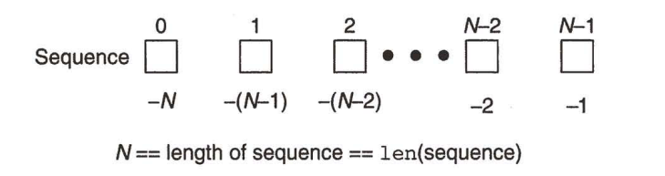
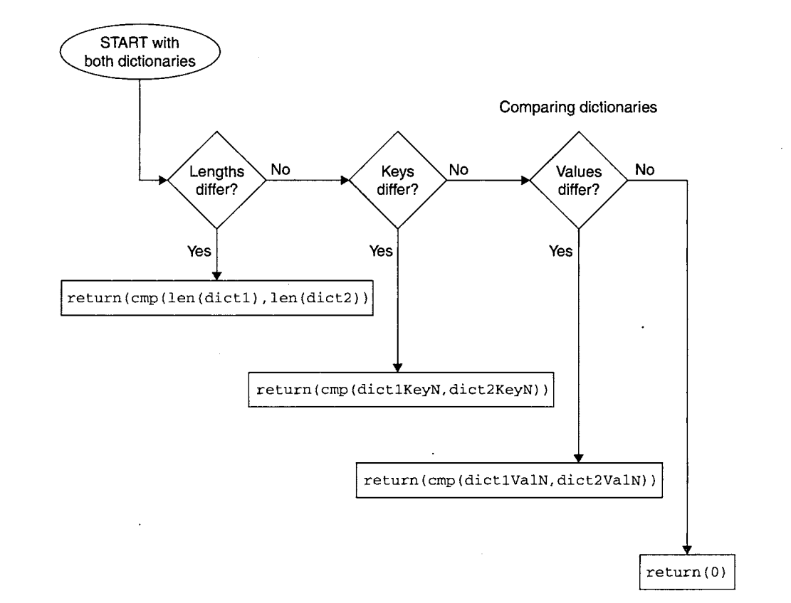

# Python序列和字典

### 本节重点
>* 理解Python的序列的基本概念.
>* 掌握字符串/列表/元组/字典的基本使用方法.
>* 理解列表和元组的区别和各自的应用场景.
>* 理解Python中的深拷贝和浅拷贝.
>* 理解字典 "键值对" 这样的概念.

## 序列

### 序列的概念
包含若干个元素, 元素有序排列, 可以通过下标访问到一个或者多个元素. 这样的对象, Python中统一称为序列(Sequence).  

Python中的以下对象都属于序列
>* 字符串
>* 列表
>* 元组

同是序列, 他们的使用方式有很多相通之处.

### 标准类型操作符
>* 下列标准类型操作符, 大多数情况下都是适用于序列对象的(少部分特例是, 序列中保存的元素不支持标准类型操作符). 


### 序列类型操作符
>* in/not in: 判定一个元素是否存在于序列中, 返回布尔值.

	a = [1, 2, 3, 4]
	print 1 in a 

>* 连接操作符(+): 把两个相同类型的序列进行连接.
>* 连接操作符往往并不高效(新创建对象, 把原有对象拷贝进去). 对于列表, 推荐使用extend来完成这样的操作; 对于
>, 推荐使用join这样的方法.

	a = [1, 2, 3, 4]
	b = [5, 6]
	print a + b       # 返回一个新的列表, 包含了a和b中的所有元素.

>* 重复操作符(*): 让一个序列重复N次.

	a = [1, 2, 3, 4]
	print a * 2
	
	# 执行结果
	[1, 2, 3, 4, 1, 2, 3, 4]

### 序列的切片操作

>* 切片操作符([], [:], [::]): 通过下标访问其中的某一个元素, 或者某个子序列. 



>* 正数的索引以序列的起始位置作为起点, 负数的索引以序列的结束位置做为起点.
>* 试图访问一个越界的索引, 会引发异常(我们后面会讲啥是异常, 现在可以简单理解成程序执行出错).

	a = [1, 2, 3, 4]
	print a[100] 
	
	# 执行结果
	Traceback (most recent call last):
	  File "test.py", line 3, in <module>
	    print a[100]
	IndexError: list index out of range

例如, 我们有一个长度为5的序列, 我们看一下各种情况的切片操作

>* 下图为 Sequence[:]


>* 下图为 Sequence[0:3] 或者 Sequence[:3]


>* 下图为 Sequence[2:5] 或者 Sequence[2:]


>* 下图为 Sequence[1:3]


>* 下图为 Sequence[3]


>* 扩展切片操作[::] 除了可以表示子序列的起始和结束位置, 还可以表示 "步长"

	a = [1, 2, 3, 4, 5]
	print a[::2]        # 每隔一个元素取一个子元素.
	
	# 执行结果
	[1, 3, 5]

**又到了见证奇迹的时刻了~~~**


字符串翻转, 这是一个非常基础, 也是笔试面试中会经常出现的一个题目. 我们学过C/C++, 有三种方法来解决这个问题.

**普通青年**

	char str[] = "abcdefg";
	
	char* beg = str;
	char* end = str + strlen(str);
	
	while (beg < end) {
		swap(*beg++, *--end);
	}

**2B青年**
	
	char str[] = "abcdefg";
	
	Stack stack;
	char* p = str;
	while(p) {
		stack.push(*p++);
	}
	
	int index = 0;
	while(!stack.empty()){
		str[index++] = stack.top();
		stack.pop();
	}

都别笑~~这是老湿当年校招遇到的真实的笔试题, , , 周围的同学很多就是这么写的.


**文艺青年**

	#include <algorithm>
	char str[] = "abcdefg";
	
	std::reverse(str, str + strlen(str));

好了, 咱们看看Python是怎么做的. 比文艺青年还文艺~~

	a = "abcdefg"
	print a[::-1]

此时此刻, 我的心情只能用一个字形容


>* 另外, 对于切片语法来说, 下标越界也没关系. 因为取的是前闭后开区间. 区间里的元素, 能取到多少就取到多少. 

### 序列内建函数
>* len: 返回序列的长度.

	a = [1, 2, 3, 4]
	print len(a)
	
	# 执行结果
	4

>* max: 返回序列中的最大值

```python
a = [1, 2, 3, 4]
print max(a)

# 执行结果
4
```

>* min: 返回序列中的最小值

	a = [1, 2, 3, 4]
	print min(a)
	
	# 执行结果
	1

>* sorted: 排序. 这是一个非常有用的函数. 返回一个有序的序列(输入参数的副本).

	a = [1, 3, 4, 2]
	print sorted(a)
	
	# 执行结果
	[1, 2, 3, 4]

sorted可以支持**自定制排序规则**

例子1: 逆序排序

	a = [1, 3, 4, 2]
	print sorted(a, reverse=True)
	
	# 执行结果
	[4, 3, 2, 1]

例子2: 按元素的绝对值排序

	def Cmp(x, y):
	    if abs(x) < abs(y):
	        return -1
	    elif abs(x) > abs(y):
	        return 1
	    else:
	        return 0
	
	a = [1, -3, 4, 2]
	print sorted(a, cmp = Cmp)
	
	# 执行结果
	[1, 2, -3, 4]

例子3: 按字符串的长度排序

	a = ['aaaa', 'bbb', 'cc', 'd']
	print sorted(a, key = len)
	
	# 执行结果
	['d', 'cc', 'bbb', 'aaaa']

>* sum: 序列中的元素求和(要求序列中的元素都是数字)

	a = [1, 2, 3, 4]
	print sum(a)
	
	# 执行结果
	10

>* enumerate: 同时枚举出序列的下标和值. 这个是一个非常有用的函数, 可以避免很多丑陋的代码.

回忆我们之前写过的, 找出元素在列表中的下标.

	def Find(input_list, x):
	for i in range(0, len(input_list)):
	    if input_list[i] == x:
	        return i
	else:
	    return None

这里我们的for循环写的就不够优雅, 使用enumerate可以得到一种更优雅的写法.

	def Find(input_list, x):
	    for i, item in enumerate(input_list):
	        if item == x:
	            return i
	    else:
	        return None

>* zip: 这个函数的功能, 不太好用语言表达, 我们看代码.

	x = [1, 2, 3]
	y = [4, 5, 6]
	z = [7, 8, 9, 10]
	
	print zip(x, y, z)
	
	# 执行结果
	[(1, 4, 7), (2, 5, 8), (3, 6, 9)]

zip其实可以理解成矩阵的 **行列互换**


zip的一个比较常见的用法, 就是构造字典.

	key = ('name', 'id', 'score') 
	value = ('tangzhong', 1234, 60)
	d = dict(zip(key, value))
	print d
	
	# 执行结果
	{'score': 60, 'name': 'tangzhong', 'id': 1234}

## 字符串

### 三种引号的区别
>* Python中单引号(')字符串和双引号(")字符串是等价的. 而不像有些编程语言(比如Linux Shell), 转义字符只在双引号中有效.
>* Python中使用 "原始字符串" 来完成这样的功能(我们稍后再说)
>* 三引号('''/""")相比于前两种的区别是, 可以跨多行.

### 理解字符串 "不可变"
>* 字符串实际上是不可变的对象. 你不能修改这个字符串, 只能创建一个新的字符串.

	a = 'aaaa'
	a[0] = 'b'
	print a
	
	# 执行结果
	Traceback (most recent call last):
	  File "test.py", line 3, in <module>
	    a[0] = 'b'
	TypeError: 'str' object does not support item assignment

要打到同样的效果, 我们可以这么做

	a = 'b' + a[1:]  # 重新生成一个对象. 并使用a这个引用绑定到这个对象.
	print a
	
	# 执行结果
	baaa

### 字符串的标准类型操作符
>* ==, !=, <, <=, >, >= 这些操作符的行为前面已经提到过. 不赘述了.
>* 需要记得字符串比较大小是按照字典序.
>* in/not in的规则和序列的规则一致.
>* 切片操作和序列规则一致.

### 只适用于字符串的操作符
>* %: 格式化替换. 回忆我们之前的例子.

	x = 1
	print "x = %d" % x
	
	# 执行结果
	x = 1

支持以下这些格式化字符串


### 原始字符串(raw strings)
>* 有的时候, 我们需要有 \n 这样的字符作为转义字符. 但是有些时候我们又不希望进行转义, 只需要原始的 \n 作为字符串的一部分.

举个例子, QQ发消息时, 有一个 "表情快捷键" 的功能. 这个功能就相当于 "转义字符".<br>
当开启了这个功能之后, 在输入框中输入 `/se` 就会被替换成一个表情. 比如我给同事发一个目录 `/search/odin` (这本来是表示linux上的一个目录)


这种情况下, 我们需要关闭 "表情快捷键" 功能. 对于Python来说, 我们就可以使用原始字符串来解决这个问题.

>* 在字符串字面值前加上 r或者R 前缀, 表示原始字符串(同学们想想, 为啥前缀是 r ?).

	print r'hello\nworld'
	
	# 执行结果
	'hello\nworld'

### repr函数和反引号操作符
>* 我们前面讲了, 用str函数可以将一些对象转换成字符串. repr也有类似的效果.

	a = 1
	print repr(a)
	
	a = 1.0
	print repr(a)
	
	a = [1, 2, 3, 4]
	print repr(a)

看起来好像和str没啥区别, 我们再看两个例子

	print str(1.0/7.0)
	print repr(1.0/7.0)
	
	# 执行结果
	0.142857142857
	0.14285714285714285

不仅仅是精确度的问题, 再看这个

	print str('hello')
	print repr('hello')
	
	# 执行结果
	hello
	'hello'

总结一下, str转换出的字符串是给人看的. 而repr转换出的字符串, 是给Python解释器看的. 意思是说, repr得出的结果, 其实是一个Python语句, 可以直接放到解释器里执行~

>* 反引号, 和repr函数等价

### string 模块常用函数
>* Python标准库提供了string模块, 包含了很多非常方便实用的函数

<br>
<br>
<br>
<br>

不一一解释了, 我们挑几个常用的举例: 
	
将序列中的字符串合并成一个字符串.

	a = ['aa', 'bb', 'cc', 'dd']
	print " ".join(a)         
	
	# 执行结果
	'aa bb cc dd'

按空格将字符串分割成列表

	a = 'aa bb cc dd'
	print a.split(' ')      
	
	# 执行结果
	['aa', 'bb', 'cc', 'dd']

判定字符串开头结尾

	a = 'hello world'
	print a.startswith('hello')
	print a.endwith('world')
	
	# 执行结果
	True
	True

去除字符串开头结尾的空格/制表符

	a = '     hello world                '
	print a.strip()
	
	# 执行结果
	hello world

左对齐/右对齐/中间对齐

	a = 'hello world'
	print '[' + a.ljust(30) + ']'
	print '[' + a.rjust(30) + ']'
	print '[' + a.center(30) + ']'
	
	# 执行结果:
	[hello world                   ]
	[                   hello world]
	[         hello world          ]

查找子串

	a = 'hello world'
	print a.find('world')
	
	# 执行结果
	6

替换子串(记得字符串是不可变对象, 只能生成新字符串).
	
	a = 'hello world'
	print a.replace('world', 'python')
	
	# 执行结果
	hello python

判定字符串是字母/数字

	a = 'hello world'
	print a.isalpha()
	a = '1234'
	print a.isdigit()
	
	# 执行结果
	True
	True

转换大小写

	a = 'Hello World'
	print a.lower()
	print a.upper()
	
	# 执行结果
	hello world
	HELLO WORLD

### 不可见字符和转义字符(课后作业)
请同学们自行查阅资料, 了解ascii中的不可见字符在Python中都如何表示.

### 关于结束符
学过C语言的同学, 可能会问, Python的字符串是否需要 '\0' 之类的结束符来做结尾?

并不是!!
>* Python中并没有那个讨厌的 '\0'. 准确的说, 对于C语言来说, 语言本身的缺陷并不支持 "字符串类型", 才被迫使用字符数组来凑合. 但是Python完全没有这个包袱.

## 列表
字符串只能由字符组成, 而且不可变; 但是列表中可以包含任意类型的对象, 使用更加灵活.<br>

### 使用切片操作符访问列表元素
>* 列表的切片操作和字符串完全一致.
>* 但是列表还可以使用切片操作修改元素.

	a = [1, 2, 3, 4]
	a[0] = 100
	print a
	
	# 执行结果
	[100, 2, 3, 4]

### 列表常用操作
>* append: 追加元素

	a = [1, 2]
	a.append(3)
	print a
	
	# 执行结果
	[1, 2, 3]

>* 删除指定下标元素

	a = [0, 1, 2]
	del a[0]
	print a
	
	# 执行结果
	[1, 2]

>* 按值删除元素

	a = [1, 2, 3]
	a.remove(1)
	print a
	
	# 执行结果
	[2, 3]

>* 列表比较操作: ==/!= 为判定所有元素都相等, 则认为列表相等; < <= > >= 则是两个列表从第一个元素开始依次比较, 直到某一方胜出.

	a = ['abc', 123]
	b = ['xyz', 789]
	c = ['abc', 123]
	print a < b
	print b < c
	print b > c and a == c
	
	# 执行结果
	True
	False
	True

>* in/not in: 和序列操作完全一致
>* 连接操作符(+): 和序列操作完全一致
>* extend: 列表连接. 可以理解成 += (列表不支持 += 运算符)

	a = [1, 2]
	a.extend([3, 4])
	print a
	
	# 执行结果
	[1, 2, 3, 4]

>* 重复操作符(*): 和序列操作完全一致

### 列表类型内建函数


列表自身是可变对象, 因此有些方法是修改自身的, 这种情况下的方法并没有返回值, 这和字符串操作必须要生成一个新对象, 并不相同.

例如, 排序. 我们前面讲序列的时候, 有一个内建函数sorted, sorted生成了一个新的有序的序列. 列表自身还有一个成员函数, sort, 是基于自己本身做修改, 并不生成新对象.

	a = [1, 3, 2, 4]
	a.sort()
	print a
	
	# 执行结果
	[1, 2, 3, 4]

关于sort方法, 默认使用归并排序的衍生算法. 时间复杂度是 O(N*log(N))

### 基于列表的堆栈
>* 我们回顾一下数据结构中的堆栈, 这是一种后进先出的数据结构. 可以很容易使用列表进行模拟

	a = []
	a.append(1)       # push操作
	print a[-1]       # top操作, 取栈顶元素
	a.pop()           # pop操作, 删除末尾元素

### 基于列表的队列
>* 我们回顾一下数据结构中的队列, 这是一种先进先出的数据结构. 也可以很容易使用列表模拟

	a = []
	a.append(1)       # push 操作
	print a[0]        # 取队首元素
	a.pop(0)          # pop操作, 出队列

### 列表的深拷贝/浅拷贝
先看下面的例子

	a = [100, [1, 2]]
	b = a
	c = list(a)
	d = a[:]
	print id(a), id(b), id(c), id(d)
	a[0] = 1
	print a, b, c, d
	a[1][0] = 1000
	print a, b, c, d
	print id(a[1]), id(c[1]), id(d[1])
	
	# 执行结果
	140541879626136 140541879626136 140541879655672 140541879655744
	[1, [1, 2]] [1, [1, 2]] [100, [1, 2]] [100, [1, 2]]
	[1, [1000, 2]] [1, [1000, 2]] [100, [1000, 2]] [100, [1000, 2]]
	139973004362816 139973004362816 139973004362816

结果稍微有点复杂, 我们一点一点分析
>* 定义一个列表对象a.
>* 基于a, 用三种方式创建了b, c, d
>* 首先可以看到, b和a实际上是同一个对象. 而c和d都已经是新的列表对象了.
>* 修改 `a[0]` 可以看到, a和b的值都收到了影响. 但是c和d不受影响, 这个符合我们上一条的结论.
>* 再修改 `a[1][0]=1000` 这时候惊奇的发现, c和d的内容也收到影响了!!! 
>* 这时候我们猜测, a, b, c, d的下标为1的列表元素, 其实都是同一个对象. 打印出id, 证明了我们的猜测.


总结:
>* 列表的赋值(=), 切片操作([:]), list工厂函数, 都是在进行浅拷贝. 
>* 浅拷贝是指, 虽然我重新创建了一个新对象, 但是新对象里面包含的子对象, 和原来的子对象是同一个对象.
>* 相对应的, 深拷贝就是指, 重新创建了一个新对象, 同时这个新对象的子对象, 也都是重新创建了一份新的深拷贝对象.
>* 深拷贝通过 `copy.deepcopy` 来完成

	import copy
	a = [100, [1, 2]]
	b = copy.deepcopy(a)
	print id(a[1]), id(b[1]) 
	
	# 执行结果
	139818205071552 139818205117400

这次我们看到, `a[1]` 和 `b[1]` 不再是一个对象了.

>* 不光是列表, 其他容器, 例如元组, 字典, 也存在类似的深浅拷贝问题. 原理和列表相同.
>* 需要注意的是, 并不一定调用了deepcopy就一定会执行深拷贝, Python解释器自己也会根据具体的情况, 比如某些不适合深拷贝的情况, 不会触发深拷贝.

	import copy
	a = (100, 'aaa')
	b = copy.deepcopy(a)
	print id(a[0]), id(a[1]), id(b[0]), id(b[1])
	
	# 执行结果
	6783664 140700444542616 6783664 140700444542616

想想这是为啥? <br>
我们要回到最原始的问题上, 我们为什么要深拷贝? 其实是防止其中一份数据修改了, 会影响到其他数据的结果. 那么我们想想, 形如 (100, 'aaa') 这样的对象, 有可能会修改嘛?

## 元组
元组的很多操作都和列表一致. 唯一的区别是元组的内容是只读的.

### 使用切片访问元组元素
>* 规则和序列相同. 此处不再赘述.

### 元组常用操作
>* 比较运算符, 规则和列表相同.
>* 连接操作(+), 重复操作(*), 判定元素存在(in/not in)都和列表相同.
>* 由于元组不可变, 所以并不支持append, extend, sort等修改自身的操作.

### 默认集合类型
>* 所有的多个对象, 按逗号分隔的, 其实都是元组.

回忆我们之前那个牛逼闪闪的交换两个元素的值的代码.

	x, y = y, x

其实, `x, y` 就是一个元组. 通过 `y, x` 这个元组创建了一个新的元组.

	>>> x, y = 1, 2
	>>> x, y
	(1, 2)

### 理解元组的 "不可变"
>* 元组的 "不可变" 指的是元组元素的id不可变. 就是说一个元组包含了几个对象, 然后不可以给这个元组再添加或者删除其中的某个对象, 也不可以将某个对象改成其他的对象.
>* 如果元组中的某个元素, 是可变对象(比如列表或字典), 那么仍然是可以修改的.

	a = ([1, 2, 3], [4, 5, 6])
	a[0][0] = 100        # 这个东西是不是看起来长的很像C语言的 "二维数组" ?
	print a
	
	# 执行结果
	([100, 2, 3], [4, 5, 6])

**元组存在的必要性：**"不可变" 真的有必要嘛? 假如我们只是用列表, 能否应付所有的应用场景呢? <br>
答案是否定的. 既然Python的设计者提供了元组这个对象, 那么一定有一些情况下, 只有元组能胜任, 但是列表无法胜任. 

例如: 
>* 你有一个列表, 现在需要调用一个API进行一些处理. 但是你有不是特别确认这个API是否会把你的列表数据弄乱. 那么这时候传一个元组就安全很多.
>* 我们马上要讲的字典, 是一个键值对结构. 要求字典的键必须是 "可hash对象" (字典本质上也是一个hash表). 而一个可hash对象的前提就是不可变. 因此元组可以作为字典的键, 但是列表不行. 

## 字典
Python的字典是一种映射类型数据. 里面的数据是 **键值对** . Python的字典是基于hash表实现的. 
>* 键(key): 字典的键是唯一的(一个字典对象中不能有两个相同的键). 同时字典的键必须是可hash的(能够计算出一个固定的hash值)
>* 值(value): 字典的值没啥限制. 数字, 字符串, 以及其他容器, 都可以作为字典的值.

### 创建字典
>* 使用 { } 的方法, 我们前面已经介绍过了
>* 使用工厂方法 dict 

	a = dict(['x', 1], ['y', 2])

>* 使用字典的内建方法 fromkeys

	a = {}.fromkeys(('x', 'y), 0)
	print a
	
	# 执行结果
	{'x':0, 'y':0}

>* 字典的键和值的类型, 不需要相同.

### 访问字典中的元素
>* 使用 [] 可以获取到元素的值.
>* for循环遍历字典中的元素

	a = {'x':0, 'y':0}
	for i in a:
		print i, a[i]
	
	# 执行结果
	y 0
	x 0

注意, 字典中的键值对, 顺序是不确定的(回忆hash表的数据结构, 并不要求key有序).

### 修改字典元素
>* 使用 [] 可以新增/修改字典元素. 如果key不存在, 就会新增; 如果已经存在, 就会修改.

	a = {}
	a[1] = 100
	print a
	a[1] = 200
	print a
	
	# 执行结果
	{1:100}
	{1:200}

>* 使用del来删除某一个键值对

	a = {1:100}
	del a[1]
	print a
	
	# 执行结果
	{}

>* 使用clear方法, 清空整个字典中所有的键值对

	a = {1:100, 2:200}
	a.clear()
	print a
	
	# 执行结果
	{}

>* 使用pop函数, 删除键值对, 同时获取到值

	a = {1:100, 2:200}

注意: 字典也是可变对象. 但是键值对的key是不能修改的. 

### 查找元素是否是字典的key
>* 使用in/not in来判定一个key是否在字典中.

### 标准类型操作符(选学)
>* 字典的 == != < <= > >= 的规则和序列就不太一样了~
>* 两个字典的key和value都完全相等, 那么才是字典相等.
>* 字典之间的大小关系参见下图.



实际上, 字典比较这样的操作, 实践中基本用不到. 大家对这个比较规则稍微有点印象就可以了.

### 常用内置函数
>* len: 字典中键值对的数目
>* hash: 判定一个对象是否可hash. 如果可hash, 则返回hash之后的hashcode. 否则会运行出错.

	print hash(())
	print hash([])
	
	# 执行结果
	3527539
	Traceback (most recent call last):
	  File "test.py", line 4, in <module>
	    print hash([])
	TypeError: unhashable type: 'list'

>* keys: 返回一个列表, 包含字典的所有的key
>* values: 返回一个列表, 包含字典的所有value
>* items: 返回一个列表, 每一个元素都是一个元组, 包含了key和value

	a = {'x':0, 'y':1}
	print a.items()
	
	# 执行结果
	[('y', 1), ('x', 0)]

## 集合(set) (选学)
集合是基于字典实现的一个数据结构. 集合数据结构实现了很多数学中的交集, 并集, 差集等方法, 可以很方便的进行这些操作. <br>
集合的使用方法很简单, 同学们课后自学.

**注意!!** 熟练掌握集合操作, 对我们后续解笔试题面试题, 都会有很大帮助.

集合基本操作

	a = set([1, 2, 3])
	b = set([1, 2, 3, 4])
	
	print a & b      # 取交集
	print a | b      # 取并集
	print b - a      # 取差集
	print a ^ b      # 取对称差集(项在a中或者在b中, 但是不会同时存在于a和b中)

数据去重

	a = [1, 1, 2, 2, 3, 3]
	b = set(a)
	
	print b


​	


​	
