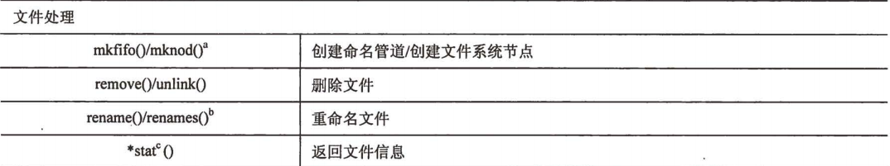

# Python文件操作

### 本节重点
>* 掌握文件基本操作
>* 掌握文件系统基本操作
>* 能够结合之前学习的知识, 写出一些实用程序.

## 文件的基础操作
### 打开/关闭文件
>* 内建函数open, 能够打开一个指定路径下的文件, 返回一个文件对象.
>* open最常用的有两个参数, 第一个参数是文件名(绝对路径或者相对路径), 第二个是打开方式, 'r'/'w'/'a'/'b', 表示读(默认)/写/追加写/二进制.

**关于内建函数**: 

>* 我们反复遇到了 "内建函数" 这个词. 内建函数其实是包含在 `__builtins__` 这个模块中的一些函数. 
>* 而 `__builtins__` 这个模块Python解释器会自动包含.
>* 使用 `dir(__builtins__)` 可以看到Python中一共有哪些内建函数.

**关于文件对象**: 

>* 我们学习C语言知道`FILE*`, 通过`FILE*`进行文件读写操作. 
>* 我们学习Linux时又知道, `FILE*`结构中其实包含了文件描述符, 操作系统是通过文件描述符来对文件操作的.
>* Python的文件对象, 其实也包含了文件描述符, 同时也包含了这个文件的一些其他属性. 本质上也是通过文件描述符完成对文件的读写操作.
>* 既然文件对象包含了文件描述符, 我们知道, 一个进程可操作的文件描述符的数目是有上限的. 因此对于用完了的文件描述符要及时关闭.

	f = open('test.txt', 'r')    # 打开文件
	f.close()                    # 关闭文件

>* 当文件对象被垃圾回收器销毁时, 也会同时释放文件描述符.
>* 如果文件打开失败(例如文件不存在), 就会执行出错.

	f = open('aaa.txt', 'r')
	
	# 执行结果
	Traceback (most recent call last):
	  File "test.py", line 3, in <module>
	    f = open('aaa.txt', 'r')
	IOError: [Errno 2] No such file or directory: 'aaa.txt'

### 读文件
>* read: 读指定长度字节数的数据, 返回一个字符串(不是很常用).
>* readline: 读取一行数据, 返回一个字符串, 
>* readlines: 读取整个文件, 返回一个列表. 列表中的每一项是一个字符串, 代表了一行的内容.
>* 直接使用 `for line in f` 的方式循环遍历每一行. 功能和readline类似. 一次只读一行, 相比于readlines占用内存少.

	f = open('test.txt', 'r', encoding='utf-8')
	print f.readlines()

>* 注意, readline或者readlines这些函数仍然会保留换行符. 所以我们往往需要写这样的代码来去掉换行符.

	for line in f.readlines():
		print line.strip()
	
	# 或者
	
	data = [line.strip() for line in f.readlines()]      # 还记得我们的列表推导语法嘛~

### 写文件
>* write: 向文件中写一段字符串. 
>* 如需写文件, 必须要按照 'w' 或者 'a' 的方式打开文件. 否则会写失败.

	f = open('test.txt', 'w')
	f.write('aaaaaaaaaaaaa')
	
	# 执行结果
	Traceback (most recent call last):
	  File "test.py", line 4, in <module>
	    f.write('aaaaaaaaaaaaa')
	IOError: File not open for writing

>* writelines: 参数是一个列表, 列表中的每一个元素是一个字符串.
>* 并没有一个 writeline 这样的函数. 因为这个动作等价于 write 时在字符串后面加上 '\n'. 同理, 使用writelines的时候, 也需要保证每一个元素的末尾, 都带有 '\n'

### 关于读写缓冲区
>* 学习Linux我们知道, C语言库函数中的fread, fwrite和系统调用read, write相比, 功能是类似的. 但是fread/fwrite是带有缓冲区的. 
>* Python的文件读写操作, 既可以支持带缓冲区, 也可以选择不带缓冲区.
>* 在使用open函数打开一个文件的时候, 其实还有第三个参数, 可以指定是否使用缓冲区, 以及缓冲区的大小是多少.
>* 使用flush方法可以立即刷新缓冲区.

### 操作文件指针
文件具备随机访问能力. 这个过程是通过操作文件指针完成的.
>* 
>
>
>
>
>
>
>
>
>
>
>
>
>
>
>
>
>
>
>
>
>
>
>
>
>
>
>
>
>
>
>: 将文件指针移动到从文件开头算起的第几个字节上. 有两个参数. 第一个参数offset表示偏移的字节数. 第二个参数whence表示偏移量的起始位置在哪. 值为0, 表示从开头计算, 值为1, 表示从当前位置, 值为2, 表示从文件结尾位置.
>
>* tell: 获取当前文件指针指向的位置. 返回当前位置到文件开头的偏移量.

### 文件对象内建属性

 
 

### with语句和上下文管理器
>* 我们刚才说了, 用完的文件对象, 要及时关闭, 否则可能会引起句柄泄露.
>* 但是如果逻辑比较繁琐, 或者我们忘记了手动调用close怎么办?
>* C++中使用 "智能指针" 这样的方式来管理内存/句柄的释放, 借助对象的构造函数和析构函数, 自动完成释放过程.
>* 但是Python中对象的回收取决于GC机制, 并不像C++中时效性那么强.
>* Python中引入了上下文管理器来解决这类问题.

	with open('out') as f:
   		print ''.join(f.readlines())

>* 在with语句块内进行文件操作. 当文件操作完毕之后, 出了with语句之外. 就会自动执行f的关闭操作.
>* 一个支持上下文协议的对象才能被应用于with语句中. 我们将这种对象称为**上下文管理器**. Python中很多内置对象都是上下文管理器, 例如文件对象, 线程锁对象等.
>* 关于上下文管理器的细节, 我们后面再讨论.

### 代码示例: 基于一个简单文本, 构造一个大文本(构造测试数据)

	import sys
	
	input_file_path = sys.argv[1]
	output_file_path = sys.argv[2]
	output_size = int(sys.argv[3]) * 1024 * 1024
	
	input_file = open(input_file_path)
	input_data = input_file.readlines()
	
	output_file = open(output_file_path, 'w')
	index = 0
	totol_size = 0
	while True:
	    if totol_size > output_size:
	        break
	    output_file.write(input_data[index % len(input_data)])
	    totol_size += len(input_data[index % len(input_data)])
	    index += 1

### 代码示例: 实现简易less命令
>* 我们使用vim打开上个例子中生成的文件, 发现打开速度很慢(因为vim要把所有的数据都读到内存中).
>* 我们使用less命令打开文件, 就很流畅(因为less只读当前一个屏幕的内容).
现在我们使用Python实现一个简易的less命令. 按回车翻屏

	#!/usr/bin/python
	import os, sys
	
	def PrintScreen(f):
	    line_num = 0
	    for line in f:
			print line,
	        if line_num > 25:
	            break
	        line_num += 1
	
	path = sys.argv[1]
	f = open(path)
	while True:
	    os.system('clear')
	    PrintScreen(f)
	    commond = raw_input(':')
	    if commond == 'q':
	        break

>* 将程序重命名为 `myless` , 并拷贝到 `/usr/bin` 目录下. 即可方便的使用.
>* [作业1] 修改程序, 实现按j键, 能够下翻一行(提示, 将文件按行读取一定数目, 存放到列表中, 下翻时, 再读一行文件, 同时更新列表中的内容)
>* [作业2] 修改程序, 实现按k键, 能够上翻一行(提示, 将文件指针向前移动一定的字节数并read出来, 从后向前找到第一个'\n'即为前一行, 注意处理边界条件)
>* [作业3(选做)] 使用raw_input监控键盘输入, 需要输入一个字符之后, 按回车, 程序才能响应. 是否有办法不敲回车, 直接只按j/k这样的键, 是程序立刻响应? (提示, 有两种方案, 1. 捕捉键盘事件; 2. 修改终端的输入响应方式, 可以使用curses库).

## 文件系统的基础操作
### 文件路径操作
os.path这个模块中, 包含了一些实用的路径操作的函数

 
 
 

我们举几个最常用的例子

	import os.path
	print os.path.basename('/home/tangzhong/test.py')
	print os.path.dirname('/home/tangzhong/test.py')
	print os.path.split('/home/tangzhong/test.py')
	print os.path.splitext('/home/tangzhong/test.py')
	
	# 执行结果
	test.py
	/home/tangzhong
	('/home/tangzhong', 'test.py')
	('/home/tangzhong/test', '.py')

### 常用文件系统操作
os模块中包含了很多对文件/目录的基础操作, 参见下表.

 
 	
	
### 代码示例: 用Python生成一个Python的Hello World文件并执行

	import os, stat
	if os.path.exists('hello.py'):
	    os.remove('hello.py')
	os.mknod('hello.py')
	f = os.open('hello.py', os.O_RDWR)
	os.write(f, '#!/usr/bin/python\nprint "hello world"')
	os.close(f)
	os.chmod('hello.py', stat.S_IRUSR | stat.S_IXUSR)
	os.system('./hello.py')
	
	# 执行结果
	hello world

注意:
>* 虽然os模块中也提供了open, read, write系列函数, 可以用于读写文件.
>* 内建open返回的是文件对象. os.open返回的是文件描述符.
>* 我们实际使用中仍然更推荐使用内建函数open创建文件对象, 并使用文件对象的读写操作来操作文件. 因为文件对象使用起来更方便一些. 
>* 使用os.system函数来执行一个程序.

### 代码示例: 实现ls命令

	#!/usr/bin/python
	import os, sys
	
	path = sys.argv[1]
	for f in os.listdir(path):
	    print f,

>* sys.argv能够获取到命令行参数.
>* print 后加一个 , 可以在打印两个结果之间使用空格分割(而不是换行) 
>* 将这个python代码文件命名为 `myls` , 并拷贝到 `/usr/bin` 目录下, 就可以达到和系统自带的ls类似的效果.
>* [作业] 实现 ls -l
### 代码示例: 遍历目录中的所有目录和文件

	#!/usr/bin/python
	import os,sys
	
	path = sys.argv[1]
	for root, dirnames, filenames in os.walk(path):
	    for filename in filenames:
	        print os.path.join(root, filename)

>* os.walk函数返回了一个三元组, 分别是路径, 目录名列表, 文件名列表.
>* os.walk会自动递归遍历path下的所有目录
>* 我们仍然把文件命名为 `mylsr` , 并拷贝到 `/usr/bin` 目录下, 就得到了一个能够遍历目录的程序

	# 执行效果
	mylsr ./
	./text.txt
	./calc_words.py
	./add.py
	./add.pyc
	./test.txt
	./hello.py
	./test.py
	./out

>* [作业1] 改进程序, 从命令行参数中读入一个文件名, 并删除指定文件.
>* [作业2] 不使用walk函数, 实现遍历目录下所有文件和子目录(提示, 使用递归)

>* 注意, 如果尝试执行比较大的目录, 比如 / 这种, 执行时间可能会很长~~		

### 代码示例: 将目录中的文件批量重命名(加上时间戳后缀)
>* 我们先构造一个这样的目录 `data`, 里面包含以下文件: `dict1, dict2, dict3`.
>* 通过程序, 自动的将data目录下, dict开头的文件, 加上时间戳后缀(精确到天).
>* time模块用于处理时间戳

	import os, time
	
	os.chdir('./data')
	date = time.strftime('%Y%m%d', time.localtime())
	[os.rename(file_name, file_name + '.' + date) for file_name in os.listdir('./') if file_name.startswith('dict')]  

### 代码示例: 按时间戳, 删除3天之前的指定文件

>* 参照上例, 文件命名形如 dict1.20171014 

	import os, datetime
	
	def CheckRemove(file_name):
	    current_date = datetime.datetime.now()
	    _, file_date_str = os.path.splitext(file_name)
	    file_date = datetime.datetime.strptime(file_date_str[1:], '%Y%m%d')
	    if (current_date - file_date).days >= 3:
	        print 'remove file:' + file_name
	        os.remove(file_name)
	
	path = './data/'
	os.chdir(path)
	[CheckRemove(file_name) for file_name in os.listdir('./') if file_name.startswith('dict')]    

>* 使用datetime类来计算日期差.
>* [作业1] 同学们自行改进程序, 通过命令行参数, 使程序能过处理指定目录下的N天之前的指定文件前缀的文件.
>* [作业2] 将这个文件加入到crontab命令中, 这样就成为了一个能清理文件的定时任务. 这种使用方法在服务器上定时清理日志非常常用.

### 代码示例: 通讯录
>* 用Python实现 "通讯录" . 功能要求和C语言课程中的一样. 实现的过程中体会Python和C语言的差异和优势. 

### 思考
同学们是否学过, C++操作文件系统操作相关的库函数? 这些库函数是否被吸纳到标准库中? 为什么要这么设计?