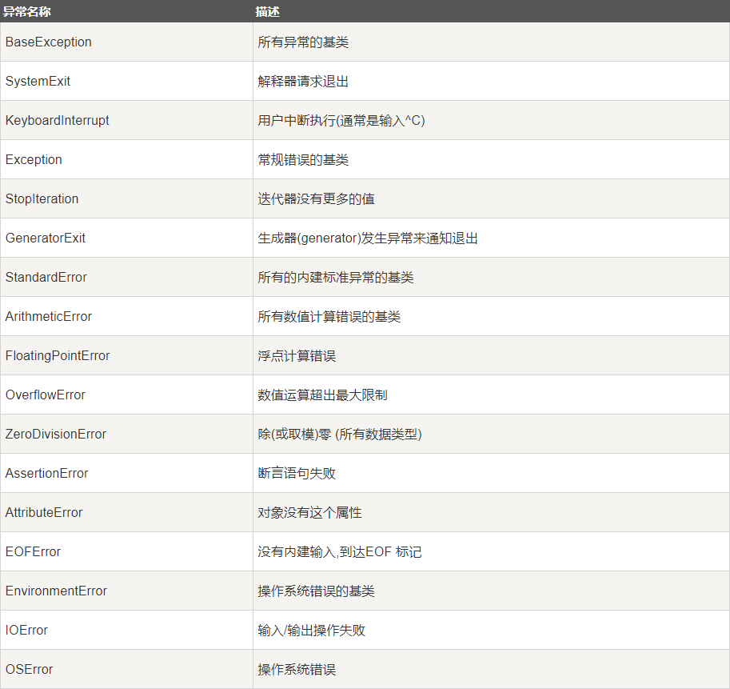
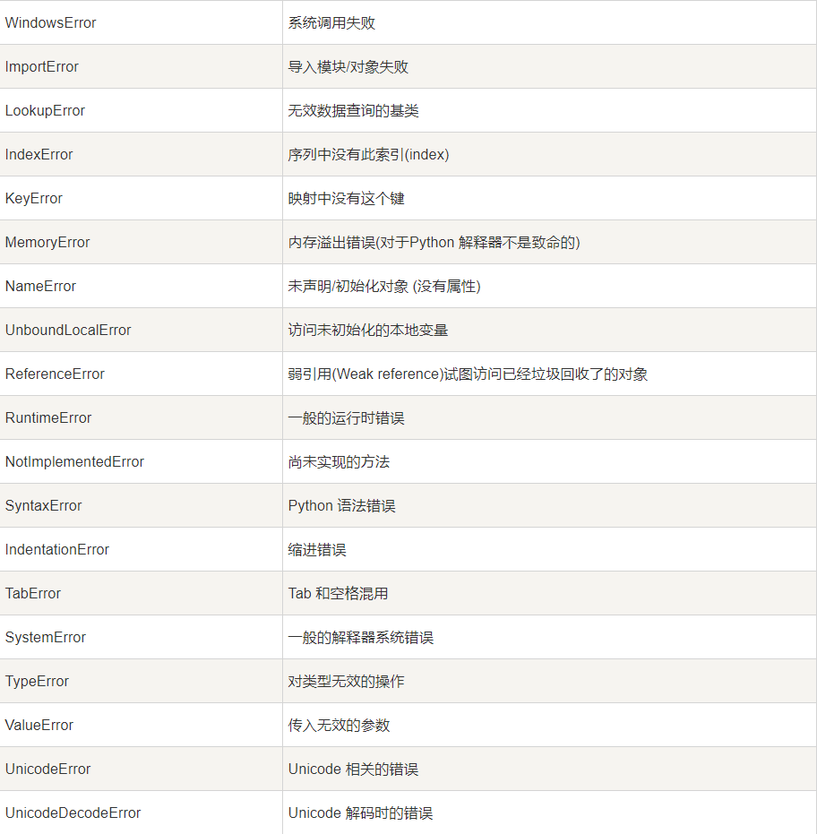
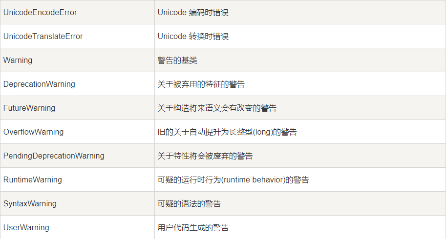

# Python 异常处理

### 本节重点
>* 理解异常的基本概念
>* 掌握Python中异常的基本使用方法

## 认识异常
在我们前面经常提到 "程序运行出错" 这样的概念. 实际上, 这是Python解释器抛出了一个 **异常**

### 异常的基本概念

>* 我们故意将 print 敲错, 解释器抛出了一个 `SyntaxError` 异常

	Print 'hello world'
	
	# 执行结果
	
	  File "test.py", line 3
	    Print 'hello'
	                ^
	SyntaxError: invalid syntax

>* 我们故意访问一个下标越界的列表, 解释器抛出了一个 `IndexError` 异常

	a = [1, 2, 3]
	print a[100]
	
	# 执行结果
	Traceback (most recent call last):
	  File "test.py", line 4, in <module>
	    print a[100]
	IndexError: list index out of range

>* 我们故意打开一个不存在的文件, 解释器抛出一个 `IOError` 异常

	f = open('aaaaaaaaaaaaaaa.txt')
	
	# 执行结果	
	Traceback (most recent call last):
	  File "test.py", line 3, in <module>
	    f = open('aaaaaaaaaaaaaaa.txt')
	IOError: [Errno 2] No such file or directory: 'aaaaaaaaaaaaaaa.txt'

总结一下:
>* 异常是指程序执行过程中, 发生了错误. 根据不同的错误类型, 抛出不同类型的异常.
>* 如果一个程序抛出了异常, 如果不对这个异常做任何处理, 默认行为就是导致程序运行终止.
>* 这里我们要把Python的异常和C++/Java的异常做一个区分. 因为Python是解释执行的, 所以语法错误和执行逻辑出现问题导致的错误都被Python统一成了异常. 而C++和Java会预先对代码进行编译. 如果语法出错, 在编译期就能检查出来. 因此C++和Java的异常只涵盖运行时的错误.

### 异常机制的意义
异常机制归根结底是想办法帮我们简化代码的错误处理逻辑.

我们看一段C语言的代码. 这是在C语言中常见的片段.
	
	  int fd = socket(AF_INET, SOCK_STREAM, 0);
	  if (fd < 0) {
	    perror("socket");
	    return 1;
	  }
	
	  int ret = bind(fd, (struct sockaddr*)&addr, sizeof(addr));
	  if (ret < 0) {
	    perror("bind");
	    return 1;
	  }
	
	  ret = listen(fd, 10);
	  if (ret < 0) {
	    perror("listen");
	    return 1;
	  }
	  ...

>* 调用一个函数, 有可能会调用失败. C语言中通常使用函数返回一个错误的值的方式来判定函数的成功失败. 因此每个函数调用完成, 往往需要检查一下函数都返回值.
>* 每调用一个函数, 都要围绕这个函数写一大堆处理错误情况的逻辑, 导致处理正常逻辑的代码, 和处理异常逻辑的代码混淆在一起. 
>* 通过异常处理机制, 就可以做到将正常逻辑和异常逻辑分离. 使代码的可读性更好.

	try:
		sock=socket(AF_INET, SOCK_STREAM)
		sock.bind(ADDR)
		sock.listen(5)
	except:
		print 'error'       # 可以进行其他复杂的处理

## 处理异常
>* 我们使用 try 语句来捕捉异常(可能触发异常的代码放到try中). 使用except来具体处理异常.
>* 如果异常能够被except捕捉到, 则不会影响程序继续执行.
>* IndexError, e相当于捕捉到的这个异常对象的名字为e. 这个异常对象中包含了异常的具体信息.

	a = [1, 2, 3]
	try:
		print a[100]
		print 'hello1'
	except IndexError as e:
		print type(e)
		print e
	print 'hello'
	
	# 执行结果
	<type 'exceptions.IndexError'>
	list index out of range
	hello

>* except可以指定一个具体的处理哪种类型异常. 如果try中抛出的异常类型, 不在except中, 那么仍然会程序终止.

	a = [1, 2, 3]
	try:
		print a[100]
		print 'hello1'
	except IOError, e:
		print e
	print 'hello'
	
	# 执行结果
	Traceback (most recent call last):
	  File "test.py", line 5, in <module>
	    print a[100]
	IndexError: list index out of range

>* 一个try语句, 可以和多个except语句联合工作. 

	a = [1, 2, 3]
	try:
		print a[100]
	except IOError, e:
		print e
	except IndexError, e:
		print e

>* 一个try语句, 还可以搭配else工作.

	a = [1, 2, 3]
	try:
		print a[1]
	except IndexError, e:
		print e             # 出现异常, 执行这个逻辑
	else:
		print 'process ok'  # 未出现异常, 执行这个逻辑

>* except可以不带具体的异常类型, 这样只要try中触发了任意的异常, except都能捕捉到.

	a = [1, 2, 3]
	try:
		print a[100]
	except:
		print 'process error'
	else:
		print 'process ok'

>* Python中内置的异常类, 其实都继承自 Exception 类. 所以上面的代码还可以写成

	a = [1, 2, 3]
	try:
		print a[100]
	except Exception, e:
		print e
	else:
		print 'process ok'

>* 如果想执行一些不管是否触发异常, 都要执行到的代码, 可以放到finally语句块中.

	try:
		f = open('text.txt')
		for line in f:
			print line
	except Exception, e:
		print e
	finally:
		f.close()                   # 无论try中是否触发异常, 都会调用到finally中的f.close()

## 抛出异常
>* 使用 `raise` 关键字在代码中 "抛出异常"

	# 我们实现一个函数做整数除法.
	def Divide(x, y):
	    if y == 0:
	        raise Exception('divide zero')
	    return x / y
	
	Divide(1, 0)
	
	# 执行结果
	Traceback (most recent call last):
	  File "test.py", line 8, in <module>
	    Divide(1, 0)
	  File "test.py", line 5, in Divide
	    raise Exception('divide zero')
	Exception: divide zero

>* 因为我们只是抛出了异常, 并没有捕捉异常, 程序还是执行终止了(但是错误信息是我们所定义的异常信息)
>* 略微修改一下程序, 捕捉一下异常.

	def Divide(x, y):
	    if y == 0:
	        raise Exception('divide zero')
	    return x / y
	
	try:
	    Divide(1, 0)
	except Exception, e:
	    print e
	
	# 执行结果
	divide zero

>* 所谓抛出的 "异常" 其实是一个对象. 我们 `Exception('divide zero')` 代码实际上是构造了一个异常对象. 这个对象的类型是Exception(Python异常的基类). 
>* 我们也可以自己实现一个自定制的异常类型. 具体方法我们课堂上不讲了, 课后感兴趣的同学自己试一试.

## 内置异常类
 
 
 