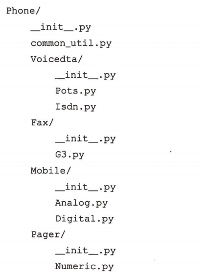
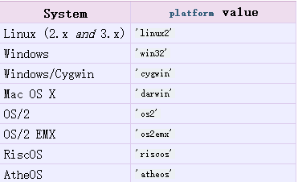

# Python的模块和包

### 本节重点
>* 理解模块和包的基本概念
>* 理解模块的导入过程
>* 熟悉sys模块和os模块中的一些重要操作

## 模块
### Python 模块初识
>* 当代码量比较大的时候, 我们最好把代码拆分成一些有组织的代码片段.
>* 每个代码片段里面包含一组逻辑上有关联的函数或者类. 
>* 每一个片段里放在一个独立的文件中. 这样的片段就称为**模块(module)**
>* 使用 `import` 可以在一个Python文件中引入其他的模块.

### 对比C语言的 include
>* 回忆我们C语言中, 如果一个文件想使用其他文件的功能, 通过 `#include` 的方式来引入一个头文件.
>* C语言的 `#include` 本质上是文本替换. 因此可能会导致一系列的问题(重复包含, 包含顺序相关).

### 模块也是对象
>* Python的模块则避免了C语言中的这些问题. import 实际上是创建了一个模块对象. 通过这个对象来访问模块中的具体方法.

	import os
	print type(os)
	print id(os)
	
	# 执行结果
	<type 'module'>
	140115706952960

### 模块的搜索路径
>* 我们尝试 import 一个模块名时, Python解释器必须要知道模块文件的路径
>* 例如, 我们此处有一个add.py, 那么对应的模块名就是add

	# 假设我们有文件bit/python/test.py, 和bit/add.py
	
	import add
	
	# 执行结果
	Traceback (most recent call last):
	  File "test.py", line 3, in <module>
	    import add
	ImportError: No module named add

>* Python从sys.path中查找模块.

	import sys
	print sys.path
	
	# 执行结果
	['/home/tangzhong/bit/python', '/usr/lib64/python27.zip', '/usr/lib64/python2.7', '/usr/lib64/python2.7/plat-linux2', '/usr/lib64/python2.7/lib-tk', '/usr/lib64/python2.7/lib-old', '/usr/lib64/python2.7/lib-dynload', '/usr/lib64/python2.7/site-packages', '/usr/lib64/python2.7/site-packages/gtk-2.0', '/usr/lib/python2.7/site-packages']

>* 我们可以看到, sys.path其实是一个列表. 里面的内容是Python的一些默认搜索路径. 如果我们想再加入一些新的路径, 直接修改sys.path即可.

	import sys
	sys.path.append('..')
	import add

>* import语句不一定非要写在源代码文件的最开始(当然, 还是推荐大家写在最上面).
>* 如果在多个目录中, 都存在相同名字的模块, 这个时候Python解释器会从前往后顺序查找, 把找到的第一个匹配的结果进行加载.

### 理解 "命名空间"
>* 名字冲突问题: 如果一个项目中的代码量很大, 那么很可能函数/类的名字会冲突. 因此C语言采用的方案是, 给函数名加一个又丑又长的前缀.

	void Huichuan_AdServer_Strategy_IndexAccessor_Load()

 

>* C++中使用命名空间来解决这个问题

	namespace Huichuan {
		namespace AdServer {
			namespace Strategy {
				namespace IndexAccessor {
					void Load()
				}
			}
		}
	}

>* Python的模块也相当于是命名空间. 例如 `os.path.exists` , 通过这样的层级结构, 将函数的名字组织起来, 就可以有效的避免命名冲突.

### import语句
>* import语句导入模块, 可以一次import一个, 或者一次import多个

	import os
	import sys
	
	# 或者
	
	import os, sys     # 使用 , 分割.

我们推荐使用第一种方式, 这样代码看起来更好看一些.

>* import语句的顺序: 我们推荐按 Python标准库, Python第三方库, 应用程序自定制模块 的顺序来import, 来提高我们代码的可读性.
>* 记住, 模块也是一个对象, 也有作用域这样的概念. 在函数内部import, 那么这个模块的作用域就是在这个函数内.

	def Func():
	    import sys
	    print 'In Func', sys.argv
	
	Func()
	print 'Out Func', sys.argv
	
	# 执行结果
	In Func ['test.py']
	Out Func
	Traceback (most recent call last):
	  File "test.py", line 8, in <module>
	    print 'Out Func', sys.argv
	NameError: name 'sys' is not defined

>* 记住, 既然模块也是一个对象, 那么也可以给这个对象赋值(相当于定义别名).

	import os.path
	
	p = os.path
	print p.exists('test.py')

这样可以一定程度上简化我们的代码(敲一个字符p肯定比敲一串字符os.path要方便).

### from-import 语句
>* import语句是直接导入一个模块. 而有时候我们只需要用到模块中的某一个或几个函数, 就可以使用from-import
>* from-import相当于把模块中的名字引入了当前文件的命名空间中.

	from os.path import exists
	print exists('test.py')        # 这个时候不需要敲 os.path 了.

>* 可以使用 `from module import * ` 的方式将module模块中的所有名字都导入进来. 但是不推荐这么用.

### import as语句
>* 前面我们使用赋值的方式, 给模块起了一个很短的别名. 实际上使用import-as可以更方便的完成这个动作

	import os.path as p
	print p.exists('test.py')

### 导入模块意味着 "被执行"
>* 模块导入意味着这个模块 "被执行" , 也就是说所有顶层的代码(无缩进部分的代码)都会被执行到. 这通常包括函数的定义和全局变量的定义.

	# 我们此处有两个Python文件: test.py和add.py
	# add.py
	print 'hello'
	
	# test.py
	import add
	
	# 执行结果
	hello

>* 这往往不是我们期望的结果(比如导入模块是打印了一些奇怪的日志), 我们只是想使用模块中的一些函数和变量. 因此往往我们在实现一个模块时, 只将函数定义/类定义放到顶层代码中.

### 理解 "导入" 和 "加载"
>* 我们写 import module 时, 其实有两个大的阶段, 先将这个模块的文件加载到内存中, 并创建一个对象来表示; 然后通过一个变量名来将这个模块引入到当前的命名空间中.
>* 如果同一个模块(例如sys这样的常用模块)被import了多次, 其实加载动作只进行了一次(也就是说内存中只有一份sys的代码), 执行动作也只进行了一次.

	# add.py
	print 'hello'
	
	# test.py
	import add
	import add
	
	# 执行结果
	hello

### 重新导入模块
>* 使用reload函数可以重新导入模块

	# add.py
	print 'hello'
	
	# test.py
	import add
	reload(add)
	
	# 执行结果
	hello
	hello

>* reload的使用场景: 比如, 项目中有一个配置文件 config.py

	# config.py
	ip_data = {
		'ip':'127.0.0.1',
		'port':80
	}
	
	# server.py
	import config
	print config.ip_data
	...

如果在外部对ip进行修改, 想在不终止server.py的情况下, 就使改动生效, 那么就可以在server.py中使用reload函数在一定情况下(比如收到一个特定的命令, 或者特定的控制请求)重新加载config模块即可.

### 模块的内置变量
>* 我们可以通过globals()函数看到全局命名空间下有几个内置变量

	print globals()
	
	# 执行结果
	{'__builtins__': <module '__builtin__' (built-in)>, '__name__': '__main__', '__file__': 'test.py', '__doc__': None, '__package__': None}

>* `__builtins__`: 内建函数模块. 包含了open, help, doc等内建函数的定义
>* `__name__`: 模块名字. 如果是从这个模块开始执行, 那么`__name__`值为`__main__`
>* `__file__`: 模块的文件名
>* `__doc__`: 模块的文档字符串
>* `__package__`:模块从属的包名(关于包, 我们稍后讲).

回忆我们刚刚讲过的, import的时候, 会执行这个模块. 我们期望, 这个模块被别人导入时, 只进行函数定义; 如果直接从这个模块开始运行, 则在函数定义完成后再进行一些测试.

	# add.py
	def Add(x, y):
		return x + y
	
	if __name__ == '__main__':
		print Add(1, 2)
		print Add(2, 5)

>* 判定 `__name__` 是否值为 `__main__`, 如果是的话, 说明是直接执行add.py, 这时候就执行测试代码. 否则认为add是被其他Python文件import的, 不执行测试代码. 

## 包(Package)
当我们代码量进一步变大时, 光拆分成多个文件已经不足以满足需求, 还需要能按照一定的目录结构层次化的组织这些模块. 同时包也可以解决模块之间的名字冲突问题.

例如, 我们以下面的方式组织代码结构:
	
	test.py
	calc/
		add.py
		sub.py
		__init__.py

>* 在calc目录中增加一个 `__init__.py` 文件, calc这个目录就成了包(Package).
>* 可以在test.py中import calc中的模块了.

	import calc.add
	print calc.add.Add(1, 1)

>* `__init__.py` 是在包加载的时候会进行执行, 负责一些包的初始化操作. 一般是空文件即可.
>* 包中是可以嵌套其他的包的. 下面是一个稍微复杂一点的包的例子.

	

>* zip文件会被Python当做一个目录, 也可以达到类似于包的效果.

回忆我们执行 print sys.path 时的结果, 其中有一项就是 `/usr/lib64/python27.zip`

## sys模块
sys模块是Python的非常重要的基础模块, 里面的很多属性其实在描述程序的 "执行环境"

我们挑选一些比较重要的属性进行说明.
>* sys.argv: 命令行参数. 是一个列表. 因此不需要 argc ~~
>* sys.byteorder: 返回当前机器的字节序. 值是 'big' 或者 'little'
>* sys.builtin_module_names: Python解释器内置哪些模块(编译Python解释器的时候都编译进了哪些功能模块).

	import sys
	print sys.builtin_module_names
	
	# 执行结果
	('__builtin__', '__main__', '_ast', '_codecs', '_sre', '_symtable', '_warnings', '_weakref', 'errno', 'exceptions', 'gc', 'imp', 'marshal', 'posix', 'pwd', 'signal', 'sys', 'thread', 'zipimport')

>* sys.dont_write_bytecode: 如果值为True, Python执行时就不会生成pyc文件(一般我们不会去修改这个值).
>* sys.executable: Python解释器的绝对路径.
>* sys.exit(): 退出Python.
>* sys.getrefcount(): 获取对象的引用计数. 但是得到的结果会比实际的大(因为调用函数sys.getrefcount()过程中也创建了新的引用).
>* sys.getrecursionlimit(): 获取Python解释器的最大递归深度.
>* sys.getsizeof(): 获取一个对象占用的内存空间大小(字节数).

	import sys
	def Func():
	    pass
	print sys.getsizeof('aaaa')
	print sys.getsizeof(100)
	print sys.getsizeof([])
	print sys.getsizeof(())
	print sys.getsizeof({})
	print sys.getsizeof(Func)
	print sys.getsizeof(sys)
	
	# 执行结果
	41
	24
	72
	56
	280
	120
	56

>* sys.modules: 一个字典对象, 描述了当前程序都加载了哪些模块(模块名为key, 模块对象为value).
>* sys.path: 模块查找路径, 一个列表.
>* sys.platform: 一个字符串对象, 操作系统的标识符.

	import sys
	print sys.platform
	
	# 执行结果
	linux2

	

>* sys.stdin, sys.stdout, sys.stderr: 三个文件对象. 分别对应标准输入, 标准输出, 和标准错误.
>* sys.version: Python的版本信息

	import sys
	print sys.version
	
	# 执行结果
	2.7.5 (default, Nov  6 2016, 00:28:07) 
	[GCC 4.8.5 20150623 (Red Hat 4.8.5-11)]

## os模块
os模块也是一个非常重要的模块. 官方文档称之为 "混杂的操作系统接口(Miscellaneous operating system interfaces)"

虽然不同的操作系统的API不尽相同, os模块试图将这些不同的API封装成一份统一的接口供开发者使用.  
接下来我们可能会看到很多熟悉的面孔.

### 进程信息
>* os.getpid(): 获取进程的pid.
>* os.getppid(): 获取父进程的pid.
>* os.getuid(): 获取用户id.
>* os.getenv(): 按key获取当前的环境变量.

	import os
	print os.getenv('PATH')
	
	# 执行结果
	/usr/lib64/qt-3.3/bin:/usr/local/bin:/usr/bin:/usr/local/sbin:/usr/sbin:/home/tangzhong/.local/bin:/home/tangzhong/bin

>* os.putenv(): 按key修改指定的环境变量.
>* os.uname(): 返回一个五元组, 描述操作系统的详细信息

	import os
	print os.uname()
	
	# 执行结果
	('Linux', 'tz', '3.10.0-514.26.2.el7.x86_64', '#1 SMP Tue Jul 4 15:04:05 UTC 2017', 'x86_64')

### 文件操作和路径操作
这个我们之前已经讲过, 这里不再赘述了.

### 进程管理
>* os.abort(): 生成一个SIGABRT信号(往往会终止程序).
>* os.exec()函数族: 进程替换函数族.
>* os.fork(): 创建子进程.
>* os.wait()/os.waitpid(): 进程等待. 返回一个元组, 表示子进程的pid和退出码.

	import os, sys
	ret = os.fork()
	if ret == 0:
	    print 'child %d' % os.getpid()
	    sys.exit(1)
	else:
	    print 'father %d' % os.getpid()
	    ret = os.wait()
	    print 'child ret: ' + str(ret)
	
	# 执行结果
	father 5437
	child 5438
	child ret: (5438, 256)

>* os.kill(): 发送信号.
>* os.system(): 创建一个子shell, 并在子shell中执行程序. 等价于C语言中的system函数.
>* os.getloadavg(): 获取系统负载. 返回一个三元组, 返回最近1分钟, 5分钟, 15分钟的系统负载的值.

	import os
	print os.getloadavg()
	
	# 执行结果
	(0.04, 0.04, 0.05)

>* 关于系统负载, 其实是描述系统 **繁忙程度** 的重要指标. 数字越大说明系统就越忙.
