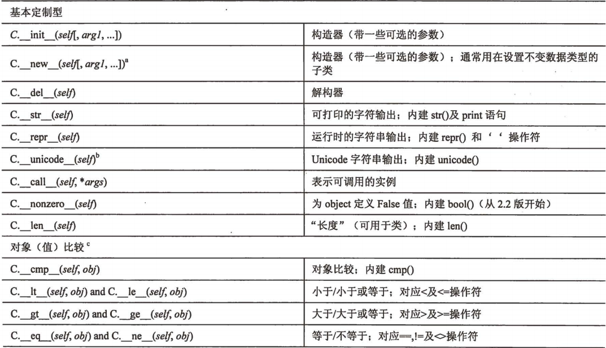

# Python面向对象编程

### 本节重点
>* 理解面向对象编程OOP的概念和思想方法
>* 掌握Python面向对象的语法规则
>* 理解继承, 封装, 多态等面向对象特性, 在Python中的具体体现.

## 面向对象编程概念(OOP)
对于一个程序猿来说, 没有对象? 好办, 咱们new一个~~

>* 面向过程是编年史: 按照时间先后顺序, 一条一条的记录发生的事情.
>* 面向对象是记传史: 按照每个王侯将相的维度, 记录这个人是谁, 有哪些特点, 做过哪些事情.

所以史记其实是中国古代的一个非常成功的应用了 OOP 思想的著作

OOP是一种编程思想. 所谓 "思想", 指的是解决一类问题时, 使用的一系列的方法手段, 一套组合拳. 我们看看这套组合拳都有哪些招式

### 抽象
>* 抽象是指对现实世界问题和实体的本质表现, 行为, 特征进行建模;
>* 抽象的反义词是 "具体"

一只具体的猫

一只抽象的猫. 叫我灵魂画湿, 蟹蟹~

>* 抽象的本质, 是抓住我们重点关注的主体, 而忽略一些我们不需要关注的细节; 
>* 写程序也是一样, 我们不可能把一个现实事物所有的信息都在程序中表示出来, 而是只表示我们需要用到的.

### 类和实例
>* 类是施工图纸, 里面有房子的重要信息(户型, 面积, 朝向, 层高等等). 
>* 实例是造好的房子, 房子造好了, 才能住进去, 才能娶到媳妇. 如果房子烂尾了, 美好生活就只是在YY~ 
>* 通过同一张图纸可以建造出N个相同格局的房子, 那么这N个实例就都是属于同一个类(回忆下我们的type函数).

>* 通过同一张图纸可以建造出不同的房子, 每一个房子都有一个房号, 5号楼1单元101这种, 其实就是实例的id(回忆下我们的id函数).
>* 这N个房子里, 住的人也不相同, 比如101是我住, 隔壁102住的是老王. 这个就是实例的值不同.

总结:
>* 对象就是类的实例, 是**一个客观事物**的抽象.
>* 把多个对象按一定的规则归一归类, 就成为了**类**.
>* Python中的对象包含三个部分: id, 类型, 值.

### 封装/接口
>* 封装描述了对数据/信息进行隐藏的观念, 对象的使用者只能通过接口来访问/修改对象的数据.
>* 封装的好处是减轻调用者的使用负担, 调用者只需要知道接口如何使用, 而不需要知道对象的具体实现. 
>* 封装这个概念当然不是只存在于面向对象思想中. 回忆计算机网络协议栈的分层结构, 也是为了达到封装的效果.

只要通话双方能听懂对方的语言, 就可以正常使用电话通话. 而不需要理解电话的任何实现细节.

### 组合/包含
>* 多个小的类组合成一个大的类, 来解决一个相对复杂的问题.
>* 组合表示`has-a`语义

例如, 我们用代码表示一个 "学校" , 那么可以先创建一个学校类. 学校类中又包含了教师类, 学生类, 行政人员类, 后勤人员类等.

>* 组合的目的是**代码重用**

### 派生/继承
>* 基于一个现有的类, 通过继承这个类创建一个新的类. 
>* 如果基于类A用继承的方式创建了类B, 我们就将这个过程成为类A派生出了类B. 类A称为父类(或超类), 类B称为子类.
>* 子类对象包含了父类对象的所有属性和操作. 
>* 继承表示了 `is-a` 这样的语义. 

>* 继承的目的还是**代码重用**.

### 多态
>* 多态是OOP中比较难理解的概念, 我们先看一个 **花木兰替父从军** 的例子.

花木兰替父(父亲名叫花弧)从军, 我们先创建这么两个类

	父类对象:
		数据:
			姓名: 花弧
			性别: 男
			年龄: 60
		方法
			冲锋杀敌(花弧精通降龙十八掌)
	
	子类对象:
		数据:
			姓名: 花木兰
			性别: 女
			年龄: 28
		方法
			冲锋杀敌(木兰精通打狗棒法)
			涂脂抹粉(这个是子类具备的方法)

>* 木兰先去军营报道, 将军的花名册上写着花弧的名字. 相当于是一个父类对象的引用. 而木兰替父从军, 相当于父类引用指向一个子类的对象.
>* 两军交战了, 将军发号施令: 花弧听令, 冲锋杀敌! 将军是对象的使用者, 将军通过父类的引用, 让子类执行"冲锋杀敌"这个动作, 实际上阵杀敌的是木兰而不是花弧, 因此木兰肯定是按照自己熟悉的武功招式来杀敌.
>* 将军并不知道 "花弧" 这个引用是父类的还是子类的, 将军只知道这个类有冲锋杀敌的方法, 而不知道这个 "花弧" 其实还有涂脂抹粉的动作.
>* 战争结束, 木兰衣锦还乡, 这时候亲朋好友都知道木兰的底细, 使用"花木兰"这个子类对象的引用来称呼. 这时, 木兰就可以涂脂抹粉了.

总结一下:
>* **本质上讲** 多态是在运行时能够自动的识别出对象的类型, 并使用对应类型的方法来完成一定的动作. 
>* 多态也是一种 "信息隐藏", 让调用者了解的信息越少, 那么使用起来负担就越低. 
>* 刚才我们说的封装, 只是让调用者不知道这个类里面的实现; 而我们的多态, 是让调用者连这个类究竟是哪个类都不需要关心.

多态对我们简化代码有非常大的意义. 我们先看一段C语言代码. 这个代码表示的是某品牌路由器检查所有网口状态的代码. 
每一种型号的路由器的端口数目/端口类型可能都不同, 因此每一个或几个这样的类型必须提供一个专门的函数. 

	switch(board_type) {
		case Board2304:
		case Board2306:
			CheckPortStatus1();
			break;
		case Board3300:
		case Board3302:
			CheckPortSatus2();
			break;
		case Board5300:
			CheckPortStatus3();
			break;
		case Board6300:
			CheckPortStatus4();
			break;
		...
	}

每新增一种型号, 都意味着需要将这些`switch-case`语句都修改一遍. 而且每个地方都要判定所有的板类型. 
如果使用多态机制, 每一个新的类型就新增一种子类, 只需要在需要的地方使用父类的对象调用即可 

	board.CheckPortStatus();

### 自省/反射
>* 自省和反射是一个意思. 顾名思义, 就是认清自己是谁. 指对象在程序运行时能获取到一些自己的信息.

>* `dir/id/type/__name__/__doc__` 这些内置属性和方法就是自省的具体体现.
>* 其实C++中也有typeid这样的方法来进行一部分的"自省"的功能. 只不过是和C++的设计理念背道而驰, 因此不推荐使用.

回忆我们之前的dir函数

	def Hello():
		print 'hello'
	
	print dir(Hello)
	
	# 执行结果
	['__call__', '__class__', '__closure__', '__code__', '__defaults__', '__delattr__', '__dict__', '__doc__', '__format__', '__get__', '__getattribute__', '__globals__', '__hash__', '__init__', '__module__', '__name__', '__new__', '__reduce__', '__reduce_ex__', '__repr__', '__setattr__', '__sizeof__', '__str__', '__subclasshook__', 'func_closure', 'func_code', 'func_defaults', 'func_dict', 'func_doc', 'func_globals', 'func_name']
	
	print Hello.func_name
	
	# 执行结果
	Hello

## 属性和方法

### 创建类
>* 使用class关键字创建一个类. 创建类的语法和创建函数很像.

	# 创建一个函数
	def FunctionName(arg):
		'function doc string'     # 文档字符串
		function_suite			  # 函数体
	
	# 创建一个类
	class ClassName(object):
		'class doc string'        # 文档字符串
		class_suite               # 类体

>* 创建一个类, 实际上是创建了一个自定制的**类型**. 其实Python中, 类和类型是统一的. 而不像很多其他编程语言那样, 区分内置类型和"类类型".
>* 类的定义语句一般出现在模块的顶级缩进; 但是Python并不强制要求. 类的定义也可以出现在类/函数, 或者其他语句块中. 当然作用域也就不一样了.

### 创建对象
>* 在C++或者Java中, 使用new这个关键字来创建一个对象. 在Python中把这个new直接就省略掉了. 

	class C(object):
		pass
	
	c = C()

>* 这个用法是不是挺眼熟的? 回忆一下, 我们创建一个空的列表的时候.

	a = []
	
	# 或者
	
	a = list()

### 类属性(静态成员变量)
>* 在类创建过程中, 可以直接在类里定义一些属性.

	class C(object):
		val = 100
	
	print C.val

>* 这种方法在类创建好之后就可以直接使用, 而不需要先创建一个对象. 这就是我们C++或者Java中接触过的**静态成员变量**
>* 所谓静态成员, 其实指的是这是一个类的属性, 而不是一个对象的属性.

### 实例方法(非静态成员函数)
>* 在类中直接定义的函数就是类的成员函数.
>* 成员函数必须先创建一个类的对象, 然后通过对象的 "." 操作来访问.

	class C(object):
		def Print(self):
			print 'hello'
	
	c = C()
	c.Print()
	
	# 执行结果
	hello

>* 注意看, 我们在类中定义的这个成员函数Print, 有一个参数self. 这个self参数只的是这个对象本身(注意是对象, 不是类!).
>* self相当于C++中的this指针. 这个参数不一定非叫self, 也可以改成其他的名字(比如命名为this). 但是大家约定俗成, 都写作self.

	class C(object):
		def Print(this):
			print 'hello'
	
	c = C()
	
	# 执行结果, 执行效果是一样的.
	hello      

>* 如果我们不创建对象, 直接通过类名来调用, 就会抛出异常.

	C.Print()
	
	# 执行结果
	Traceback (most recent call last):
	  File "test.py", line 7, in <module>
	    C.Print()
	TypeError: unbound method Print() must be called with C instance as first argument (got nothing instead)

>* 根据这个错误信息, 看起来貌似是缺少一个参数?? 我们尝试一下.

	c = C()
	C.Print(c)
	
	# 执行结果
	hello

>* 实际上, `c.Print()` 在Python解释器中会转换成 `C.Print(c)`. 但是为了方便, 我们平时都写作 `c.Print()`

### 实例属性(非静态成员变量)
>* 类的成员变量, 也称为实例属性, 和类的属性相对应.
>* Python可以在运行时给一个对象新增或删除实例属性. 这一点是C++和Java等语言做不到的.
>* 可以在任何一个类的方法中创建实例属性.

	class C(object):
		def Init(self):
			self.a = 100
		def Print(self):
			print self.a
	
	c = C()
	c.Init()
	c.Print()
	
	# 执行结果
	100

>* 如果不调用 `c.Init()` 执行就会出错了. 

	class C(object):
		def Init(self):
			self.a = 100
		def Print(self):
			print self.a
	
	c = C()
	c.Print()
	
	# 执行结果
	Traceback (most recent call last):
	  File "D:\code\python\test\test.py", line 9, in <module>
	    c.Print()
	  File "D:\code\python\test\test.py", line 5, in Print
	    print self.a
	AttributeError: 'C' object has no attribute 'a'

>* 使用构造器 `__init__` 来创建实例属性, `__init__` 会在创建对象的时候自动被调用, 这样就不需要我们手动去调一个Init这样的函数了.

	class C(object):
		def __init__(self):
			self.a = 100
		def Print(self):
			print self.a
	
	c = C()
	c.Print()
	
	# 执行结果
	100

>* `__init__` 构造器可以带一些参数, 这样的话就可以创建对象的时候直接赋值进去了. 记得第一个参数一定是 self(表示示例自身).

	class C(object):
		def __init__(self, x):
			self.a = x
		def Print(self):
			print self.a
	
	c = C(100)
	c.Print()
	
	# 执行结果
	100

>* 如果构造器有多重不同形式的参数怎么办? 和C++, Java不同, Python不需要进行多个版本的构造器 "重载", 因为Python中压根就不需要 "重载" 语法~. 回忆我们之前讲的Python函数的相关细节.

>* Python中还有一个解构器 `__del__`, 但是Python有内置的GC机制, 一般不需要程序猿手动定义 `__del__` 来回收对象.

### 静态方法(静态成员函数)
刚才我们提到的成员函数, 都是实例属性, 必须要创建实例才能调用. 我们能否创建一个类属性, 也就是 "静态成员函数" 呢?

	class C(object):
		def Print():
			print 'hello'
		Print = staticmethod(Print)
	
	C.Print()
	
	# 执行结果
	hello

但是, 多加一句这样的代码 `Print = staticmethod(Print)` , 对于一个有强迫症的, 完美主义者的程序猿来说, 是完全不能接受的!!

于是, 请同学们瞪大眼睛!!!! 又到了见证奇迹的时刻!!!

	class C(object):
		@staticmethod
		def Print():
			print 'hello'
	
	C.Print() 

>* 使用 `@staticmethod` 这种方式来修饰 Print 函数, 同样能达将一个方法定义成静态方法的效果. 这个语法叫做函数修饰符, 也叫 **装饰器**.
>* 对于静态方法, 就不需要`self`这样的参数了.
>* 对于类的静态方法, 本质上是一个和类无关的函数, 只是这个函数的作用域是在类名之内.

关于更多装饰器的细节, 我们后续再讨论.

对于学过C++的同学, 都会知道, 静态方法, 可以访问静态属性. 我们试一试~

	class C(object):
		x = 100
		@staticmethod
		def Print():
			print x
	
	C.Print()
	
	# 执行结果
	Traceback (most recent call last):
	  File "D:\code\python\test\test.py", line 7, in <module>
	    C.Print()
	  File "D:\code\python\test\test.py", line 5, in Print
	    print x
	NameError: global name 'x' is not defined

竟然运行出错!! 看来Python解释器, 把x当成了一个 "global name", 而不是一个类属性~~

### 类方法
>* Python中的静态方法, 其实不能和C++的静态成员函数等价. 真正能作为等价的应该是 **类方法**
>* 使用 classmethod 进行修饰, 同时使用 cls 作为第一个参数, 这样就构成了类方法.

	class C(object):
		x = 100
		@classmethod
		def Print(cls):
			print cls.x
	
	C.Print()
	
	# 执行结果
	100

>* 用cls这个参数, 来表示类(记得Python中类也是对象). 然后就可以通过 cls 来访问到类属性了.
>* 和self类似. cls 也只是一个约定俗称的名字. 也可以命名成其他的名字.

### 属性的访问权限
学过C++/Java的同学们知道, 使用关键字public/private/protected等关键字, 可以对属性的访问权限进行控制. 这也是 "封装" 思想的一种具体体现.

>* Python中使用双下划线前缀(`__`)来表示私有成员. 

	class C(object):
		def __init__(self):
			self.__a = 100
	
	c = C()
	print c.__a
	
	 # 执行结果
	Traceback (most recent call last):
	  File "D:\code\python\test\test.py", line 6, in <module>
	    print c.__a
	AttributeError: 'C' object has no attribute '__a'

## 类之间的关系
在设计一个程序时, 需要设计多个有一定关系的类. 而这种类和类之间的关系, 最主要有两种. 组合和继承.

### 组合
>* 一个类中包含其他的类, 形成这样的组合关系, 表示 has-a 语义.
>* 类之间显著不同, 并且较小的类是较大的类的组件的时候, 使用组合非常合适.

一个简单的通讯录. AddrBook类中包含了一个字符串title, 一个列表对象data(其实是N个AddrBookEntry对象). 
同时AddrBookEntry中又包含了两个字符串, 表示一个AddrBookEntry对象里有一个人名, 也有一个电话号码. 

	class AddrBookEntry(object):
		def __init__(self, name, phone):
			self.name = name
			self.phone = phone
	
	class AddrBook(object):
		def __init__(self, title):
			self.data = []
			self.title = title
		def Add(self, entry):
			self.data.append(entry)
		def Show(self):
			print self.title
			for entry in self.data:
				print entry.name + '\t' + entry.phone
	
	addr_book = AddrBook('bit addr book')
	addr_book.Add(AddrBookEntry('tangzhong', '1234567'))
	addr_book.Add(AddrBookEntry('tangzhong2', '12345678'))
	addr_book.Show()
	
	# 执行结果
	bit addr book
	tangzhong	1234567
	tangzhong2	12345678

### 继承
>* 类之间大体相似, 但是某些细节不同, 这时候适合使用继承的方式. 表示 is-a 语义.
>* 继承也可以理解成, 对一个已经定义好的类, 进行一定的扩展.

>* 创建子类的语法如下:

	class SubClass(ParentClass [, ParentClass2]):
		'class doc string'
		class_suite

>* 如果一个类没有从任何一个父类继承, 那么可以让这个类继承自object

	class C(object):
		pass

>* 另外, 也可以不写继承自object. 这种类称为经典类(也叫旧式类). 旧式类和新式类大部分特性都是一样的. 他们的区别, 我们后面再说.

	class C:
		pass

>* 子类能够继承父类的属性和方法.

	class Parent(object):
		def ParentMethod(self):
			print 'ParentMethod'
	
	class Child(Parent):
		def ChildMethod(self):
			print 'ChildMethod'
	
	p = Parent()
	p.ParentMethod()
	c = Child()
	c.ChildMethod()
	c.ParentMethod()	
	
	# 执行结果
	ParentMethod
	ChildMethod
	ParentMethod

>* 如果子类中存在和父类中相同名字的方法, 子类方法会覆盖父类方法. 
>* Python的覆盖和方法的参数没关系.

	class Parent(object):
		def Func(self):
			print 'ParentMethod'
	
	class Child(Parent):
		def Func(self):
			print 'ChildMethod'
	
	p = Parent()
	p.Func()
	c = Child()
	c.Func()
	
	# 执行结果
	ParentMethod
	ChildMethod

>* 这一点在实现类的构造器要额外注意. 子类和父类都有同名的构造器. 子类的构造器中需要显式调用父类构造器.

	class Parent(object):
		def __init__(self):
			self.x = 100
	
	class Child(Parent):
		def __init__(self):
			self.y = 200
	
	p = Parent()
	print p.x
	c = Child()
	print c.x
	
	# 执行结果
	Traceback (most recent call last):
	  File "D:\code\python\test\test.py", line 12, in <module>
	    print c.x
	AttributeError: 'Child' object has no attribute 'x'

没有显式调用父类构造器, 执行报错.

	class Parent(object):
		def __init__(self):
			self.x = 100
	
	class Child(Parent):
		def __init__(self):
			Parent.__init__(self)    # 显式调用父类的方法.
			self.y = 200
	
	p = Parent()
	print p.x
	c = Child()
	print c.x
	
	# 执行结果
	100
	100

>* 可以使用super方法来协助我们找到父类的方法, 而不需要显式的指定父类的类名.

	class Parent(object):
		def __init__(self):
			self.x = 100
	
	class Child(Parent):
		def __init__(self):
			super(Child, self).__init__()
			self.y = 200
	
	p = Parent()
	print p.x
	c = Child()
	print c.x
	
	# 执行结果
	100
	100

### 理解Python的多态
回顾我们上面提到的替父从军的例子, 我们用Python来简单实现一下. 

	class Soldier(object):
		def Skill(self):
			print "Skill1"
	
	class SuperSoldier(Soldier):
		def Skill(self):
			print "Skill2"
	
	def Charge(soldier):
		soldier.Skill()
	
	huahu = Soldier()
	Charge(huahu)
	huamulan = SuperSoldier()
	Charge(huamulan)
	
	# 执行结果
	Skill1
	Skill2	

其实, 只要Charge这个参数 x , 具备技能Skill这个方法, 就可以通过Charge函数来执行, 而不要求x一定要继承自Solder类的一个对象.
>* 对于Python的多态, 其实和 "父类/子类" 并没有必然联系. 
>* 对于Pythond的这种多态方式, 也称为 鸭子类型(duck typing). 
只要一个东西, 能像鸭子一样能叫, 能走路, 能游泳, 那么就可以认为这是一只鸭子~~而不考虑这个对象真实是什么类型. 
换句话说, 只要一个对象具有Skill这样的方法, 甭管它是不是一个Solder对象, 还是一个其他什么的对象, 都可以被Charge函数使用.

好了, 其实鸭子类型, 并不是Python这样的动态类型语言的专属. 一些静态类型语言, 也应用了这样的思想. 比如下面这段C++代码.

	template <typename T>
	int Size(const T& x) {
		return x.size();
	}

只要 x 这个对象中, 包含了size这样的方法, 这个对象就可以使用Size函数. 这一样也是一种 "鸭子类型". 只不过这里是在编译期进行判定的.

### 多继承(选学)
Python支持多继承. 实际中使用的不是很多. 多继承中存在臭名昭著的**菱形继承**问题. 同学们感兴趣自行查阅相关资料.

## 类和实例的常用内建函数
### issubclass
>* 判定一个类是不是另外一个类的子类.

	class Parent(object):
		pass
	
	class Child(Parent):
		pass
	
	print issubclass(Child, Parent)
	
	# 执行结果
	True

### isinstance
>* 判定一个对象是不是一个类的实例.

	class C(object):
		pass
	
	c = C()
	print isinstance(c, C)
	
	# 执行结果
	True

回忆一下, 我们之前也使用过isinstance来判定一个对象的类型.

### hasattr, getattr, setattr, delattr
>* 用来对一个类/对象的属性进行操作和判定.

	class C(object):
		x = 100
	
	print hasattr(C, 'x')
	print getattr(C, 'x')
	setattr(C, 'x', 200)
	print C.x
	delattr(C, 'x')
	
	# 执行结果
	True
	100
	200

### dir
>* 查看类/对象的所有属性和方法.

	class C(object):
		pass
	
	print dir(C)
	
	# 执行结果
	['__class__', '__delattr__', '__dict__', '__doc__', '__format__', '__getattribute__', '__hash__', '__init__', '__module__', '__new__', '__reduce__', '__reduce_ex__', '__repr__', '__setattr__', '__sizeof__', '__str__', '__subclasshook__', '__weakref__']

### vars
>* 和dir类似. dir只是返回了有哪些属性, 但是没显示属性的值. vars将值也取了出来. 

	class C(object):
		pass
	
	print vars(C)
	
	# 执行结果
	{'__dict__': <attribute '__dict__' of 'C' objects>, '__module__': '__main__', '__weakref__': <attribute '__weakref__' of 'C' objects>, '__doc_None}

### super
>* 获取到当前类/对象的父类
>* super本质也是一个工厂函数, 创建了一个父类的对象.

## 使用特殊方法定制类
### 特殊方法的作用
我们前面学的 `__init__` 只是其中一个特殊方法. 其实类还有很多特殊方法, 通过这些特殊方法, 可以完成
>* 运算符重载
>* 模拟标准类型

我们以 `__str__` 为例写一个简单的代码. 更多的特殊方法, 同学们课后自己学习.

	class Time(object):
		def __init__(self, h, m):
			self.hour = h
			self.minute = m
	
		def __str__(self):
			return '[%02d:%02d]' % (self.hour, self.minute)
	
	t = Time(13, 5)
	print t
	
	# 执行结果
	[13:05]

**作业**: 通过重写特殊方法 `__sub__` , 实现两个时间对象做减法, 并得到时间差.

### 特殊方法一览

 
 
 
 
 

## 经典类与新式类(选学)
我们前面提到了, 如果一个类继承自 object , 那么这就是一个新式类, 否则就是一个经典类. 

我们课堂上讲的所有内容, 对于新式类和经典类都是通用的. 但是新式类在经典类的基础上, 增加了一些新特性. 具体我们不展开讨论, 同学们课后自行收集资料自学. 

<a href="http://blog.csdn.net/u010066807/article/details/46896835">Python经典类和新式类的区别</a>