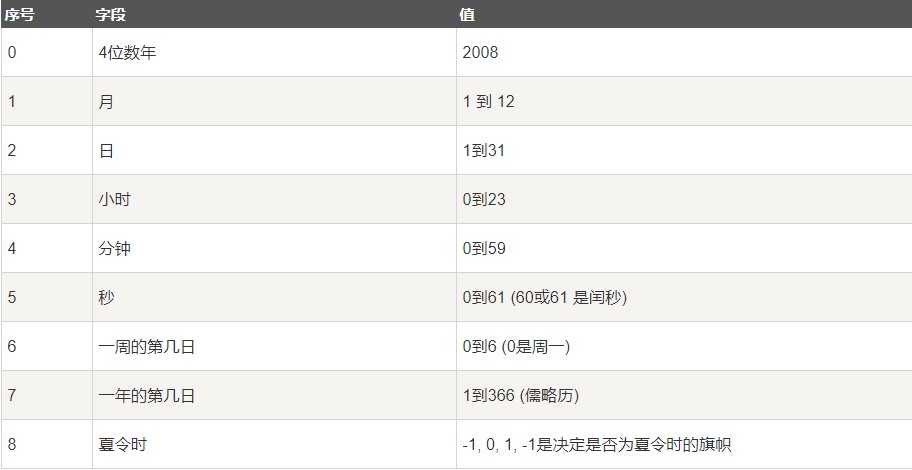
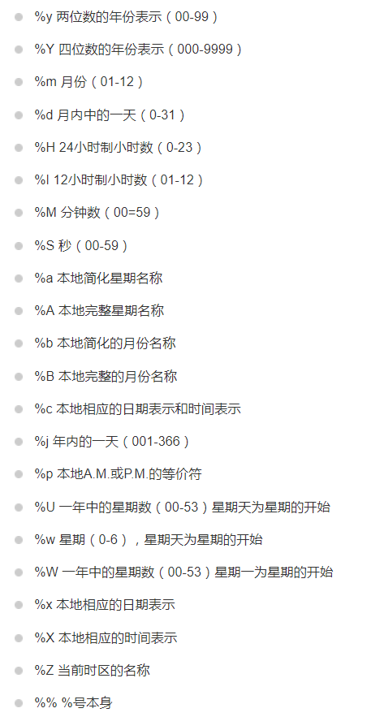
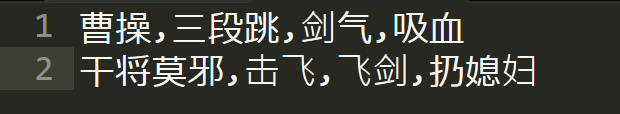
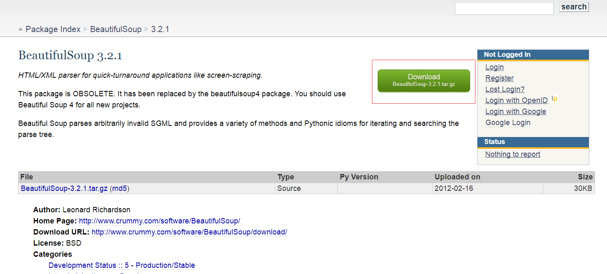
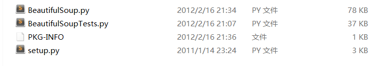
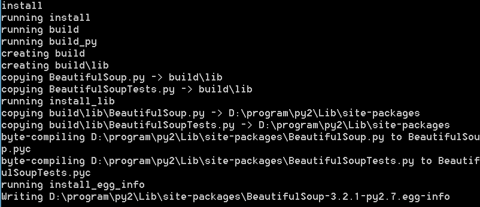

# Python标准库概览

### 本节重点
>* 了解Python的标准库都能做哪些事情.
>* 对其中一些常用组件, 能掌握基本用法.
>* 掌握如何安装第三方库.

## 时间和日期

### 时间戳和时间元组

>* time模块包含了一些时间的处理函数.
>* 使用 time.time() 能够获取到当前的时间戳(从1970年1月1日午夜（历元）经过了多长时间). 返回值是一个浮点数.

	import time
	print time.time()

	# 执行结果
	1508638165.16 

>* 很多Python函数用一个元组装起来的9组数字处理时间.

>* 通过 time.localtime() 将时间戳转换成时间元组. 如果localtime不填参数, 则获取到的就是当前时间戳的时间元组.

	import time
	print time.localtime(time.time())	

	# 执行结果
	time.struct_time(tm_year=2017, tm_mon=10, tm_mday=22, tm_hour=10, tm_min=13, tm_sec=18, tm_wday=6, tm_yday=295, tm_isdst=0)

>* 通过 time.mktime() 将时间元组转换成时间戳.

	import time
	t = time.localtime()
	print time.mktime(t)

	# 执行结果
	1508639400.0

### 格式化时间

>* 通过 time.asctime() 将时间元组转换为格式化时间

	import time
	print time.asctime(time.localtime(time.time()))

	# 执行结果
	Sun Oct 22 10:16:08 2017

>* 使用 time.strftime() 来更灵活的获取到格式化时间.

	import time
	print time.strftime('%Y/%m/%d %H:%M:%S', time.localtime())

	# 执行结果
	2017/10/22 10:20:19

>* 格式化字符串有以下这些

>* 使用 time.strptime() 能够从一个格式化的时间字符串中, 还原出时间结构体

	import time
	print time.strptime('2017/10/22 10:20:19', '%Y/%m/%d %H:%M:%S')

	# 执行结果
	time.struct_time(tm_year=2017, tm_mon=10, tm_mday=22, tm_hour=10, tm_min=20, tm_sec=19, tm_wday=6, tm_yday=295, tm_isdst=-1)

### 计算时间差
>* 计算两个时间元组的时间差, 只要将他们都转为时间戳, 再直接相减即可. 

### 计算日期差
>* 标准库中还有一个 datetime 模块, 可以很方便的帮助我们处理日期问题.
>* datetime模块中有date类, time类, 和datetime类, 分别来处理日期, 时间, 日期+时间.

示例: 计算两两之间的日期差

	import datetime
	d1 = datetime.datetime.strptime('2018/05/02', '%Y/%m/%d')
	d2 = datetime.datetime.strptime('2007/11/16', '%Y/%m/%d')
	print (d1 - d2).days

	# 执行结果
	3820

### 获取3天之前的日期

	import datetime
	d = datetime.datetime.strptime('2018/05/02', '%Y/%m/%d')
	delta = datetime.timedelta(days = 3)
	print (d - delta).strftime('%Y/%m/%d')

	# 执行结果
	2018/04/29

## decimal模块
### 理解浮点数的精度问题
我们先看一个神奇的代码

	a = 0.2 + 0.4
	print a
	print a == 0.6

	# 执行结果
	0.6
	False

我们稍微调整一下我们的代码, 就能看到为什么结果是False了.

	a = 0.2 + 0.4
	print repr(a)
	print a == 0.6

	# 执行结果
	0.6000000000000001
	False

我们要记得, repr 返回的字符串, 是 Python解释器 的表示形式. 这就意味着, 0.2 + 0.4 的结果, 在Python解释器中保存的值实际是 0.6000000000000001

具体原因, 我们此处不再深究, 但是我们要知道两点:
>* Python中的浮点数是双精度浮点数. 即使如此, 能表示的一个数字的精度仍然有限. 
>* 这不是Python的问题，而是实数的无限精度跟计算机的有限内存之间的矛盾. 

这种浮点数的精度问题, 在某些场景下可能是致命的(例如在金融行业或者科学计算). 要知道, 对于科学家来说, 小数点N位后的一个1, 可能会带来完全不同的研究结果.

### decimal模块精确计算小数
>* decimal模块是使用字符串来表示一个小数.

	import decimal

	a = decimal.Decimal('0.2') + decimal.Decimal('0.4')
	print a
	print a == decimal.Decimal('0.6')

	# 执行结果
	0.6
	True

>* 相比于浮点数, decimal可以保证更高的精度. 但是运算性能会非常慢.

**课后作业**: 比较浮点数运算, 和decimal运算, 运算性能差多少(给出具体数字指标). 提示: 两种方式进行相同运算, 循环重复100w次, 记录时间.

### 参考资料
<a href="https://www.zhihu.com/question/25457573">Python中的浮点数问题</a>

## json解析

### 认识json
>* json是一种文本格式. 按照一定的规则, 构建成一个结构化字符串.
>* json使用一种k-v的方式来组织内容.

例如, 我们使用json来表示亡者农药中曹操的技能.

	{
		"技能1" : "三段跳",
		"技能2" : "剑气",
		"技能3" : "吸血",
		"被动技能" : "加攻速"
	}

这个格式是不是看起来很眼熟? Python的字典也是用这样的格式来表示的.  

>* 构建成格式化字符串, 最主要的目的是为了解析方便.

### Python解析json
我们在当前目录下存放一个 "亡者农药.txt" 文件, 内容如上. 我们使用Python代码来解析一下.

>* 使用 json.loads() 函数将字符串转换成Python字典. 相当于将json字符串转换成了json对象, 就可以方便的取出其中的内容.

	# 开头这几行代码的含义是调整源代码文件的编码格式. 否则在源码中使用中文可能会报下面的错误
	# UnicodeEncodeError: 'ascii' codec can't encode characters in position 0-2: ordinal not in range(128)

	#coding:utf-8
	import sys
	reload(sys)
	sys.setdefaultencoding( "utf-8" )

	import json

	with open(u'./亡者农药.txt') as f:
		data = f.read()
		json_data = json.loads(data)     
		print json_data[u'技能1']
		print json_data[u'技能2']
		print json_data[u'技能3']

	# 执行结果
	三段跳
	剑气
	吸血

关于中文编码, 这里不展开说. 有兴趣的同学参考 <a href="https://www.zhihu.com/question/23374078">Unicode 和 UTF-8 有何区别？</a>
 
>* 在Python2中对于中文编码处理的并不是特别好, 在Python3中会有一定的改善.
>* 使用 json.dumps() 函数将一个字典对象转化成json字符串.

	#coding:utf-8

	import json
	json_data = {
		u'技能1' : u'三段跳',
		u'技能2' : u'剑气',
		u'技能3' : u'吸血'
	}
	
	json_str = json.dumps(json_data)
	print json_str

>* 使用 json.dump() 函数能将一个字典对象转换成json字符串后直接写到文件中.

	#coding:utf-8

	import json
	json_data = {
		'技能1' : '三段跳',
		'技能2' : '剑气',
		'技能3' : '吸血'
	}
	
	with open('result.txt', 'w') as f:
		json_str = json.dump(json_data, f)

## xml解析
### 认识xml
xml也是一种k-v文本格式. 用途和json类似. 只是组织规则不同. xml和html更相似, 使用标签作为key, 标签中的内容作为value

例如, 我们使用xml来表示亡者农药中曹操的技能.

	<曹操>
	<技能1>三段跳</技能1>
	<技能2>剑气</技能2>
	<技能3>吸血</技能3>
 	</曹操>

### Python解析xml
Python解析xml的方式有很多种. 我们只介绍基于dom方式解析.

	#coding:utf-8
	import sys
	reload(sys)
	sys.setdefaultencoding('utf-8')
	import xml.dom.minidom as dom
	
	dom_tree = dom.parse(u'亡者农药.xml')
	caocao = dom_tree.documentElement
	print caocao.nodeName
	
	skill1 = caocao.getElementsByTagName(u'技能1')
	print skill1[0].nodeName
	print skill1[0].firstChild.data

	# 执行结果
	曹操
	技能1
	三段跳

更详细的使用过程, 参考Python官方文档.

整体来看, xml使用起来还是比较麻烦的. 不如json在代码上更简单, 文件格式上也更清晰.

## csv解析
### 认识csv
>* csv是一种通用的电子表格或者数据库的导入导出格式. 
>* csv是简单的本文文件. 用 \n 分割两条记录. 用逗号(,)分割一条记录中的N个字段(也可以是其他字符作为分割).

### 按列解析csv
我们先使用构造一个csv文件, 命名为 "亡者农药.csv"

这个文件可以用excel打开.

然后我们使用Python来解析这个文件. 
>* csv模块用来解析csv文件

	#coding:utf-8
	import csv
	with open(u'亡者农药.csv', 'rb') as f:
		reader = csv.reader(f)
		for row in reader:
			print row[0], row[1], row[2], row[3]

	# 执行结果
	曹操 三段跳 剑气 吸血
	干将莫邪 击飞 飞剑 扔媳妇

>* csv.reader() delimiter参数可以指定分割符. 默认使用逗号(,)分割. 如果分割符是其他字符, 就可以通过这种方式指定分隔符. 

	#coding:utf-8
	import csv
	with open(u'亡者农药.csv', 'rb') as f:
		reader = csv.reader(f, delimiter = ',')
		for row in reader:
			print row[0], row[1], row[2], row[3]

	# 执行结果
	曹操 三段跳 剑气 吸血
	干将莫邪 击飞 飞剑 扔媳妇

### 按字典解析csv
>* 我们可以给每个字段指定一个含义(类似于表头). 然后就可以按照表头的方式读取字段的值.
>* 使用 csv.DictReader 完成按字典的方式解析的过程.

在代码中可以这样解析:

	#coding:utf-8
	import csv
	with open(u'亡者农药2.csv', 'rb') as f:
		fields = [u'英雄', u'技能1', u'技能2', u'技能3']
		reader = csv.DictReader(f, delimiter=',', fieldnames = fields)
		for row in reader:
			print row[u'英雄'], row[u'技能1'], row[u'技能2'], row[u'技能3']

	# 执行结果
	曹操 三段跳 剑气 吸血
	干将莫邪 击飞 飞剑 扔媳妇

### 按csv格式写文件(作业)
使用csv.writer和csv.DictWriter完成写动作. 接口比较简单, 同学们课后自行完成.

## 命令行参数解析

### getopt

>* getopt模块中包含一个getopt函数, 可以协助解析命令行参数.  
>* 使用sys.argv[1:] 过滤掉第一个参数（它是执行脚本的名字，不应算作参数的一部分）.  
>* 使用短格式分析串"ho:". 当一个选项只是表示开关状态时，即后面不带附加参数时，在分析串中写入选项字符. 当选项后面是带一个附加参数时，在分析串中写入选项字符同时后面加一个":" 号. 所以"ho:" 就表示"h" 是一个开关选项；"o:" 则表示后面应该带一个参数。  
>* 使用长格式分析串列表：["help", "output="] . 长格式串也可以有开关状态，即后面不跟"=" 号。如果跟一个等号则表示后面还应有一个参数 。这个长格式表示"help" 是一个开关选项；"output=" 则表示后面应该带一个参数。  
>* getopt函数返回两个列表：opts 和args. opts 为分析出的格式信息. args 为不属于格式信息的剩余的命令行参数; opts 是一个两元组的列表, 每个元素为：( 选项串, 附加参数) . 如果没有附加参数则为空串'' . 
>* 整个过程使用异常来包含，这样当分析出错时，就可以打印出使用信息来通知用户如何使用这个程序。  

如上面解释的一个命令行例子为:   

	'python test.py -h -o file --help --output=out file1 file2' 

在分析完成后，opts 应该是：  
	
	[('-h', ''), ('-o', 'file'), ('--help', ''), ('--output', 'out')] 

而args 则为：  
	
	['file1', 'file2'] 

代码如下:

	import sys
	import getopt
	
	opts, args = getopt.getopt(sys.argv[1:], shortopts = 'ho:', longopts = ['help', 'output='])
	for name, value in opts:
		print 'opts:', name, value
	
	for item in args:
		print 'args:', item

	# 执行结果
	opts: -h
	opts: -o file
	opts: --help
	opts: --output out
	args: file1
	args: file2

### argparse
位置参数: 
>* 使用add_argument()来注册顺序参数, 并给顺序参数起了名字.
>* 使用parse_args()来得到一个参数对象. 通过属性操作符(.)来获取到参数的具体值.

	import argparse
	
	parser = argparse.ArgumentParser()
	parser.add_argument('arg1')
	parser.add_argument('arg2')
	
	args = parser.parse_args()
	print args.arg1
	print args.arg2

	# 直接执行, 执行效果
	D:\code\python\test>python test.py
	usage: test.py [-h] arg1 arg2
	test.py: error: too few arguments

	# 添加参数, 执行效果
	D:\code\python\test>python test.py hello world
	hello
	world

选项参数:
>* 使用一个横线(-)指定短参数, 例如 -h
>* 使用两个横线(--)指定长参数, 例如 --help
>* 使用 add_argument() 来注册参数
>* 使用 parser_args() 来获取到参数对象

	import argparse

	parser = argparse.ArgumentParser()
	parser.add_argument('-v', '--verbosity')
	
	args = parser.parse_args()
	print args.verbosity

	# 直接执行, 执行效果
	D:\code\python\test>python test.py
	None

	# 添加参数, 执行结果
	D:\code\python\test>python test.py  -v 1
	1

	# 添加一部分参数, 执行结果
	D:\code\python\test>python test.py  -v
	usage: test.py [-h] [-v VERBOSITY]
	test.py: error: argument -v/--verbosity: expected one argument

>* 但是有时候需要类似于 -h 这样的参数, 不需要后面再追加参数了. 在add_argument中使用 action='store_true' 参数可以完成这样的动作.

	import argparse

	parser = argparse.ArgumentParser()
	parser.add_argument('-v', '--verbosity', action='store_true')
	
	args = parser.parse_args()
	print args.verbosity

	# 执行结果
	D:\code\python\test>python test.py  -v
	True

## 其他常用标准库模块

### 操作系统接口
>* os模块中包含了大量的操作系统底层操作(我们前面已经提过了).
>* shutil模块提供了更方便的文件, 目录操作. 例如文件拷贝, 文件压缩/解压缩(支持zip, tar等格式)等.

### 文件通配符
>* glob模块支持模糊匹配的方式查找符合条件的文件.

	import glob
	print glob.glob(r'D:/*.ini')

	# 执行结果
	['D:/DownLoadRecord.ini']

### 数学运算
>* math提供了一些浮点数运算的接口.

	>>> import math
	>>> math.cos(math.pi / 4.0)
	0.70710678118654757
	>>> math.log(1024, 2)
	10.0

>* random模块提供了随机数访问操作

	>>> import random
	>>> random.choice(['apple', 'pear', 'banana'])
	'apple'
	>>> random.sample(xrange(100), 10)   # sampling without replacement
	[30, 83, 16, 4, 8, 81, 41, 50, 18, 33]
	>>> random.random()    # random float
	0.17970987693706186
	>>> random.randrange(6)    # random integer chosen from range(6)
	4

### 文件压缩
>* zlib, gzip, bz2, zipfile, tarfile 这些模块分别提供了不同算法的压缩/解压缩.

### 日志模块
>* logging模块能够按照不同的级别来打印日志. 默认输出到标准错误中.

	import logging
	logging.debug('Debugging information')
	logging.info('Informational message')
	logging.warning('Warning:config file %s not found', 'server.conf')
	logging.error('Error occurred')
	logging.critical('Critical error -- shutting down')

	# 执行结果
	WARNING:root:Warning:config file server.conf not found
	ERROR:root:Error occurred
	CRITICAL:root:Critical error -- shutting down

>* 可以使用 logging.basicConfig 对日志输出格式和输出方式进行配置.

## 第三方库
Python的一个非常强大之处, 在于除了自身标准库比较强大之外, 还有非常庞大的第三方库. 合理使用第三方库, 能够大大的提高我们的开发效率.

### 认识pypi
pypi 是Python官方的一个第三方包的管理网站. 上面收集了非常多的第三方包.

网站链接: <a href="https://pypi.python.org">pypi.python.org</a>

>* 第三方包的开发者可以将包上传到pypi上.
>* 普通用户可以从pypi上下载到这些包, 供自己使用.

### 直接下载包源码
我们以 BeautifulSoup 库为例. 

点击下载按钮, 就下载到了源码压缩包.

解压缩后, 看到目录中包含

执行 `python setup.py install`, 就完成了安装过程.

通过安装日志, 我们可以看到, 其实安装过程就是把下载下来的包拷贝到了Python目录下的site-packages目录.

还记得我们 sys.path 的值不? 拷贝完成之后, 就能在Python解释器中直接import相关的包了.

### 包管理器pip
手动下载包安装, 比较繁琐. 官方推荐使用pip工具, 能够更方便的完成包的安装. (pip类似于yum)

pip工具一般安装python时默认就会带. 如果没有的话, 可以在pypi.python.org先用手动安装的方法安装好pip. 或者在linux上执行

	yum install python2-pip

也可以完成pip的安装.

安装完毕后, 直接在命令行中敲

	pip search beautifulsoup

就可以在pypi上进行包查找. 找到我们要安装的库的名字之后, 例如beautifulsoup4, 就可以执行

	pip install beautifulsoup4

进行安装了(可能需要sudo执行). 

参考文章
<a href="http://blog.csdn.net/liuchunming033/article/details/39578019">Python的包管理工具pip的安装与使用</a>