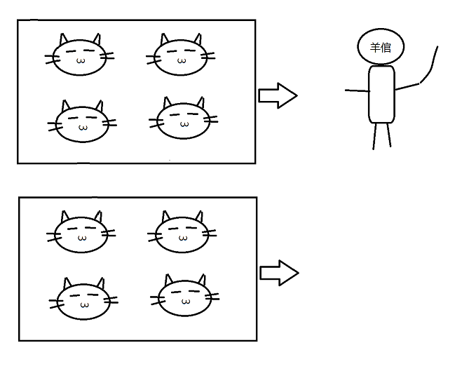

# Python多进程

### 本节目标
>* 回顾进程的基本概念.
>* 掌握Python创建子进程的方法.
>* 掌握Python中的进程同步互斥方法.
>* 掌握Python中的进程间通信的几种方式.
>* 能够熟练运用Python开发多进程程序.

## 进程的概念
>* 计算机程序只不过是磁盘上的可执行文件.
>* 被操作系统调用的时候才开始它的生命周期.
>* 进程是程序的一次执行. 进程拥有自己的地址空间, 内存, 数据栈等其他的记录其运行轨迹的辅助数据.
>* 操作系统对所有的进程进行统一的调度和管理.
>* 进程之间相互独立. 只有使用进程间通信IPC的方式才能进行交互.

## os模块中的多进程
我们在之前讲os模块中, 提到了一些相关的多进程的函数.

>* fork
>* wait/waitpid
>* exec函数族
>* system

### fork

回顾我们之前写过的一段fork的代码:

	import os, sys
	ret = os.fork()
	if ret == 0:
	    print 'child %d' % os.getpid()
	    sys.exit(1)
	else:
	    print 'father %d' % os.getpid()
	    ret = os.wait()
	    print 'child ret: ' + str(ret)

	# 在Linux上执行结果为
	father 3450
	child 3451
	child ret:(3451, 256)

	# 在Windows上执行结果为
	Traceback (most recent call last):
	  File "D:\code\python\test\test.py", line 2, in <module>
	    ret = os.fork()
	AttributeError: 'module' object has no attribute 'fork'

等等, 我们不是说好的跨平台嘛~~怎么同样的代码在windows上就报错了?

	

>* Python的os模块封装了一些系统调用. 但是Windows上没有fork这个系统调用, 因此会执行出错.
>* 其实Python只能保证大部分操作跨平台, 仍然有一小部分内容, 只适用于某些操作系统.

### system
>* os.system相当于C语言中的system函数. 创建一个shell, 然后再shell中再创建子进程执行一个程序.
>* os.system在Linux上相当于 fork + wait + exec;
>* 虽然Windows上没有fork, 但是有system.

[windows例子] 一键启动 qq + 坚果云

	import os

	os.system(r'D:\Applications\Bin\QQ.exe')
	os.system(r'D:\program\nut\Nutstore.exe')

将这个代码文件保存为start.py, 右键 -> 打开方式 -> 选择python.exe. 双击.py文件就会自动将qq和坚果云程序启动起来.

	

但是有一点比较low, 就是会弹出一个cmd的黑色框框~~, 能否去掉这个框呢? 答案是肯定的. 我们接着用另外一种更优雅的方式来实现这个功能.

## multiprocessing模块
难道, Windows上就不能使用多进程的方式编程嘛? 当然是可以的. Windows只是没有fork而已, 也是有自己的API可以创建进程的.

Python的multiprocessing模块就提供了这样的一组跨平台的多进程操作的API.

而且, multiprocessing有一个特点, 按照 "线程接口" 提供了进程操作接口. 相当于将进程和线程的操作方式统一在一起了. 

	

毕竟, 平心而论, fork函数这样的接口, 理解起来还是相当费劲, 使用起来也非常麻烦.

### multiprocessing.Process

>* 使用 Process 可以很容易的创建一个进程. 而且进程的操作接口, 和线程非常像.

	from multiprocessing import Process
	import os
	
	def Func(name):
		print 'hello', name, os.getpid()
	
	if __name__ == '__main__':
		p = Process(target = Func, args=('bob',))
		print 'main:', os.getpid()
		p.start()
		p.join()

	# 执行结果
	main: 2656
	hello bob 4812

>* 先创建一个Process的实例. target是进程的入口执行函数. args是Func函数的参数. args是一个元组. 里面元素的数目必须和Func函数的参数数目一致.
>* start()方法会正式创建进程. join方法是在主进程等待子进程执行完成.
>* 注意, 这里如果不调用join方法, 就会产生僵尸进程(回忆僵尸进程的产生原因和危害).

	from multiprocessing import Process
	import os
	import time
	
	def Func(name):
	    print name
	
	if __name__ == '__main__':
	    process_list = [
	            'aa',
	            'bb'
	    ]
	    for path in process_list:
	        p = Process(target = Func, args=(path,))
	        p.start()
	        # p.join()
	    while True:
	       time.sleep(10)

	# 执行代码
	python test.py
	
	# 同时在另外一个终端上执行
	ps aux | grep python

	[tangzhong@tz ~]$ ps aux | grep python
	root       821  0.0  0.6 327376 26888 ?        Ssl  09:50   0:01 /usr/bin/python -Es /usr/sbin/firewalld --nofork --nopid
	root      1182  0.0  0.4 553156 16444 ?        Ssl  09:51   0:04 /usr/bin/python -Es /usr/sbin/tuned -l -P
	tangzho+  4626  0.5  0.1 151204  5736 pts/0    S+   18:20   0:00 python test.py
	tangzho+  4627  0.0  0.0      0     0 pts/0    Z+   18:20   0:00 [python] <defunct>
	tangzho+  4628  0.0  0.0      0     0 pts/0    Z+   18:20   0:00 [python] <defunct>
	tangzho+  4630  0.0  0.0 112664   980 pts/1    R+   18:20   0:00 grep --color=auto python

>* 如果在Windows上不加 `if __name__ == '__main__':` 判定, 会报出如下错误:

	# 执行结果
		Traceback (most recent call last):
	  File "<string>", line 1, in <module>
	  File "D:\program\py2\lib\multiprocessing\forking.py", line 380, in main
	    prepare(preparation_data)
	  File "D:\program\py2\lib\multiprocessing\forking.py", line 509, in prepare
	    '__parents_main__', file, path_name, etc
	  File "D:\code\python\test\test.py", line 9, in <module>
	    p.start()
	  File "D:\program\py2\lib\multiprocessing\process.py", line 130, in start
	    self._popen = Popen(self)
	  File "D:\program\py2\lib\multiprocessing\forking.py", line 258, in __init__
	    cmd = get_command_line() + [rhandle]
	  File "D:\program\py2\lib\multiprocessing\forking.py", line 358, in get_command_line
	    is not going to be frozen to produce a Windows executable.''')
	RuntimeError: 
	            Attempt to start a new process before the current process
	            has finished its bootstrapping phase.
	
	            This probably means that you are on Windows and you have
	            forgotten to use the proper idiom in the main module:
	
	                if __name__ == '__main__':
	                    freeze_support()
	                    ...
	
	            The "freeze_support()" line can be omitted if the program
	            is not going to be frozen to produce a Windows executable.

基于Process, 我们再实现一下刚才的那个启动多个程序的代码:

[windows代码]

	from multiprocessing import Process
	import os
	
	def Func(path):
		print path
		os.execl(path, path)     # 注意, execl第一个参数是可执行文件的路径, 第二个参数是argv[0]
	
	if __name__ == '__main__':
		path_list = [
			r'D:\Applications\Bin\QQ.exe',
			r'D:\program\nut\Nutstore.exe'
		]
		process_list = [Process(target=Func, args=(path,)) for path in path_list]
		for p in process_list:
			p.start()
			p.join()

这次我们执行的时候, 发现仍然弹出了cmd这个黑框. 我们将代码保存的源文件命名为 `start.pyw` . 这会我们再执行这个代码, 就看不到黑框了. 

注意:
>* .pyw和.py的区别是, .pyw是用于实现一个GUI程序, 因此自动会隐藏cmd窗口.
>* 但是我们上一个system版本的程序, 即使使用 .pyw 仍然达不到这样的效果. 因为system函数本质上是创建一个shell来执行程序, 所以仍然会有黑框出现.

### 进程池
很多时候我们可能需要频繁创建大量的子进程, 我们知道, 创建/销毁进程的成本较高, 因此我们采用进程池的思路, 提前将进程创建好, 并进行重用.

	from multiprocessing import Pool
	import os, time
	
	def LongTimeTask(name):
	    print 'Run task %s %d beg' % (name, os.getpid())
	    beg = time.time()
	    time.sleep(2)
	    end = time.time() - beg
	    print 'Run task %s %d end' % (name, end)
	
	if __name__ == '__main__':
	    print 'parent process %d' % os.getpid()
	    p = Pool(4)
	    for i in range(4):
	        p.apply_async(LongTimeTask, args=(str(i),))
	    p.close()
	    p.join()

	# 执行结果
	parent process 6375
	Run task 0 6376 beg
	Run task 1 6377 beg
	Run task 2 6378 beg
	Run task 3 6379 beg
	Run task 3 2 end
	Run task 1 2 end
	Run task 0 2 end
	Run task 2 2 end

>* 创建一个Pool对象, 作为进程池. 对象的参数表示进程池中进程的个数.
>* 调用apply_async像进程池中添加若干个任务.添加到进程池中的任务会立刻以子进程的形式执行.
>* p.close()相当于禁止再向Pool中提交任何任务.
>* p.join()是让父进程等待子进程执行完成. 如果不调用join, 则父进程就直接跑完了(这时候子进程就成为孤儿进程了). 在调用join之前, 一定要调用close.

我们创建的进程池中有四个进程, 那么如果我们向其中提交5个task会如何?

	from multiprocessing import Pool
	import os, time
	
	def LongTimeTask(name):
	    print 'Run task %s %d beg' % (name, os.getpid())
	    beg = time.time()
	    time.sleep(2)
	    end = time.time() - beg
	    print 'Run task %s %d end' % (name, end)
	
	if __name__ == '__main__':
	    print 'parent process %d' % os.getpid()
	    p = Pool(4)
	    for i in range(5):
	        p.apply_async(LongTimeTask, args=(str(i),))
	    p.close()
	    p.join()

	# 执行结果
	parent process 6384
	Run task 0 6385 beg
	Run task 1 6386 beg
	Run task 2 6387 beg
	Run task 3 6388 beg
	Run task 1 2 end
	Run task 0 2 end
	Run task 2 2 end
	Run task 4 6386 beg
	Run task 3 2 end
	Run task 4 2 end

观察结果可以看到, 直到有其他进程执行完了, 才轮到第五个任务执行.

>* 在我们实际开发过程中使用进程池或线程池之类的组件时, 都要注意这样的问题, 要保证进程池/线程池的数目足够, 否则可能导致达不到我们预期的并发效果.

还有一种更方便的方式使用进程池. 通过map方法可以更优雅的创建多个任务.

	from multiprocessing import Pool
	import os, time
	
	def LongTimeTask(name):
	    print 'Run task %d %d beg' % (name, os.getpid())
	    beg = time.time()
	    time.sleep(2)
	    end = time.time()
	    print 'Run task %d %d end' % (name, end - beg)
	
	if __name__ == '__main__':
	    p = Pool(5)
	    p.map(LongTimeTask, range(10))

	# 执行结果
	Run task 0 11204 beg
	Run task 0 2 end
	Run task 5 11204 beg
	Run task 5 2 end
	Run task 10 11204 beg
	Run task 10 2 end
	Run task 15 11204 beg
	Run task 15 2 end
	Run task 4 512 beg
	Run task 4 2 end
	Run task 9 512 beg
	Run task 9 2 end
	Run task 11 512 beg
	Run task 11 2 end
	Run task 18 512 beg
	Run task 18 2 end
	Run task 3 10352 beg
	Run task 3 2 end
	Run task 6 10352 beg
	Run task 6 2 end
	Run task 13 10352 beg
	Run task 13 2 end
	Run task 17 10352 beg
	Run task 17 2 end
	Run task 1 8820 beg
	Run task 1 2 end
	Run task 8 8820 beg
	Run task 8 2 end
	Run task 14 8820 beg
	Run task 14 2 end
	Run task 16 8820 beg
	Run task 16 2 end
	Run task 2 8064 beg
	Run task 2 2 end
	Run task 7 8064 beg
	Run task 7 2 end
	Run task 12 8064 beg
	Run task 12 2 end
	Run task 19 8064 beg
	Run task 19 2 end
	[Finished in 8.2s]

>* 创建了5个进程的进程池p
>* map函数的第二个参数是一个列表, 列表中的元素会分别被传入到LongTimeTask函数中.
>* 每一个进程会轮流承担输入的任务. 直到将所有的任务都完成.

### 进程间同步与互斥
进程之间如果有共享的临界资源, 往往需要进行同步与互斥. 

标准输出也是一种 "临界资源"

	from multiprocessing import Process, Lock
	import os
	
	def Task(name, lock):
	    #lock.acquire()
	    for i in range(100):
	        print name,
	    #lock.release()
	
	if __name__ == '__main__':
	    lock = Lock()
	    process_list = [Process(target=Task, args=(str(i), lock)) for i in range(10)]
	
	    for p in process_list:
	        p.start()

	# 输出结果
	太长了T_T, 就不粘贴了. 但是我们可以看到, 如果不加互斥锁, 几个进程之间的输出结果会混在一起.

>* 互斥锁的使用比较简单, Lock对象的acquire方法进行加锁, release方法进行释放.
>* 如果只加锁不释放, 会造成死锁.

### 进程间通信之匿名管道
管道这个东西, 很像传说中的**虫洞**

传说中的修仙大能, 挥手之间撕开空间裂缝, 打通了两界之间的通道.

	from multiprocessing import Process, Pipe

	def Func(conn):
		conn.send([42, None, 'hello'])
		conn.close()
	
	if __name__ == '__main__':
		parent_conn, child_conn = Pipe()
		p = Process(target = Func, args = (child_conn,))
		p.start()
		print parent_conn.recv()
		p.join()

	# 执行结果
	[42, None, 'hello']

>* 使用Pipe函数创建一对管道对象.
>* 将其中一个以参数的形式传给子进程.
>* 父/子进程可以通过这一对管道对象的send/recv方法进行通信.
>* close()函数用于释放管道的文件描述符. 不一定非要显式调用, 当conn对象通过gc回收的时候, 也会自动释放.
>* 注意, 和Linux的管道不同, Python这里的管道是**全双工**的, 可以同时读/写.

	from multiprocessing import Process, Pipe

	def Func(conn):
		conn.send([42, None, 'hello'])
		print conn.recv()
		# conn.close()
	
	if __name__ == '__main__':
		parent_conn, child_conn = Pipe()
		p = Process(target = Func, args = (child_conn,))
		p.start()
		parent_conn.send('picklable')
		print parent_conn.recv()
		p.join()

	# 执行结果
	[42, None, 'hello']
	picklable

### 进程间通信之消息队列
消息队列的接口和管道非常像, 但是是操作系统完全不同两种底层机制.

	from multiprocessing import Process, Queue
	
	def Func(q):
		q.put([42, None, 'hello'])
	
	if __name__ == '__main__':
		q = Queue()
		p = Process(target = Func, args = (q,))
		p.start()
		print 'parent', q.get()
		p.join()

>* 使用Queue()函数创建一个消息队列对象.
>* 通过函数参数的方式, 将队列对象传进去.
>* 使用put和get方法进行队列的读/写操作.

### 共享内存
共享内存是父子进程共享同一块内存, 通过内存中的变量值的变化完成交互.

	from multiprocessing import Process, Value, Array
	
	def f(n, a):
	    n.value = 3.1415927
	    for i in range(len(a)):
	        a[i] = -a[i]
	
	if __name__ == '__main__':
	    num = Value('d', 0.0)
	    arr = Array('i', range(10))
	
	    p = Process(target=f, args=(num, arr))
	    p.start()
	    p.join()
	
	    print num.value
	    print arr[:]

>* Value模块创建单个的共享内存变量. Array则是创建一个数组.
>* 'd'和'i'声明了共享内存变量的类型. 'd'表示double类型, 'i'表示有符号整数.
>* 对于Value类型的对象, 使用value的方式访问. 对于Array类型的对象, 可以使用切片操作访问.

### subprocess模块
Process让我们可以方便的创建子进程来执行一段Python代码. 但是我们很多时候是需要创建出子进程来执行其他程序(类似于exec函数族).  
虽然我们有exec函数族, 但是这个相对来说比较贴近操作系统底层, 我们还有更上层一些的封装. 这就是subprocess模块.

我们再来实现一次 启动多个程序 的代码.

[windows代码]

	import subprocess
	subprocess.call(r'D:\Applications\Bin\QQ.exe')
	subprocess.call(r'D:\program\nut\Nutstore.exe')

借助管道 + 重定向, 可以完成进程间的通信. 

	import subprocess
	p = subprocess.Popen(['python'], stdin=subprocess.PIPE, stdout=subprocess.PIPE, stderr=subprocess.PIPE)
	output, err = p.communicate('print "hello"\n')
	print output
	print p.returncode

	# 执行结果
	hello

	0

>* subprocess.Popen创建了一个对象. 通过这个对象创建一个子进程, 同时子进程进程替换成python进程. 并且父子进程建立管道, 通过管道进行交互.
>* p.communicate将 print "hello" 这一行代码通过管道传递给python解释器进行执行. 返回结果分别是标准输出和标准错误的结果. communicate函数会阻塞等待子进程运行结束.
>* p.returncode表示字进程的返回值. 

### 作业
使用C/C++, 基于fork等进程控制函数, 将进程操作封装成类似于线程的接口.

例如:

	void* func(void* arg) {
		printf("%s", (void*)arg);
	}
	
	Process* p = process_create(func, "hello");
	p->start();
	p->join();

进一步完成管道, 消息队列的封装.

# Python多线程
>* 回顾线程的基本概念.
>* 掌握线程模块threading的使用方法.
>* 理解GIL的概念, 原因, 缺陷, 和规避手段.

## 线程的概念
>* 线程和进程有些相似. 但是是所有的线程运行在同一个进程中的.
>* 线程有自己的上下文, 包括调用栈信息, 指令指针等.
>* 多个线程共享同一个进程的内存地址空间.

## 线程模块threading

### 理解串行执行
我们先看一个顺序执行的例子

	from time import sleep, ctime
	
	def Func1():
	    print 'start Func1 at:', ctime()
	    sleep(4)
	    print 'finish Func1 at:', ctime()
	
	def Func2():
	    print 'start Func2 at:', ctime()
	    sleep(2)
	    print 'finish Func2 at:', ctime()
	
	print 'start at:', ctime()
	Func1()
	Func2()
	print 'finish at:', ctime()

	# 执行结果	
	start at: Fri Oct 27 13:03:50 2017
	start Func1 at: Fri Oct 27 13:03:50 2017
	finish Func1 at: Fri Oct 27 13:03:54 2017
	start Func2 at: Fri Oct 27 13:03:54 2017
	finish Func2 at: Fri Oct 27 13:03:56 2017
	finish at: Fri Oct 27 13:03:56 2017

我们可以看到, 程序总的执行时间, 是两个函数执行时间之和. 

### 理解多线程并行执行
我们使用多线程的方式重构刚才的代码.

	from time import sleep, ctime
	from threading import Thread
	
	def Func1():
	    print 'start Func1 at:', ctime()
	    sleep(4)
	    print 'finish Func1 at:', ctime()
	
	def Func2():
	    print 'start Func2 at:', ctime()
	    sleep(2)
	    print 'finish Func2 at:', ctime()
	
	print 'start at:', ctime()
	t1 = Thread(target=Func1)
	t2 = Thread(target=Func2)
	t1.start()
	t2.start()
	t1.join()
	t2.join()
	print 'finish at:', ctime()

	# 执行结果 
	start at: Fri Oct 27 13:10:45 2017
	start Func1 at: Fri Oct 27 13:10:45 2017
	start Func2 at: Fri Oct 27 13:10:45 2017
	finish Func2 at: Fri Oct 27 13:10:47 2017
	finish Func1 at: Fri Oct 27 13:10:49 2017
	finish at: Fri Oct 27 13:10:49 2017

>* 使用threading.Thread创建一个线程对象. 起哄target参数用来传递线程的入口函数. args参数用来传递入口函数的参数(同Process).
>* 创建的线程对象, 使用start方法开始执行. 使用join方法等待执行结束.

### 线程安全
我们知道, 多个线程访问同一个共享资源的时候, 会涉及到线程安全问题. 

Python中引入全局解释器锁GIL, 来解决这样的问题. 

## 全局解释器锁GIL
### GIL的概念
GIL不是Python的特性, 而是Python解释器在实现的时候引入的一个概念.
>* Python的代码执行, 由Python解释器控制.
>* Python代码中创建的多个线程, 其实都是由Python解释器进程创建的线程.
>* 但是同一时刻, 只有一个线程能在Python解释器上执行. 

### GIL的执行逻辑

这个过程由全局解释器锁(global interpreter lock, GIL)来控制. 执行的逻辑如下:

- 加锁GIL
- 切换到一个线程去运行
- 运行:
	- 执行数量的字节码指令
	- 线程主动让出控制(线程中调用sleep)
- 把线程设置为睡眠状态
- 解锁GIL
- 重复上面步骤

### GIL的原因
我们知道, 随着硬件设备的发展, 多核设备已经越来越多. 为了能充分利用多个处理器的性能, 因此出现了多线程的编程方式 
Python当然也要支持多线程了~~ 但是多线程有一个硬伤, 叫做线程安全. 要保证每一个Python对象, 在多个线程访问的时候, 都是安全的 

于是, Python解释器的开发者大手一挥, 咱们干脆来个全局的锁, 同一时刻, 只有一个线程能被解释器执行, 这不就结了~~~咩蛤蛤

于是众多Python库的开发者也接收了这样的设定, 并大量依赖这样的特性(所有Python的对象都是线程安全的).  
然鹅~~, 慢慢的大家发现这种实现方式蛋疼而且低效. 当大家试图去拆分和去除GIL的时候, 卧槽, 为时已晚. 大家发现大量库的开发者已经重度依赖GIL而且非常难以去除了~~

### GIL下的Python多线程性能
我们计算1千万次的 i = i + 1操作.

使用两个线程, 但是两个线程串行执行:

	from threading import Thread
	import time
	
	def Counter():
	    i = 0
	    for _ in range(10000000):
	        i = i + 1
	
	if __name__ == '__main__':
	    start_time = time.time()
	    for _ in range(2):
	        t = Thread(target = Counter)
	        t.start()
	        t.join()
	    print 'time: %f' % (time.time() - start_time)

	# 执行结果
	time: 0.948000

使用两个线程, 但是两个线程并行执行:

	from threading import Thread
	import time
	
	def Counter():
	    i = 0
	    for _ in range(10000000):
	        i = i + 1
	
	if __name__ == '__main__':
	    start_time = time.time()
	    thread_arr = [Thread(target = Counter) for _ in range(2)]
	    for t in thread_arr:
	        t.start()
	    for t in thread_arr:
	        t.join()
	    print 'time: %f' % (time.time() - start_time)

	# 执行结果
	time: 2.981000

多线程非但没有提高效率, 反而消耗的时间是串行执行的3倍!

### GIL的缺陷
非但不能并行执行, 反而性能比串行执行还差!

为什么呢? 我们先看一个羊倌赶羊的例子.

因为只有一个羊倌, 但是有两个羊圈, 那么羊倌有两种方案, 把所有的羊从圈里都赶出来. 
>* 先把一个圈里的羊赶出来, 再赶下一个羊圈.
>* 把第一个圈里的样赶出来5只, 就立刻去赶下一个羊圈. 再赶5只, 再回到第一个羊圈.

按我们前面的逻辑, 同时执行的性能最多就是和串行执行性能一样嘛~~
这个缺陷, 其实是GIL的设计缺陷导致的.

按照Python社区的想法，操作系统本身的线程调度已经非常成熟稳定了，没有必要自己搞一套.  
所以Python的线程就是C语言的一个pthread，并通过操作系统调度算法进行调度. 
为了让各个线程能够平均利用CPU时间，python会计算当前已执行的**微代码数量**，达到一定阈值后就强制释放GIL. 
而这时也会触发一次操作系统的线程调度(当然是否真正进行上下文切换由操作系统自主决定).

	# 伪代码
	while True:
	    acquire GIL
	    for i in 1000:
	        do something
	    release GIL

也就是说, 对于我们刚才的两个线程同时执行的情况来说, 每执行一定数量的代码, Python解释器就强制进行一次线程切换. 这样相比于串行执行, 还凭空多出了一大堆的上线文切换操作!!

### 规避GIL的问题
首先, 对于IO密集型的任务, 使用多线程一般也是可以胜任的.

对于GIL带来的问题, 官方也做出了很多尝试. 但是至今尚没有比较好的解决方案. 但是, 可以有一些替代方案. 

**多进程**

多进程程序, 相当于两个Python解释器在分别执行, 这样自然就没有GIL的问题了. 

**进程的数目推荐不超过CPU的核数, 否则进程的切换开销仍然很大**

还是我们刚才的例子, 执行1千万次的累加操作, 多进程版本.

	from multiprocessing import Process
	import time
	
	def Counter():
	    i = 0
	    for _ in range(10000000):
	        i = i + 1
	
	if __name__ == '__main__':
	    start_time = time.time()
	    process_list = [Process(target = Counter) for _ in range(2)]
	    for p in process_list:
	        p.start()
	    for p in process_list: 
	        p.join()
	    print 'time: %f' % (time.time() - start_time)	

	# 执行结果
	time: 0.669000

>* 使用多进程重构代码, 发现性能确实比串行提高了. 真正的体现出了并行执行的效果.
>* 但是另一方面, 创建进程的成本还是比创建线程要高的. 因此也不能做到执行时间是串行执行的一半.
>* 另外, 我们还发现, 使用多进程的代码, 和多线程的代码, 其实是一模一样的(就是换了个类名). 所以从开发成本来看, 使用进程和线程的开发成本是几乎相同的.

**使用其他解释器**

有一点我们刚才没有提到, GIL其实只是在CPython中才引入的(C语言实现的Python解释器, 主流). 其他语言实现的Python解释器, 例如Jython(基于Java实现), 是不存在这样的问题的.  
但是, 这些小众的解释器版本, 也失去了利用社区众多C语言模块有用特性的机会, 性能也会弱于Python. 

Python社区也在针对GIL进行积极的处理. 但是, 在未来相当长的一段时间里, GIL都会是一个一直困扰开发者的问题. 

### GIL参考资料

<a href="http://python.jobbole.com/81822/">Python的GIL到底是什么鬼</a>

## 小结
Python的线程, 比较揪心, 只是在IO密集的场景下, 才多少能有一些用处. 但是在CPU密集的情况下, 多线程执行还不如单线程. 

但是话又说回来了~~对于CPU密集的逻辑, 为啥要使用低效的Python来实现? 早早的使用C++来重构就好了.

