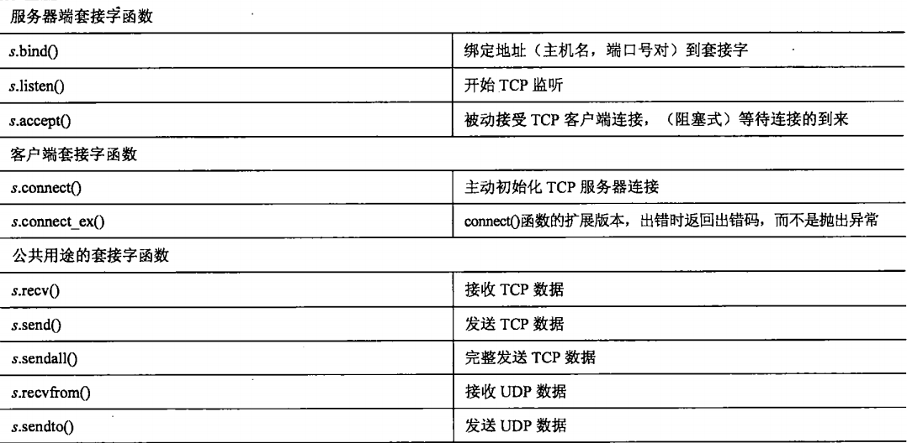
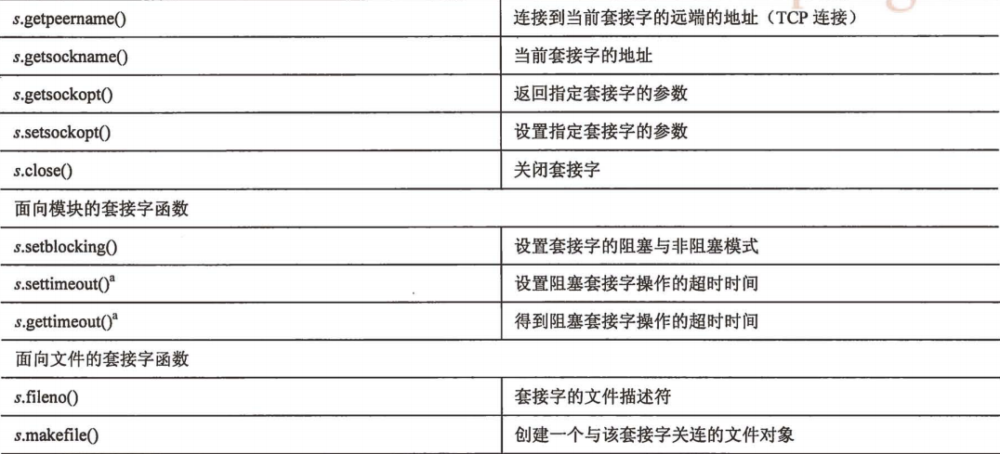
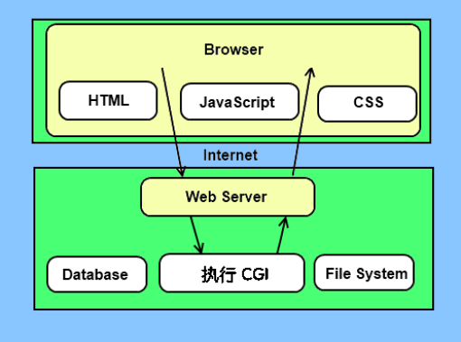
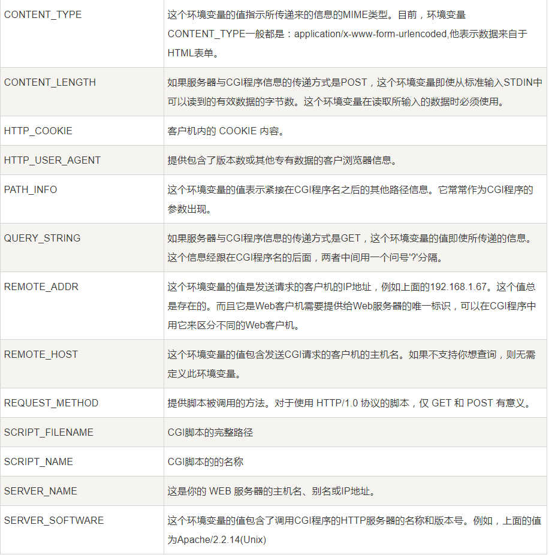

# Python网络编程

### 本节重点
>* 回顾网络编程的基础理论
>* 掌握Python socket编程的基本方法
>* 能够基于socket实现Python版本的TCP服务器(多进程版本, 多线程版本, epoll版本)
>* 能够基于SocketServer实现Python版本的TCP/UDP服务器
>* 基于Python实现HTTP客户端/服务器
>* 掌握Python发送电子邮件的方法

## 网络基础
### 客户端/服务器架构

服务器是一个软件或硬件, 为一个或者多个客户端提供 **服务**

这个**服务**怎么理解呢?

- 餐馆给客户提供了用餐服务;
- 超市给客户提供了购买服务;
- 百度给客户提供了搜索服务;
- 滴滴给客户提供了打车服务;
- UC给客户提供了"震惊"服务;

震惊！！UC编辑部招聘试题外露！

>* 服务器是 "受", 只能被动的等待客户端的连接和请求;
>* 客户端是 "攻", 主动发起请求和连接;

>* 服务器不光可以是软件, 也可以是硬件设备. 比如打印机, 就是一个典型的硬件服务器.
>* 当然软件的服务器, 也是要运行在某个硬件上的~~ web服务器(http/https服务器), 数据库服务器都是典型的软件服务器.
>* 服务器的特点是不会退出. 要么在处理客户端的请求, 要么就是在等待客户端的请求;

关于网络编程, 操作系统提供了套接字socket这一系列的编程接口. Python中也是可以使用这样的接口的. 而且相比于C语言, 使用起来更简洁方便.

### IP和端口号
回忆唐僧的自我介绍: 
贫僧法号玄奘, 来自东土大唐, 要去西天拜佛求经.

>* IP表示位置, 源IP就是东土大唐, 目的IP就是西天.
>* 端口号表示"谁". 源端口就是玄奘, 目的端口就是如来佛祖.

### TCP和UDP
TCP
>* 可靠传输
>* 有连接
>* 面向字节流

UDP
>* 不可靠传输
>* 无连接
>* 面向数据报

## socket模块
socket模块是操作系统原生socket api接口的简单封装.

### 创建socket对象
使用socket模块中的socket函数来创建一个socket对象. 

>* 创建一个UDP socket对象

	udp_socket = socket.socket(socket.AF_INET, socket.SOCK_DGRAM)

>* 创建一个TCP socket对象

	tcp_socket = socket.socket(socket.AF_INET, socket.SOCK_STREAM)

使用方法和C风格API非常接近.

### socket对象内置方法

## UDP客户端/服务器
### UDP服务器

	import socket

	sock = socket.socket(socket.AF_INET, socket.SOCK_DGRAM)
	sock.bind(("0.0.0.0", 9090))
	
	while True:
	    data, addr = sock.recvfrom(1024)    # 1024表示接收缓冲区的大小
	    print addr, data
	    sock.sendto(data, addr)

### UDP客户端

	import socket
	addr = ("192.168.1.108", 9090)
	sock = socket.socket(socket.AF_INET, socket.SOCK_DGRAM)
	while True:
	    data = raw_input("> ")
	    sock.sendto(data, addr)
	    data, _ = sock.recvfrom(1024)
	    print data

## TCP客户端/服务器

### TCP服务器

	import socket
	addr = ('0.0.0.0', 9090)
	sock = socket.socket(socket.AF_INET, socket.SOCK_STREAM)
	sock.bind(addr)
	sock.listen(5)
	
	while True:
	    print 'waiting for connection'
	    client_sock, addr = sock.accept()
	    print 'connect from ', addr
	
	    while True:
	        data = client_sock.recv(1024)
	        if not data:
	            break
	        client_sock.send(data)
	    client_sock.close()
	sock.close()

### TCP客户端

	import socket
	addr = ('192.168.1.108', 9090)
	sock = socket.socket(socket.AF_INET, socket.SOCK_STREAM)
	sock.connect(addr)
	while True:
	    data = raw_input('> ')
	    sock.send(data)
	    data = sock.recv(1024)
	    if not data:
	        break
	    print data
	sock.close()

但是问题来了, 按照这样的形式实现的server, 同一时刻只能处理一个连接.

我们可以有多种方式来处理这个问题.

### 多进程服务器: fork版本 

代码略

### 多进程服务器: multiprocessing版本

	import socket
	from multiprocessing import Process
	import os
	
	def ProcessConnect(client_sock):
	    while True:
	        data = client_sock.recv(1024)
	        if not data:
	            break
	        client_sock.send(data)
	    client_sock.close()
	
	def CreateProcess(client_sock):
	    p = Process(target=ProcessConnect, args=(client_sock,))
	    p.start()
	    os._exit(0)
	
	addr = ('0.0.0.0', 9090)
	sock = socket.socket(socket.AF_INET, socket.SOCK_STREAM)
	sock.bind(addr)
	sock.listen(5)
	
	while True:
	    print 'waiting for connection'
	    client_sock, addr = sock.accept()
	    print 'connect from ', addr
	    p = Process(target=CreateProcess, args=(client_sock,))
	    p.start()
	    p.join()
	    
	sock.close()

>* 子进程创建孙子进程, 由孙子进程负责和客户端交互.
>* 子进程创建了孙子进程后, 主动使用 `os._exit(0)` 退出. 此处使用 `sys.exit(0)` 无效. 因为 `sys.exit(0)` 本质上是抛出一个异常, 这个异常被multiprocessing模块捕获了, 不会执行退出行为.
>* 这样可以保证子进程快速退出, 不会在join处阻塞. 同时也不会产生僵尸进程(子进程退出后, 孙子进程成为了孤儿进程, 会被init进程回收). 

### 多线程服务器

	import socket
	from threading import Thread
	
	def ProcessConn(client_sock):
	    while True:
	        data = client_sock.recv(1024)
	        print data
	        if not data:
	            break
	        client_sock.send(data)
	
	addr = ('0.0.0.0', 9090)
	sock = socket.socket(socket.AF_INET, socket.SOCK_STREAM)
	sock.bind(addr)
	sock.listen(5)
	while True:
	    print 'wait connection'
	    client_sock, addr = sock.accept()
	    t = Thread(target=ProcessConn, args=(client_sock,))
	    t.start()
	sock.close()

>* 虽然我们前面讲了, Python的多线程受制于GIL. 但是无论accept还是recv, 都阻塞在IO上, 这样的话线程之间是可以并行执行的.
>* 但是当并发比较高的时候, 这种方案不是一个非常靠谱的方法.

### 多路转接服务器
我们这里就以epoll为例

**epoll对象的使用方法**

	import select 导入select模块
	
	epoll = select.epoll() 创建一个epoll对象
	
	epoll.register(文件句柄,事件类型) 注册要监控的文件句柄和事件
	
	事件类型:
	
	　　select.EPOLLIN    可读事件
	
	　　select.EPOLLOUT   可写事件
	
	　　select.EPOLLERR   错误事件
	
	　　select.EPOLLHUP   客户端断开事件
	
	epoll.unregister(文件句柄)   销毁文件句柄
	
	epoll.poll(timeout)  当文件句柄发生变化，则会以列表的形式主动报告给用户进程,timeout
	
	                     为超时时间，默认为-1，即一直等待直到文件句柄发生变化，如果指定为1
	
	                     那么epoll每1秒汇报一次当前文件句柄的变化情况，如果无变化则返回空
	
	epoll.fileno() 返回epoll的控制文件描述符(Return the epoll control file descriptor)
	
	epoll.modfiy(fineno,event) fineno为文件描述符 event为事件类型  作用是修改文件描述符所对应的事件
	
	epoll.fromfd(fileno) 从1个指定的文件描述符创建1个epoll对象
	
	epoll.close()   关闭epoll对象的控制文件描述符

**epoll服务器代码(LT)**

	import select
	import socket
	
	def ProcessConn(listen_sock, epoll, connection):
	    client_sock, addr = listen_sock.accept()
	    print 'client: ' + str(addr) + ' connect!'
	    epoll.register(client_sock.fileno(), select.EPOLLIN)
	    connection[client_sock.fileno()] = client_sock
	    return epoll, connection
	    
	def ProcessRecv(fd, epoll, connection):
	    print 'ProcessRecv'
	    client_sock = connection[fd]
	    data = client_sock.recv(1024)
	    if not data:
	        epoll.unregister(fd)
	        client_sock.close()
	        del connection[fd]
	        return epoll, connection
	    print 'recv: ' + data
	    client_sock.send(data)
	    return epoll, connection
	
	addr = ('0.0.0.0', 9090)
	listen_sock = socket.socket(socket.AF_INET, socket.SOCK_STREAM)
	listen_sock.bind(addr)
	listen_sock.listen(5)
	
	epoll = select.epoll()
	epoll.register(listen_sock.fileno(), select.EPOLLIN)
	connection = {}
	while True:
	    print 'wait events'
	    events = epoll.poll()
	    if not events:
	        print 'wait timeout'
	        continue
	    for fd, event in events:
	        if fd == listen_sock.fileno():
	            epoll, connection = ProcessConn(listen_sock, epoll, connection)
	        elif event & select.EPOLLIN:
	            epoll, connection = ProcessRecv(fd, epoll, connection)
	
**epoll服务器(ET)**

同学们自己完成

## SocketServer模块
socket模块在官方文档中称为Low-level networking interface. Low-level呢, 此处有两层含义. 第一是很接近底层, 贴近操作系统. 第二就是 "逼格" 太low

既然如此, Python肯定提供了一个更NB的模块让我们去实现一个TCP/UDP服务器. 这就是SocketServer 

**TCP服务器**

	from SocketServer import ThreadingTCPServer, BaseRequestHandler
	
	class MyRequestHandler(BaseRequestHandler):
	    def handle(self):
	        print 'connected from:', self.client_address
	        while True:
	            data = self.request.recv(1024)
	            if not data:
	                break
	            self.request.sendall(data)
	
	addr = ('0.0.0.0', 9090)
	# udp = ForkingUDPServer(addr, MyRequestHandler)
	# tcp = ForkingTCPServer(addr, MyRequestHandler)
	# udp = ThreadingUDPServer(addr, MyRequestHandler)
	tcp = ThreadingTCPServer(addr, MyRequestHandler)
	print 'waiting for connection...'
	tcp.serve_forever()

>* ForkingUDPServer, ForkingTCPServer, 使用多进程的方式创建了UDP, TCP服务器
>* ThreadingUDPServer, ThreadingTCPServer, 使用多线程的方式创建了UDP, TCP服务器
	
## HTTP客户端/服务器

### HTTP客户端: urllib2模块
>* urllib2是Python标准库中提供的一个HTTP客户端, 可以让我们非常容易的访问到HTTP服务器.

	import urllib2

	f = urllib2.urlopen('http://www.baidu.com')
	print f.read()

	# 执行结果
	[太长了不粘贴了, /捂脸]

### HTTP服务器: 基于CGI
CGI全称为 "通用网关接口" , 是互联网发展早期的时候, 一种实现动态网站的 "通用编程接口" .

在我们学习Linux网络编程阶段, 已经基于C语言和TCP协议, 实现了一个支持CGI的HTTP服务器. 我们对于CGI的基本原理已经有了一定的理解了. 

此处我们直接使用Python提供的现成的CGI模块, 可以非常方便的搭建出一个HTTP服务器.

**示例1: 访问静态文件**

>* 我们创建一个目录 `root`
>* 在root目录中, 创建index.html, 代码如下

	<html>
		<h1>hello cgi</h1>
	</html>

>* 在root目录中, 我们执行 `python -m CGIHTTPServer`
>* 在浏览器中输入 `http://127.0.0.1:8000/index.html` 即可看到页面内容.

**示例2: 基于CGI动态生成页面**

>* 我们在root目录下创建一个目录 `cgi-bin` (名字必须是这个)
>* 在 cgi-bin 目录下, 我们创建一个 hello.py, 内容如下

	import cgi
	print '''HTTP/1.1 200 OK
	Content-Type: text/html
	Content-Length: 15 
	
	<h1>hello</h1>'''

>* 在Linux下, 还需要指定python执行路径 #!/usr/bin/python, 并 chmod +x hello.py 添加执行权限.
>* 在root目录中, 我们执行 `python -m CGIHTTPServer`
>* 在浏览器中输入 `http://127.0.0.1:8000/cgi-bin/hello.py` 即可看到页面内容.
>* 注意, 如果hello.py不放到cgi-bin目录下, 而是放在其他目录下, 服务器不会把hello.py当做cgi程序执行, 而是按文本文件返回.
>* 注意, hello.py向标准输出输出的内容, 是一个符合HTTP协议响应内容的字符串, 需要带有首行, header, 空行, 以及body.

**示例3: 处理带参数的请求(GET/POST)**

CGI约定, 通过环境变量, 将一些参数传递给CGI子进程

查看CGI程序中的环境变量

	#!/usr/bin/python
	import cgi, os
	print 'HTTP/1.1 200 OK'
	print 'Content-Type: text/html'
	print
	print '<html>'
	for key in os.environ:
	    print '
' + key + ':' + os.environ[key] + '
'
	print '</html>'

	# 执行结果
	[太长了, 就不粘贴了]

其中我们可以通过QUERY_STRING这个环境变量拿到参数. 不过我们此时拿到的参数是一个使用 & 和 = 分割的参数.  
我们可以基于cgi模块中的 FieldStorage 方法来更轻松的获取到参数的值. 

	#!/usr/bin/env python
	import cgi
	form = cgi.FieldStorage()
	name = form.getvalue('name')
	print 'HTTP/1.1 200 OK'
	print 'Content-type:text/html'
	print
	print '<html>'
	print '
name: %s
' % name
	print '</html>'

	# 执行结果
	浏览器输入: http://192.168.1.108:8000/cgi-bin/arg_index.py?name=aabbb
	浏览器返回: name: aabbb

>* POST请求的处理方式和GET一样, 也是可以通过FieldStorage获取到内容, 这里就不展开了. 

**小技巧**

我们在命令行执行 `python -m CGIHTTPServer` 命令的时候, 如果终端退出了, 服务器也就随之退出了(我们的这个Python服务器进程其实是当前这个终端对应的shell的子进程, 终端退出时会给子进程发信号将子进程干掉).

我们可以使用 `nohup python -m CGIHTTPServer &` 的方式执行命令, 这样就使Python服务器在后台执行, 终端断开也不会使服务器退出.

在这种情况下, 如果需要退出服务器, 就需要使用 kill 命令将Python进程终止即可.

### HTTP服务器: 基于各种框架

Python的HTTP框架有很多, 例如大名鼎鼎的重量级框架Django, 远古大神轻量级框架webpy, 后起之秀Flask等等等.

关于这些框架, 同学们可以参考一篇文章, 写的非常中肯. 

<a href="http://www.cnblogs.com/suzhigang/p/6208244.html">浅谈Python Web开发五大框架</a>

## 邮件客户端
### SMTP协议和smtplib模块
SMTP（Simple Mail Transfer Protocol）即简单邮件传输协议, 这也是一种应用层协议. 它是一组用于由源地址到目的地址传送邮件的规则，由它来控制信件的中转方式. 

Python中使用smtplib模块实现了一个基于SMTP的客户端.

	import smtplib

	smtpObj = smtplib.SMTP( [host [, port [, local_hostname]]] )

参数说明：
>* host: SMTP 服务器主机。 你可以指定主机的ip地址或者域名，这个是可选参数。
>* port: 如果你提供了 host 参数, 你需要指定 SMTP 服务使用的端口号，一般情况下 SMTP 端口号为25。
>* local_hostname: 如果 SMTP 在你的本机上，你只需要指定服务器地址为 localhost 即可

	SMTP.sendmail(from_addr, to_addrs, msg[, mail_options, rcpt_options]

参数说明：
>* from_addr: 邮件发送者地址。
>* to_addrs: 字符串列表，邮件发送地址。
>* msg: 发送消息

注意, msg这个参数是一个字符串. 但是我们一个email, 其实也是一个结构化的数据, 包含标题, 正文, 发送者, 接受者等信息. 
可以使用 email 模块协助我们来构建一个这样的格式化字符串.

### 给自己的QQ邮箱发邮件

	#!/usr/bin/python
	# -*- coding: UTF-8 -*-
	 
	import smtplib
	from email.mime.text import MIMEText
	from email.utils import formataddr
	 
	my_sender = '727706910@qq.com'  # 发件人邮箱账号
	my_pass = 'nsoyymrygewbbcci'    # 发件人邮箱密码
	my_user = '727706910@qq.com'    # 收件人邮箱账号
	msg = MIMEText('邮件正文','plain','utf-8')
	msg['From'] = formataddr(["汤众",my_sender])          # 参数为对应发件人邮箱昵称、件人邮箱账号
	msg['To'] = formataddr(["汤众",my_user])              # 参数为对应收件人邮箱昵称、收件人邮箱账号
	msg['Subject'] = "我是主题"                           # 邮件的主题
	
	server=smtplib.SMTP_SSL("smtp.qq.com", 465)
	server.login(my_sender, my_pass)  # 参数为发件人邮箱账号, 邮箱密码
	server.sendmail(my_sender,[my_user,],msg.as_string())  # 括号中对应的是发件人邮箱账号、收件人邮箱账号、发送邮件
	server.quit()  # 关闭连接
	print("邮件发送成功")

注意:
>* 发送邮件之前, 需要在QQ邮箱的设置界面中开启授权. 

>* 此处填写的邮箱密码, 指的不是qq邮箱的登录密码, 而是授权码. 
>* 收到的邮件可能会被放到垃圾邮件里~~
>* 如果发送失败, 会反馈一个错误码, 可以根据错误码查看原因.
