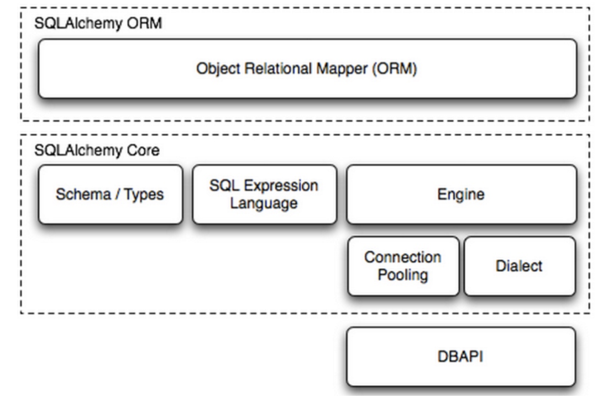

# Python数据库编程

### 本节重点
>* 回顾数据库的基础理论
>* 掌握基于数据库API操作数据库
>* 掌握基于ORM方式操作数据库

## 关系型数据库回顾
### 底层存储
数据库底层通常使用文件系统进行存储. 可能是:

- 普通操作系统文件
- 专用操作系统文件
- 磁盘分区

### 用户界面
大部分数据库都提供一个命令行工具来执行SQL命令进行数据查询操作.  
当然也有一些图形界面的客户端能完成同样的事情.

### 结构化数据
数据库中有若干张数据表. 每一个表都有固定的表结构(表头).  
也就是说每一条记录, 包含的字段的数目和类型都是约定好的.  
对于一张表来说, 可以通过SQL语句进行 **增, 删, 查, 改**

### SQL简单回顾
关系型数据库都支持SQL语句. 

	# 创建数据库test
	create database test;

	# 切换到数据库test
	use test;

	# 删除数据库test
	drop database test;

	# 创建表users, 包含了3个字段.
	create table users(login VARCHAR(8), uid INT, prid INT);

	# 删除表
	drop table users;

	# 插入行
	insert into users values('tangzhong', 100, 200);

	# 更新行
	update users set prid=400 where prid=200

	# 删除行
	delete from users where prid=200;

	# 删除所有行
	delete from users

## 使用API访问数据库

### 使用sqlite数据库API
我们以sqlite为例. sqlite是一个非常小的轻量级数据库, 使用非常方便, 很适合数据库初学者.

Python中自带了sqlite数据库, 不需要额外安装(大概在/usr/lib64/python2.7/sqlite3这样的目录中). 使用 sqlite3 模块可以完成数据库的基本操作.

	import sqlite3

	conn = sqlite3.connect('test.db')
	c = conn.cursor()
	c.execute('create table student(id int primary key, score int, name text)')
	c.execute('insert into student values(%d, %d, "%s")' % (100, 94, 'tangzhong'))
	c.execute('insert into student values(%d, %d, "%s")' % (101, 95, 'tangzhong2'))
	c.execute('insert into student values(%d, %d, "%s")' % (102, 96, 'tangzhong3'))
	conn.commit()
	
	result = c.execute('select * from student')
	for row in result:
	    print row
	
	conn.close()

执行之后, 可以看到本地生成了一个 test.db 的数据库文件. 

	sqlite3 test.db

打开文件之后, 使用 sql 语句

	select * from student;	

即可看到刚才通过代码插入的记录.

### 使用MySQL数据库API

Python中使用模块MySQLdb封装了MySQL的API接口. 

注意: MySQLdb模块不是标准库中的模块, 需要额外安装. 

	sudo pip install mysql-python

我们先使用mysql创建数据库

	# 创建用户
	create user 'test'@'%' identified by '1';

	# 创建数据库 testDB
	create database testDB;

	# 给test用户授权
	grant all privileges on testDB.* to test identified by '1';

	# 刷新权限表
	flush privileges;
	
	# 切换到 testDB 数据库
	use testDB;

	# 创建表
	create table student(id int primary key, score int, name text);

	# 插入数据
	insert into student values(100, 94,  'tangzhong');
	insert into student values(101, 95,  'tangzhong2');
	insert into student values(102, 96,  'tangzhong3');

接口使用和sqlite非常相似.

	# -*- coding: UTF-8 -*-
	import MySQLdb

	db = MySQLdb.connect(host='localhost', user='test', passwd='test', db='testDB')
	cursor = db.cursor()
	result = cursor.execute('select * from student')
	for row in result:
	    print row
	db.close()

## 使用ORM访问数据库
现今的数据库, 种类很多. 其中绝大多数的数据库都支持Python API. 但是这些API有一个最大的缺点, 就是要求用户必须懂SQL. 

而接下来我们介绍的对象-关系管理器(ORM), 不需要程序猿会写SQL, 也能非常流畅的操作数据库.

那么我只能说

### 初识ORM(Object-Relational Mapping)
数据库表是一个二维表，包含多行多列。把一个表的内容用Python的数据结构表示出来的话，可以用一个list表示多行，list的每一个元素是tuple，表示一行记录，比如，包含id和name的user表：

	[
	    ('1', 'Michael'),
	    ('2', 'Bob'),
	    ('3', 'Adam')
	]

Python的DB-API返回的数据结构就是像上面这样表示的。

但是用tuple表示一行很难看出表的结构. 如果把一个tuple用class实例来表示，就可以更容易地看出表的结构来. 

	class User(object):
	    def __init__(self, id, name):
	        self.id = id
	        self.name = name
	
	[
	    User('1', 'Michael'),
	    User('2', 'Bob'),
	    User('3', 'Adam')
	]

考虑对象, 而不是SQL. 
>* 将SQL层的功能抽象为Python对象. 
>* 只要操作相关的Python对象就可以完成数据库的操作. 
>* 数据库的表被转换成Python的类. 它具有列属性和操作数据库的方法.

知名的ORM模块有很多. 我们取其中较知名的SQLAlchemy为例. 其他ORM模块的使用方法都是类似的. 

 

SQLAlchemy本身无法操作数据库, 而是通过调用数据库API的方式, 完成具体的数据库操作.

SQLAlchemy也是一个第三方的包. 需要使用pip进行安装 

	sudo pip install sqlalchemy

### 使用SQLAlchemy操作数据库
我们基于刚刚创建的sqlite数据库的学生表

	CREATE TABLE student(id int primary key, score int, name text);

我们讲创建好学生表结构的数据库名字命名为 test.db 

**创建student.py, 创建用来映射表结构的类**

	from sqlalchemy import Column, TEXT, BIGINT
	from sqlalchemy.ext.declarative import declarative_base
	
	Base = declarative_base()
	
	class Student(Base):
	    __tablename__ = 'student'
	    id = Column(BIGINT(), primary_key = True)
	    score = Column(BIGINT())
	    name = Column(TEXT())

**向数据库中插入数据**

	#coding:utf-8
	from sqlalchemy.orm import sessionmaker
	from sqlalchemy import create_engine
	from student import Student
	
	# '数据库类型+数据库驱动名称://用户名:口令@机器地址:端口号/数据库名'
	engine = create_engine('sqlite:///./test.db')
	DBSession = sessionmaker(bind = engine)
	session = DBSession()
	student = Student(id = 10, score = 100, name = 'tangzhong')
	session.add(student)
	session.commit()
	session.close()

>* 使用create_engine方法创建数据库的"连接方式"
>* 使用sessionmaker创建一个DBSession类.
>* 将DBSession类实例化成一个session对象. 这时才真正的进行了连接.
>* 使用session.add()方法向数据库插入一条记录.
>* 使用session.commit()

这个时候我们使用sqlite打开数据库, 可以看到内容已经被添加进去了. 

	sqlite3 test.db
	select * from student;

	# 执行结果
	10|100|tangzhong

**查询数据**

	from sqlalchemy.orm import sessionmaker
	from sqlalchemy import create_engine
	from student import Student
	
	engine = create_engine('sqlite:///./test.db')
	DBSession = sessionmaker(bind = engine)
	session = DBSession()
	
	students = session.query(Student).filter(Student.id == 10).all()
	for s in students:
	    print 'type:', type(s)
	    print 'name:', s.name
	session.close()

>* 使用session.query()方法进行查询. 并使用filter方法进行筛选. 
>* all()方法返回所有记录的列表. one()方法只获取一条记录.

**修改数据**

	from sqlalchemy.orm import sessionmaker
	from sqlalchemy import create_engine
	from student import Student
	
	engine = create_engine('sqlite:///./test.db')
	DBSession = sessionmaker(bind = engine)
	session = DBSession()
	
	s = session.query(Student).filter(Student.id == 10).one()
	print 'name:', s.name
	s.name = 'hehe'
	session.commit()
	session.close()

>* 依照查询到的结果, 直接修改对象的值即可. 

注意: 修改完之后, 需要调用 session.commit() 提交, 结果才能生效.

**删除数据**

	from sqlalchemy.orm import sessionmaker
	from sqlalchemy import create_engine
	from student import Student
	
	engine = create_engine('sqlite:///./test.db')
	DBSession = sessionmaker(bind = engine)
	session = DBSession()+
	
	student = session.query(Student).filter(Student.id == 10).one()
	session.delete(student)
	session.commit()
	
	student = session.query(Student).filter(Student.id == 10).one()
	print student.name

>* 使用session的delete方法进行删除.