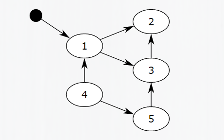
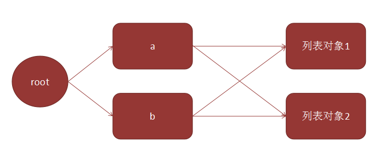
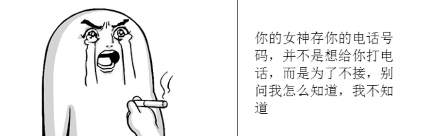

# Python高级特性

## 可调用对象
可调用对象的概念非常简单, 只要一个对象具有 `__call__`这样的方法, 就可以使用()来调用. 类似于C++中的仿函数.

	def Func():
	    print 'hello'
	
	print dir(Func)

	# 执行结果
	['__call__', '__class__', '__closure__', '__code__', '__defaults__', '__delattr__', '__dict__', '__doc__', '__format__', '__get__', '__getattribute__', '__globals__', '__hash__', '__init__', '__module__', '__name__', '__new__', '__reduce__', '__reduce_ex__', '__repr__', '__setattr__', '__sizeof__', '__str__', '__subclasshook__', 'func_closure', 'func_code', 'func_defaults', 'func_dict', 'func_doc', 'func_globals', 'func_name']

一个函数其实就是一个可调用的对象. 

我们也可以让自定义的类成为可调用对象.

	class Add(object):
	    def __init__(self, x):
	        self.x = x
	    def __call__(self, y):
	        return self.x + y
	
	add = Add(10)
	print add(20)

	# 执行结果
	30

## 上下文管理器
上下文管理器, 其实是类似于C++智能指针, 能够自动的帮助我们完成一些清理操作. 

### with语句

	with context_expr [as var]:
	    with_suite

>* context_expr是支持上下文管理协议的对象，也就是上下文管理器对象，负责维护上下文环境.
>* as var是一个可选部分，通过变量方式保存上下文管理器对象.
>* with_suite就是需要放在上下文环境中执行的语句块.

在Python的内置类型中，很多类型都是支持上下文管理协议的，例如file，thread.LockType，threading.Lock等等

	with open("test.txt") as f:
    	print "".join(f.readlines())

随着with中的语句执行结束, f会自动执行close方法来关闭文件.

### 上下文管理协议
其实所谓的 **上下文管理器** 是一种支持 **上下文协议** 的对象. 
>* `__enter__` 方法: 在执行`with_suite`之前调用执行, 进行一些初始化动作;
>* `__exit__` 方法: 在执行`with_suite`之后调用执行, 进行一些清理操作.

	with open("test.txt") as f:
		print dir(f)

	# 执行结果
	['__class__', '__delattr__', '__doc__', '__enter__', '__exit__', '__format__', '__getattribute__', '__hash__', '__init__', '__iter__', '__new__', '__reduce__', '__reduce_ex__', '__repr__', '__setattr__', '__sizeof__', '__str__', '__subclasshook__', 'close', 'closed', 'encoding', 'errors', 'fileno', 'flush', 'isatty', 'mode', 'name', 'newlines', 'next', 'read', 'readinto', 'readline', 'readlines', 'seek', 'softspace', 'tell', 'truncate', 'write', 'writelines', 'xreadlines']

### 实现一个上下文管理器
我们实现一个计时类, 完成对一个代码块执行时间的计时功能. 

	import time
	class Timer(object):
	    def __enter__(self):
	        self.beg = time.time()
	    def __exit__(self, *unused):
	        print 'time:', time.time() - self.beg
	        return False
	
	with Timer():
	    x = 0
	    for i in xrange(0, 100000):
	        x = x + 1

	# 执行结果
	time: 0.0204801559448

### __exit__函数参数说明

	__exit__(self, exception_type, exception_value, traceback)

即使在`with_suite`中抛出异常, `__exit__`也能够正常调用到. 如果是由于`with_suite`语句抛出异常了, 可以通过`__exit__`的参数来看到. 

## 装饰器

### 装饰器回顾
装饰器, 是Python的一个相当漂亮的语法, 我们已经在面向对象部分有过初步的认识了. 

	class C(object):
		@staticmethod
		def Print():
			print 'hello'
	
	C.Print() 

>* 加上 @staticmethod 的修饰, Print成为了一个类属性. 

### 函数的嵌套定义
Python中的函数, 支持嵌套定义. 即, 可以在一个函数的内部, 定义一个函数. 

	def outer():
	     x = 1
	     def inner():
	         print x 
	     inner()
	 
	outer()

	# 执行结果
	1

>* 变量作用域: 每一个函数内部都是一个新的作用域.
>* 变量名查找规则: 首先查找本函数内部, 如果本函数中不存在, 就会向上一级作用域中查找.

### 闭包: 给函数套一层外壳
函数也是对象, 可以作为一个函数的返回值

	def outer():
	     x = 1
	     def inner():
	         print x
	     return inner
	 
	func = outer()
	func()

	# 执行结果
	1

>* 我们通过outer函数, 返回了另外一个函数inner, 并且赋值给func变量. 这个过程中并没有触发打印语句, 也就是没有执行inner里的代码.
>* 调用func函数, 其实就是在执行inner函数, 执行print x语句. 
 
那么问题来了!

>* 从变量的生存周期来看，我们的变量x是函数outer的一个本地变量，这意味着只有当函数outer正在运行的时候才会存在. 
>* 根据我们已知的python运行模式，我们没法在函数outer返回之后继续调用函数inner，在函数inner被调用的时候，变量x早已不复存在，可能会发生一个运行时错误. 

然而实际上, 刚才的代码运行的很好~

Python支持一个叫做函数闭包的特性，用人话来讲就是，嵌套定义在非全局作用域里面的函数能够记住它在被定义的时候它所处的封闭命名空间.

	def outer():
	     x = 1
	     y = 'aaa'
	     def inner():
	         print x
	         print y
	     return inner
	 
	func = outer()
	func()
	print func.func_closure

	# 执行结果
	(<cell at 0x7f1c18439718: int object at 0x1da9c68>, <cell at 0x7f1c18439750: str object at 0x7f1c1843f0d0>)

记住，每次函数outer被调用的时候，函数inner都会被重新定义

	def outer(x):
	     def inner():
	         print x
	     return inner
	print1 = outer(1)
	print2 = outer(2)
	print1()
	print2()

	# 执行结果
	1
	2

被函数记住的封闭作用域. 能够被用来创建自定义的函数，本质上来说是一个硬编码的参数.  
事实上我们并不是传递参数1或者2给函数inner，我们实际上是创建了能够打印各种数字的各种自定义版本.  

在某些方面，你也许会把它当做一个类似于面向对象的技术：outer像是给inner服务的构造器，x像一个私有变量

### 装饰器: 更优雅的语法糖
装饰器其实就是一个闭包，把一个函数当做参数然后返回一个替代版函数. 

	def outer(some_func):
	     def inner():
	         print "before some_func"
	         ret = some_func()
	         return ret + 1
	     return inner
	
	def foo():
	     return 1
	
	decorated = outer(foo)
	decorated()

	# 执行结果
	before some_func
	2

其实, 我们完全可以把outer函数的返回值, 仍然赋值给foo. 

	foo = outer(foo)

这样再调用foo, 其实就是一个经过 "修饰" 的foo了. 例如我们可以用这样的方式来给一个函数的前后都加上日志.

	def logger(func):
	     def inner(x, y):
	         print 'before %s' % func.__name__
	         ret = func(x, y)
	         print 'after %s' % func.__name__
	         return ret
	     return inner
	
	def Add(x, y):
	    return x + y
	
	Add = logger(Add)
	print Add(100, 200)

	# 执行结果
	300

用 `Add = logger(Add)` 这样的语句, 有一点蠢. 于是我们可以用一个更优雅的写法

	def logger(func):
	     def inner(x, y):
	         print 'before %s' % func.__name__
	         ret = func(x, y)
	         print 'after %s' % func.__name__
	         return ret
	     return inner
	
	@logger
	def Add(x, y):
	    return x + y
	
	print Add(100, 200)

>* 在函数的脑门上, 使用@函数名 这样的方式, 就定义了一个装饰器. 这个语句等价于 `Add = logger(Add)`

但是问题来了, 目前这个logger只能适用于, 只有两个参数的函数, 一旦参数数目不同了, 就无法正常工作了. 

	@logger
	def Func():
		print 'hehe'

	Func()

	# 执行结果
	Traceback (most recent call last):
	  File "test.py", line 17, in <module>
	    Func()
	TypeError: inner() takes exactly 2 arguments (0 given)
	
### 更通用的装饰器
为了解决上面的问题, 我们可以结合Python的可变参数来搞定

	def logger(func):
	     def inner(*args):
	         print 'before %s' % func.__name__
	         ret = func(*args)
	         print 'after %s' % func.__name__
	         return ret
	     return inner
	
	@logger
	def Add(x, y):
	    return x + y
	
	@logger
	def Func():
	    print 'hehe'
	
	Func()
	Add(100, 200)

	# 执行结果
	before Func
	hehe
	after Func
	before Add
	after Add

>* 使用变长参数 *args 的方式, 就可以适应N个参数的情况. 

但是问题到这里还没完. 如果是这样的函数

	Add(x=100, y=100)

	# 执行结果
	Traceback (most recent call last):
	  File "test.py", line 18, in <module>
	    Add(x = 100, y = 200)
	TypeError: inner() got an unexpected keyword argument 'x'

我们可以这样处理

	def logger(func):
	     def inner(*args, **kwargs):
	         print 'before %s' % func.__name__
	         ret = func(*args, **kwargs)
	         print 'after %s' % func.__name__
	         return ret
	     return inner
	
	@logger
	def Add(x, y):
	    return x + y
	
	@logger
	def Func():
	    print 'hehe'
	
	Func()
	Add(x = 100, y = 200)

	# 执行结果
	before Func
	hehe
	after Func
	before Add
	after Add

>* 应用关键字参数, 就可以将我们的logger装饰器实现的更完善了. 

## 内存管理 和 垃圾回收(Garbage collection, GC)机制
垃圾回收是Python中的一个**难点**, 也是一个面试的重要**考点**.

>* Python程序猿不需要考虑一个变量占用的内存何时释放. 这些都是由GC机制帮助我们自动完成的.
>* 垃圾回收好比程序的 "肾脏". 是程序能稳定运行的重要支撑. 
>* Python的GC用一句话来描述: **引用计数为主, 标记-清除为辅, 分代回收来进一步提高效率**.

### 引用计数
>* Python中每一个变量都是 "对象". 变量名其实是一个对象的 "引用". (敲小黑板, 回忆我们之前讲的).

	>>> a = 100
	>>> id(a)
	24187568
	>>> a = 200
	>>> id(a)
	24191144
	>>> b = a
	>>> id(b)
	24191144
	>>> b = 300
	>>> id(b)
	25094648 

>* 当我们执行到 `a = 200` 的时候, 实际上是创建了一个 200 这样的一个对象, 分配一个内存, 保存了 "200" 这个数字. 同时创建一个引用a. 此时"200"对象引用计数为1.
>* 当我们执行到 `b = a` 的时候, 200这个对象, 引用计数加1, 变成了2.
>* 当我们执行到 `b = 300` 的时候, 给b重新绑定了一个对象. 这时候 200 这个对象再减1, 又成了1.
>* 一直到a这个引用也销毁(变量名出了自己的生命周期), 200这个对象的引用计数就是0了. 这个时候Python解释器就会自动把这段内存释放掉.
>* 这个过程和我们C++中的`shared_ptr`的原理是非常相似的.

### del 语句
>* del语句会删除一个引用: 将这个名字删除掉, 同时使对应的对象的引用计数减1.

	a = 100
	b = a
	del a
	print a

	# 执行结果
	Traceback (most recent call last):
	  File "test.py", line 4, in <module>
	    print a
	NameError: name 'a' is not defined

### 循环引用
>* 引用计数有一个比较致命的缺陷, 叫做循环引用.

	a = 100     # "100" 对象引用计数为1
	b = a 		# "100" 对象引用计数为2
	a = b		# "100" 对象引用计数为3??
	del a		# "100" 对象引用计数为2
	del b 		# "100" 对象引用计数为1

等等, 好像哪里不太对? 柴柴屁股一沉, 觉得事情并不简单.

>* 我们已经把a和b两个引用都干掉了, 但是100这个对象的引用计数仍然是1. 就意味着100这块内存, 并没有被释放掉~
>* 问题出在第三步, 再次执行 `a = b` 时. 如果Python解释器并不知道, a和b之前指向的是同一个对象, 仍然对引用计数+1, 于是就出事了~~

那么问题来了, 执行第三步的 `a = b` 的时候, Python解释器到底知不知道a和b指向相同的对象呢?
>* 答案是知道的, 别忘记我们有 id 这个内建函数, 可以很容易的判定当前这个引用指向的是哪个对象. 所以这种情况下其实执行 `a = b` 之后, 引用计数仍然是2.

	# 这个是正确的结果, 内存是能正确释放的.
	a = 100     # "100" 对象引用计数为1
	b = a 		# "100" 对象引用计数为2
	a = b		# "100" 对象引用计数为2
	del a		# "100" 对象引用计数为1
	del b 		# "100" 对象引用计数为0
	
>* 但是有些情况下, Python解释器就不能很好的判定这种循环引用的情况了, 例如

	a = []       # 列表对象1, 引用计数为1
	b = []		 # 列表对象2, 引用计数为1
	a.append(b)  # 列表对象2的引用计数变成了2
	b.append(a)  # 列表对象1的引用计数也变成2
	del a        # 列表对象1引用计数变为1
	del b        # 列表对象2引用计数变为1

	# 或者
	
	a = {}       # 字典对象1, 引用计数为1
	b = {}       # 字典对象2, 引用计数为1
	a['b'] = b   # 字典对象2, 引用计数为2
    b['a'] = a   # 字典对象1, 引用计数为2
	del a 		 # 字典对象1, 引用计数为1
	del b 		 # 字典对象2, 引用计数为1

>* 问题还是出现了. 这一回Python解释器没法分辨出这个循环引用了.
>* 这个时候虽然a, b两个引用都被干掉了, 但是列表对象1/字典对象1和列表对象2/字典对象2, 引用计数并没有被清0.  

柴柴屁股一沉, 觉得事情并不简单.

>* 实际上, Python中可以包含其他对象的引用的 "容器对象" 都可能导致这种循环引用. 例如列表, 元组, 字典, 类等.

### 标记-清除
针对列表, 字典这些可能导致循环引用的对象, Python通过标记-清除算法来作为引用计数的补充.

对于标记-清除, 可以简单的这么理解: 
>* 对象之间的相互引用, 构成了一个变量的有向图, 引用关系构成了有向图的边.

>* 从根对象(上图的黑色圈圈为根对象)出发, 遍历这个有向图, 将所有能被遍历到的节点, 标记为 "可达"(reachable).
>* 如上图, 1可以直达; 2, 3可以间接到达; 但是4, 5不会被遍历到, 会被标记为不可达.
>* "根对象" 就是全局变量, 调用栈, 寄存器等生命周期贯穿程序始终的对象.
>* 遍历结束之后, GC将所有不可达的对象进行释放.

回顾我们刚刚的代码

	a = []       # 列表对象1, 引用计数为1
	b = []		 # 列表对象2, 引用计数为1
	a.append(b)  # 列表对象2的引用计数变成了2
	b.append(a)  # 列表对象1的引用计数也变成2
	del a        # 列表对象1引用计数变为1
	del b        # 列表对象2引用计数变为1

构成的图结构如下:

经过 `del a ` 和 `del b` 之后, 列表对象1和列表对象2都变成了不可达, 这样就可以被清理掉了.

>* 对于标记-清除, 最大的问题就是性能. 尤其在代码量很庞大的时候, 对象非常非常多的时候, 遍历的开销也会非常大.

### 分代回收
弱代假说(weak generational hypothesis):
>* 年轻对象死的快;
>* 老对象活的时间更长;

这就好比, 创业公司. 90%的创业公司会在1年内死掉; 剩下的公司里, 又有90%会在5年内死掉; 再活下来的, 就是精华, 往往就能存活好久了.

>* Python的GC将生存时间长的对象和生存时间短的对象分别管理(使用链表管理). 分为不同的 "代" (generational).
>* 刚创建的对象, 放在年轻代(第0代)中; 经历了一定次数的GC仍然屹立不倒的, 放到中年代(第1代)中; 而任尔风吹浪打, 我自岿然不动的, 放到老年代(第2代)中(这些对象已经成为老司机);

  

>* 当年轻代对象达到一定数目时, 就会触发年轻代GC, 清理年轻代, 释放不可达对象, 并将已经符合条件的对象移动到中年代; 
>* 当中年代对象达到一定数目的时候, 也会触发中年代GC, 清理不可达对象, 并将符合条件的老司机对象移动到老年代;
>* 当老年代对象达到一定数目的时候, 再触发老年代GC, 清理不可达对象;

由上可见, 年轻代清理最频繁, 中年代次之, 老年代清理的频率就较低了.  
这样的好处就是针对可能很快被释放的对象, 扫描的频率高一些, 因为这部分对象很快被释放的话就能及时释放资源; 针对老司机对象, 不太可能被马上释放, 扫描的频率就没必要那么高, 从而节省系统开销.

这就好比, 一个女神有很多追求者, 但女神的精力是有限的; 如果你是高富帅, 女神肯定对你非常热情; 但如果你矮矬穷, 女神基本就会说 "呵呵".

  

### 参考文章
<a href="http://www.jianshu.com/p/1e375fb40506">Python垃圾回收机制</a>

<a href="http://python.jobbole.com/87843/">Python垃圾回收机制</a>

<a href="http://www.memorymanagement.org/mmref/recycle.html#tracing-collectors">memory management</a>

## Python和C语言的相互调用

### Python调用C语言
需要首先将C语言代码编译成动态链接库. 然后就可以使用Python很方便的调用了. 

**C语言代码**
	
	#include <stdio.h>
	int Add(int x, int y) {
	  return x + y;
	}
	
	void Print(const char* str) {
	  printf("print %s\n", str);
	}

使用命令
		
	gcc -shared -fPIC add.c -o libadd.so

**Python代码**

	from ctypes import cdll
	cur = cdll.LoadLibrary('./libadd.so')
	print cur.Add(10, 20)
	cur.Print("aaa")

	# 执行结果
	30
	print aaa

### C语言调用Python

test.c

	#include <python2.7/Python.h>

	int main() {
	  Py_Initialize();
	  PyRun_SimpleString("print 'hello python'");
	  Py_Finalize();
	  return 0;
	}

Makefile

	test:test.c
		gcc test.c -o test -lpython2.7

	# 执行结果
	hello python

>* 头文件默认安装在 `/usr/include/python2.7/Python.h` 中
>* 动态库默认安装在 `/lib64/libpython2.7.so.1.0` 中

如果Python安装了其他版本, 或者其他路径的话, 则需要调整头文件和库文件的路径. 

更多相关用法, 可以参考官方文档中的描述.

### 小结
实际项目中, 我们使用Python调用c/c++使用的比较多. 一方面调用方便, 另一方面可以使用Python快速完成上层逻辑, 并用C语言重构其中的对性能要求高的代码. 

参考文章: <a href="https://www.zhihu.com/question/23003213">如何实现 C/C++ 与 Python 的通信</a>

## 函数式编程
函数式编程最大的意义在于, 描述"做什么", 而不是"怎么做".  
在一个函数式的程序中，输入的数据“流过”一系列的函数，每一个函数根据它的输入产生输出. 函数式风格避免编写有“边界效应”(side effects)的函数：修改内部状态，或者是其他无法反应在输出上的变化

函数式编程有这么几个显著的特征:
>* 函数是"一等公民"
>* 支持匿名函数lamda
>* 鼓励使用封装控制结构的内置模板函数
>* 闭包(closure) 
>* 内置的不可变数据结构
>* 递归

同学们自行查找资料, 了解Python的函数式编程的基本方法.

