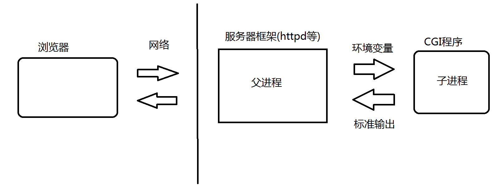
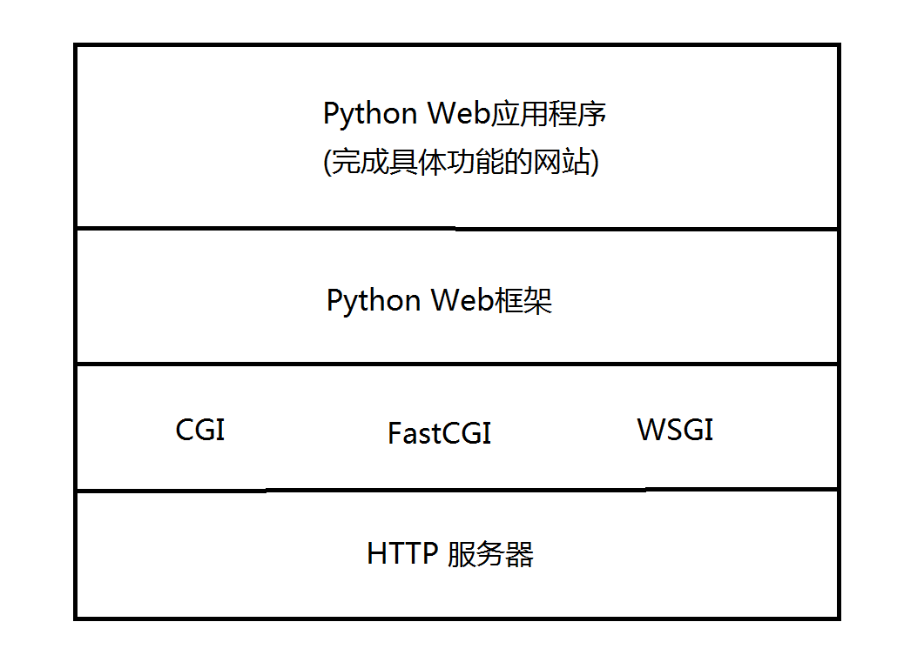
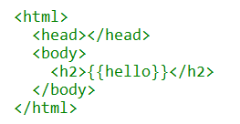
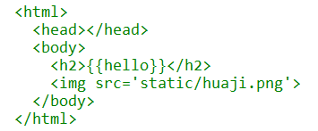

# Python 网站搭建

## 项目目标
将抓取到的招聘数据, 通过web的形式进行展示

## 背景介绍

### 什么是 "网站搭建"
所谓网站搭建, 本质上是实现一个 http 服务器(或者基于通用的 http 服务器框架进行二次开发).

Python自身具备一定的操控底层能力, 因此使用 Python 调用操作系统的 socket 接口从零实现一个 http 服务器在技术上是完全可行的.

但是实际上我们一般不会重复造轮子, 而是使用现成的 http 服务器(典型的有nginx和httpd)作为我们的程序载体, 在其上进行二次开发.  
二次开发的好处是可以更快速, 更方便的完成我们的需求. 

> 如何衡量程序猿的幸福指数?  
> 1. 工资越高, 就越幸福;  
> 2. 加班越少, 就越幸福;  

为了少加班, 于是我们选择使用现成的框架直接辅助我们进行**快速开发**

### 什么是 "框架"
现在我们要解决的问题是, **如何**能利用已有的 http 服务器进行开发. 

其实, 已经有大佬们给我们指定好了一系列的标准(或者规范, 或者协议), 使我们自己写的程序, 能够被已有的服务器程序调用起来. 

**大佬一: CGI(Common Gateway Interface)** 
>* CGI 是Web 服务器运行时外部程序的规范,按CGI编写的程序可以扩展服务器功能;
>* 服务器框架以子进程的方式调用和执行 CGI 程序(就是我们二次开发写的代码);
>* 通过**命令行参数**或**环境变量**将服务器收到的请求详细信息传递给CGI程序;
>* 通过**标准输出方式**使CGI程序将响应结果回传给服务器, 通过服务器转发回客户端;
>* CGI程序执行完毕, 子进程退出;

**大佬二: FastCGI(Fast Common Gateway Interface)** 
由于CGI是这样一种 fork-and-execute 模式, 因此虽然扩展性好, 但是性能比较低. (每次处理请求都得 fork, 开销很大). 
于是有大佬对 CGI 进行改进, 就出现了 FastCGI
>* FastCGI相比于CGI, 是在服务器启动时就事先把CGI程序对应的进程创建好(创建多个实例);
>* 当请求到达时, 服务器会把请求分配给空闲的CGI程序进行处理;
>* 当请求处理完成后, CGI程序并不会退出;
>* 这里的 HTTP服务器 和 CGI进程, 交互往往采用命名管道, 或者 TCP 的方式; 每个CGI进程中又可以使用多线程的方式来处理请求.
FastCGI避免了CGI中的频繁创建销毁进程的操作, 性能有了较大的提高; 但是由于服务器启动就会维护若干个CGI进程实例, 因此占用的内存就大大增加了. 

另一方面, FastCGI能很好的和CGI兼容. 这是当前业界最主流的一种方式.

**大佬三: WSGI(Web Server Gateway Interface)** 
这个大佬是为 Python 量身打造的一套标准(接口规范). 规定了http服务器如何和一个Python程序进行交互.

标准的具体的细节可以参考 

	https://www.python.org/dev/peps/pep-0333/

这时候问题来了, 作为一个小白, 我想做一个很简单的网站, 要先把上面这一大堆标准都搞明白, 才能开始写代码嘛? 

**当然不用!**

因为我们有很多现成的框架, 帮助我们把这些Python程序和服务器程序交互的细节给封装起来了, 以至于我们不比关注http服务器的细节和http服务器与Python程序的交互细节.

### 都有哪些框架
>* Django
>* Flask
>* Tornado
>* Web.py
>* Bottle
>* ...

用 "百花齐放" 描述并不过分.

### 为什么选择 Flask 
业界最主流使用的框架是 Django, 是一款重量级, 功能强大的存在. 但是相对来说入门成本比较高. 

因此我们选择 Flask 作为我们入门的切入点.  
相比于 Django, 入门简单, 扩展性好, 也得到了业界的普遍认可. 是Python Web开发中的后起之秀.  

## Flask快速入门

### 环境安装
使用 pip 安装即可

	pip install flask

Linux下需要使用 root 权限

参考 http://docs.jinkan.org/docs/flask/installation.html#installation

### Hello World
创建文件 main.py, 写入以下内容

	# coding:utf-8
	from flask import Flask
	
	# 1. 创建 Flask 对象. 使用一个字符串进行初始化, 作为 app 的名字
	app = Flask(__name__)
	
	# 2. 设定入口函数. 通过这个入口函数来生成响应结果
	#    该函数使用 app.route 作为装饰器. 相当于一个注册效果: 如果收到的请求访问了 / , 则调用 hello_world
	#    该函数没有参数. 函数的返回值是一个字符串, 就是 HTTP 响应报文中的 body 部分.
	@app.route('/')
	def hello_world():
	    return 'hello world'
	
	# 3. 调用 Flask 对象的 run 方法, 启动服务并等待连接. 指定的ip地址为0.0.0.0, 这时候服务器会监听该机器上所有的ip地址的网卡收到的请求.
	if __name__ == '__main__':
	    app.run(host='0.0.0.0', debug=True)

执行该代码. 然后就可以使用浏览器来访问了. 

	python main.py

	在浏览器中访问

	http://[ip]:5000

	# 执行结果
	hello world

**注意:** 不要在生产环境中开启调试!!

### 路由
所谓的 "路由" , 可以理解成 "寻路".

> 我想找到 index.html 这样的一个页面, 需要执行哪个函数能得到结果. 

具体的说, 其实就是通过 route() 装饰器把一个函数绑定到对应的 URL 上. 

基本例子

	@app.route('/')
	def index():
	    return 'Index Page'
	
	@app.route('/hello')
	def hello():
	    return 'Hello World'

带有变量(可以通过一个函数处理一类 url).

	@app.route('/user/<username>')
	def show_user_profile(username):
	    return 'User %s' % username
	
	@app.route('/post/<int:post_id>')
	def show_post(post_id):
	    return 'Post %d' % post_id

### 模板
由于 http 响应的结果往往是一个 html. 而 html 是一个比较有特点的格式. 因此直接在源代码中构造, 比较麻烦, 代码耦合度高, 可读性也不好. 

	@app.route('/')
	def hello_world():
	    result = 'hello_world'
	    return '<html><head></head><body><h2>%s</h2></body></html>' % result

这只是一个很简单的页面, 就已经如此. 如果页面非常复杂, 并且需要频繁修改, 那将更加痛苦. 

使用 "模板" 能很好的解决这样的问题.
>* 将 html 单独的放到一个文件中. 
>* 对于文件中一些需要动态生成的, 变化的数据, 使用通配符先进行占位.
>* 在处理请求的时候, 先读取模板文件, 然后对其中的通配符进行替换(这个过程称为 "渲染"), 就能够生成出想要的动态页面了.

1. 创建一个目录(和main.py同级), 名字为 "templates", **目录名字是固定的** 
2. 在 templates 中创建一个 index.html. **文件名字是随意取的** 

其中的 {{hello}} 相当于一个名字为 "hello" 的变量. 会在渲染的过程中进行替换.

然后再 main.py 中使用 `render_template` 来进行模板渲染.

	from flask import render_template
	@app.route('/')
	def hello_world():
	    result = 'hello_world!!!'
	    return render_template('index.html', hello=result)

这时候我们运行代码, 使用浏览器访问, 仍然能够得到正确的结果. 

这样的思想方法称为 "逻辑和界面分离". 和用户交互的界面部分也称之为 "视图". 

### 静态文件
有些情况下, 我们的页面中带有一些静态资源(js, css, 图片等), 就需要我们的服务器能够将这些静态资源也能返回给浏览器. 

1. 创建一个目录(和main.py同级), 名字为 "static", **目录的名字是固定的** 
2. 在 static 中放入要在页面中展示的静态资源, 例如 huaji.png  

然后就可以在页面中引入这个图片了. 

index.html中

就可以在页面中展示图片了. 

### 请求对象
我们知道, 在 http 请求报文中, 包含了好几个部分. 
>* method
>* url
>* header
>* body

如何在代码中获取到这些信息呢? 全靠我们的 request 对象. 当然, 在使用之前, 需要先 import 

	from flask import request

request 是一个 **环境局部变量**. 虽然表面上看起来是一个全局变量, 但实际上是一个请求级别的局部变量. 

**每一个请求都有一个自己的 request 变量. 一个请求不能访问其他请求中的 request 的信息.**

我们来看看 request 中有哪些属性. 

>* method: 当前请求的method
>* url: 当前请求的url
>* headers: 一个字典, 能够查看对应header的值.
>* url中的参数: request.args.get('xxx', '')
>* body中的参数: request.form('xxx')

	@app.route('/')
	def hello_world():
	    result = 'method:' + request.method + ' url:' + request.url
	    for key, value in request.headers:
	        result += '[' + key + ':' + value + ']'
	    return render_template('index.html', hello=result)

### 响应对象
视图函数的返回值会被自动转换为一个响应对象. 

规则:
>* 如果返回的是一个合法的响应对象，它会从视图直接返回。
>* 如果返回的是一个字符串，响应对象会用字符串数据和默认参数创建。
>* 如果返回的是一个元组，且元组中的元素可以提供额外的信息。这样的元组必须是 (response, status, headers) 的形式，且至少包含一个元素。 status 值会覆盖状态代码， headers 可以是一个列表或字典，作为额外的消息标头值。

可以使用	`make_response` 函数来辅助完成相应数据的更精确控制. 

	from flask import make_response
	@app.route('/')
	def hello_world():
	    result = 'method:' + request.method + ' url:' + request.url
	    response = make_response(render_template('index.html', hello=result), 200)
		response.headers['X-Something'] = 'A value'
	    return response

这样就可以更精细的控制相应报文的内容. 包括状态码和header都可以根据需要进行修改. 

### 参考文章
更详细内容, 可以参考 Flask 中文文档

http://docs.jinkan.org/docs

## 概要设计
### 展示模块
网站的界面设计

**主页** 
>* 包含一个职位的简略信息的列表
>* 每一页展示15条数据
>* 每一条数据的简略信息中包含: 公司简称, 职位名称
>* 点击数据, 将跳转到详情页.
>* 最下方包含一个翻页的实现.

**详情页** 
>* 包含职位名称, 公司全称, 薪水, 工作年限要求, 职位诱惑, 职位描述, 工作地点.

### 数据模块
将数据从数据库中读取出来. 

实现接口:
>* 查询出某天都有哪些招聘信息(简略信息)
>* 查询出某天具体某个position_id的详细招聘信息

### 控制模块
控制网站的主逻辑.

实现功能:
>* 主页展示
>* 详情页展示
>* 主页翻页

## 核心代码实现
(略)

## 部署
当前我们的代码都是基于flask内置的http服务器来运行的. 但是内置的http服务器只能满足基本的调试需求. 一旦请求量比较大, 性能和稳定性难以胜任. 

于是我们需要借助一些成熟的, 高性能的, 经过工业级别的检验的http服务器来运行我们的代码. 或者说是:

**将我们的代码部署到成熟的服务器上**

部署 flask (其他框架也是类似) 程序的方式有很多. 具体可以参考中文文档中的 http://docs.jinkan.org/docs/flask/deploying/index.html 章节.

我们这里使用一种操作简便, 并且使用广泛的方式:  
**Nginx + Gunicorn** 

### Gunicorn
Gunicorn(绿色独角兽) 是一个被广泛使用的高性能的Python WSGI UNIX HTTP服务器, 移植自Ruby的独角兽(Unicorn )项目. 

采用 pre-fork 的机制(预先创建好多个进程, 进程池), 执行python程序.

**安装** 

	pip install gunicorn

**运行** 

	gunicorn -w 4 -b 0.0.0.0:5000 main:app

选项说明:
>* -w 表示创建几个 worker 进程.
>* -b 表示服务器绑定的 ip地址和端口号.
>* main:app, main表示入口的python文件名; app表示的是 Flask 创建的 app 变量的名字(调用了 run 的那个对象名).

但是直接敲下这个指令, 启动的是一个前台进程. 作为一个服务器, 我们需要将其变成一个守护进程. 使用下面的指令启动服务器:

	nohup gunicorn -w 4 -b 0.0.0.0:5000 main:app &

这时即使关掉终端, 我们的程序仍然能正常执行.

这个时候我们就可以通过 5000 端口正常的访问我们的网站了.

### Nginx
既然我们已经有了Gunicorn这个http服务器了, 为什么还要用 Nginx 呢?

因为当前我们的网站是单机部署的, 当访问压力较大时, 单台机器的性能将会成为瓶颈. 这时候我们需要多机**分布式部署**, 并使用 Nginx 作为 **负载均衡服务器**

**安装** 

	yum install nginx

**配置** 

	修改 /etc/nginx/nginx.conf 文件, 示例如下

	# 修改1: 新增 upstream, 名字为 pyweb(这个名字随便起)
    upstream pyweb {
        server 127.0.0.1:5000;  # 这里是指向 gunicorn host 的服务地址
    }

    server {
    listen       80 default_server;
    listen       [::]:80 default_server;
    server_name  _;
    root         /usr/share/nginx/html;

    # Load configuration files for the default server block.
    include /etc/nginx/default.d/*.conf;

    location / {
			# 修改2: 在location / 中引用 pyweb
            proxy_pass http://pyweb;
            proxy_set_header Host $host;
            proxy_set_header X-Forwarded-For $proxy_add_x_forwarded_for;
    }

    error_page 404 /404.html;
        location = /40x.html {
    }

注意, 如果有多个 gunicorn 服务器实例, 就可以在 upstream pyweb 中添加多个ip即可.

**运行** 

	service nginx start

## 附录
### 使用网站模板美化界面
网上有一些免费的网站模板. 我们可以基于这些模板, 进行简单的修改, 来美化我们的网站界面.

http://www.cssmoban.com/cssthemes/

